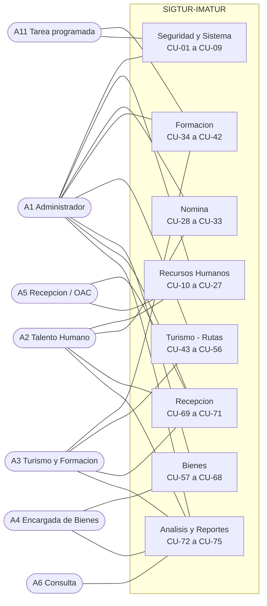
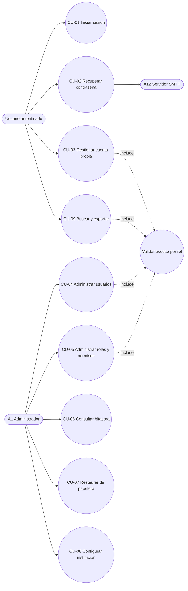
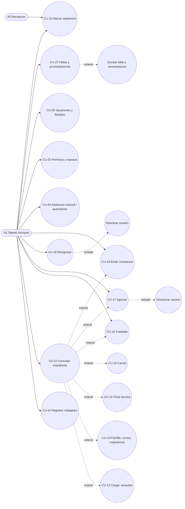
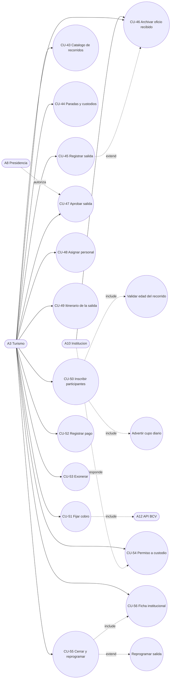
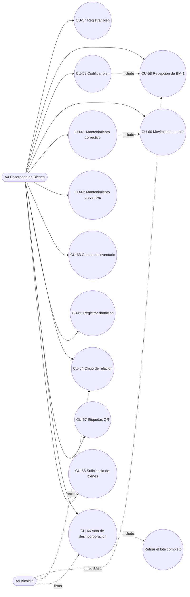
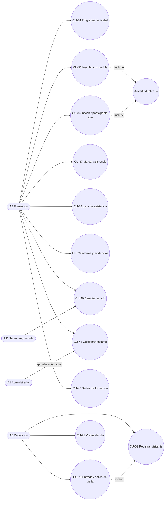

# Casos de Uso y Diagramas de Casos de Uso

**SIGTUR-IMATUR** · **75 casos de uso** · **Última actualización:** 2026-09-19
**Sistema descrito:** migraciones 001–084

> **Para qué sirve.** Insumo para dibujar los **diagramas de casos de uso** (UML) y para
> especificar cada uno en formato extendido. Los identificadores `CU-xx` son los mismos que usa la
> matriz de trazabilidad de `ESPECIFICACION_REQUERIMIENTOS.md` §11.

---

## Índice

1. [Actores](#1-actores)
2. [Diagrama general de casos de uso](#2-diagrama-general-de-casos-de-uso)
3. [Catálogo completo (CU-01…CU-75)](#3-catálogo-completo-cu-01cu-75)
4. [Diagramas por subsistema](#4-diagramas-por-subsistema)
5. [Especificación extendida de los casos de uso críticos](#5-especificación-extendida-de-los-casos-de-uso-críticos)
6. [Relaciones entre casos de uso](#6-relaciones-entre-casos-de-uso)

---

## 1. Actores

| ID | Actor | Tipo | Rol BD |
|---|---|---|---|
| **A1** | Administrador del Sistema | Primario | 1 |
| **A2** | Analista de Talento Humano | Primario | 2 |
| **A3** | Personal de Turismo y Formación | Primario | 3 |
| **A4** | Encargada de Bienes | Primario | 4 |
| **A5** | Recepcionista / OAC | Primario | 5 |
| **A6** | Usuario de Consulta | Primario | 6 |
| **A7** | Trabajador de IMATUR | Secundario (sujeto del registro, no opera el sistema) | — |
| **A8** | Presidencia de IMATUR | Secundario (autoriza fuera del sistema; su acto se registra) | — |
| **A9** | Alcaldía — Dirección de Bienes | Externo | — |
| **A10** | Institución solicitante / custodia | Externo | — |
| **A11** | Tarea programada (cron) | Sistema | — |
| **A12** | Servidor SMTP · API BCV | Sistema externo | — |

> **Generalización de actores:** A1 hereda todas las capacidades de A2, A3, A4, A5 y A6.
> En el diagrama se dibuja `A1 ──▷ (A2, A3, A4, A5, A6)`.

---

## 2. Diagrama general de casos de uso

---

## 3. Catálogo completo (CU-01…CU-75)

### 3.1 Seguridad y Sistema

| ID | Caso de uso | Actor principal | RF |
|---|---|---|---|
| CU-01 | Iniciar sesión | Todos | RF-SEG-01…04 |
| CU-02 | Recuperar contraseña olvidada | Todos | RF-SEG-07 |
| CU-03 | Gestionar la cuenta propia (usuario y contraseña) | Todos | RF-SEG-18 |
| CU-04 | Administrar usuarios del sistema | A1 + rol con el módulo *Usuarios* (sin tocar cuentas de Administrador) | RF-SEG-01, RF-SEG-19 |
| CU-05 | Administrar roles y permisos | A1 | RF-SEG-05, RF-SEG-06 |
| CU-06 | Consultar la bitácora de auditoría y los accesos | A1 | RF-SEG-09, RF-SEG-10 |
| CU-07 | Restaurar un registro desde la papelera | A1 + rol con permiso | RF-SEG-11 |
| CU-08 | Configurar los datos institucionales y parámetros | A1, A2 | RF-SEG-14, RF-SEG-15 |
| CU-09 | Buscar globalmente y exportar un listado | Todos | RF-SEG-16, RF-REP-03 |

### 3.2 Recursos Humanos

| ID | Caso de uso | Actor principal | RF |
|---|---|---|---|
| CU-10 | Registrar un trabajador (asistente por pasos) | A2 | RF-RH-03…07 |
| CU-11 | Consultar el expediente de un trabajador | A2 | RF-RH-09 |
| CU-12 | Cargar recaudos del expediente | A2 | RF-RH-11 |
| CU-13 | Gestionar carga familiar, cursos y experiencia laboral | A2 | RF-RH-10 |
| CU-14 | Generar la Ficha Técnica del Trabajador | A2 | RF-RH-09 |
| CU-15 | Generar el carnet institucional | A2 | RF-RH-15 |
| CU-16 | Trasladar un trabajador de departamento | A2 | RF-RH-12 |
| CU-17 | Egresar (desincorporar) a un trabajador | A2 | RF-RH-13 |
| CU-18 | Reingresar a un trabajador egresado | A2 | RF-RH-13 |
| CU-19 | Emitir una constancia | A2 | RF-RH-14 |
| CU-20 | Administrar el organigrama (departamentos) | A2 | RF-RH-01 |
| CU-21 | Administrar cargos | A2 | RF-RH-02 |
| CU-22 | Administrar horarios y modalidades | A2 | RF-RH-16 |
| CU-23 | Marcar asistencia (entrada / salida) | A5, A2 | RF-RH-17…19 |
| CU-24 | Registrar asistencia manual y consultar ausentismo | A2 | RF-RH-20, RF-RH-21 |
| CU-25 | Gestionar permisos y reposos | A2 | RF-RH-23 |
| CU-26 | Gestionar vacaciones y feriados | A2 | RF-RH-24…27 |
| CU-27 | Gestionar faltas y amonestaciones | A2 | RF-RH-28…31 |

### 3.3 Nómina

| ID | Caso de uso | Actor principal | RF |
|---|---|---|---|
| CU-28 | Cargar los parámetros del mes (cesta ticket y tasa) | A2 | RF-NOM-02, RF-NOM-03 |
| CU-29 | Registrar los datos salariales y de nómina del trabajador | A2 | RF-NOM-04 |
| CU-30 | Generar la nómina quincenal | A2 | RF-NOM-05…08, RF-NOM-10 |
| CU-31 | Corregir advertencias y recalcular el período | A2 | RF-NOM-09 |
| CU-32 | Cerrar y exportar la quincena | A2 | RF-NOM-11, RF-NOM-12 |
| CU-33 | Procesar el Bono Vacacional | A2 | RF-NOM-13 |
| — | *(Liquidación de Prestaciones Sociales)* | A2 | RF-NOM-14 🔒 **no implementado** |

### 3.4 Formación

| ID | Caso de uso | Actor principal | RF |
|---|---|---|---|
| CU-34 | Programar una actividad formativa | A3 | RF-FOR-01, RF-FOR-02 |
| CU-35 | Inscribir un participante con cédula | A3 | RF-FOR-03, RF-FOR-05 |
| CU-36 | Inscribir un participante libre (menor) | A3 | RF-FOR-03, RF-FOR-04 |
| CU-37 | Marcar la asistencia de la actividad | A3 | RF-FOR-06 |
| CU-38 | Emitir la lista de asistencia imprimible | A3 | RF-FOR-06 |
| CU-39 | Registrar el informe demográfico y las evidencias | A3 | RF-FOR-07, RF-FOR-08 |
| CU-40 | Cambiar el estado de la actividad | A3, A11 | RF-FOR-09, RF-FOR-10 |
| CU-41 | Gestionar el ciclo de vida de un pasante | A3, A1 | RF-FOR-11…14 |
| CU-42 | Administrar las sedes de formación | A3 | RF-FOR-15 |

### 3.5 Turismo — Rutas

| ID | Caso de uso | Actor principal | RF |
|---|---|---|---|
| CU-43 | Administrar el catálogo de recorridos | A3 | RF-TUR-01, RF-TUR-04, RF-TUR-05 |
| CU-44 | Administrar las paradas y sus instituciones custodias | A3 | RF-TUR-02, RF-TUR-03 |
| CU-45 | Registrar una solicitud de salida | A3 | RF-TUR-06, RF-TUR-07 |
| CU-46 | Archivar el oficio de solicitud recibido | A3 | RF-TUR-07 |
| CU-47 | Registrar la aprobación de la Presidencia | A3 | RF-TUR-08 |
| CU-48 | Asignar el personal de IMATUR a la salida | A3 | RF-TUR-13 |
| CU-49 | Definir el itinerario propio de la salida | A3 | RF-TUR-14, RF-TUR-15 |
| CU-50 | Inscribir participantes en la salida | A3 | RF-TUR-17…20 |
| CU-51 | Fijar las condiciones de cobro de la salida | A3 | RF-TUR-29, RF-TUR-30 |
| CU-52 | Registrar y anular pagos | A3 | RF-TUR-31…33 |
| CU-53 | Exonerar del cobro a una salida | A3 | RF-TUR-34 |
| CU-54 | Emitir y responder un oficio de permiso a un custodio | A3 | RF-TUR-23…27 |
| CU-55 | Cerrar la salida (ejecutada / no ejecutada) y reprogramar | A3 | RF-TUR-09…12, RF-TUR-16 |
| CU-56 | Completar y cerrar la Ficha Institucional; emitir el oficio de visita | A3 | RF-TUR-35…40 |

### 3.6 Bienes / Inventario

| ID | Caso de uso | Actor principal | RF |
|---|---|---|---|
| CU-57 | Registrar un bien | A4 | RF-BIE-01, RF-BIE-02 |
| CU-58 | Registrar la recepción de un formulario BM-1 | A4 | RF-BIE-03 |
| CU-59 | Codificar un bien | A4 | RF-BIE-03, RF-BIE-04 |
| CU-60 | Registrar un movimiento de bien | A4 | RF-BIE-07, RF-BIE-08 |
| CU-61 | Gestionar el mantenimiento correctivo | A4 | RF-BIE-09 |
| CU-62 | Planificar el mantenimiento preventivo | A4 | RF-BIE-09 |
| CU-63 | Realizar un conteo de inventario | A4 | RF-BIE-10 |
| CU-64 | Emitir el oficio de relación de bienes nuevos | A4 | RF-BIE-14 |
| CU-65 | Registrar la donación de un bien | A4 | RF-BIE-15 |
| CU-66 | Emitir el Acta de Desincorporación y registrarla firmada | A4 | RF-BIE-16, RF-BIE-17 |
| CU-67 | Imprimir etiquetas con código QR | A4 | RF-BIE-11 |
| CU-68 | Analizar la suficiencia de bienes | A4 | RF-BIE-12 |

### 3.7 Recepción

| ID | Caso de uso | Actor principal | RF |
|---|---|---|---|
| CU-69 | Registrar un visitante | A5 | RF-REC-01 |
| CU-70 | Registrar entrada / salida de una visita | A5 | RF-REC-02, RF-REC-03 |
| CU-71 | Consultar las visitas del día | A5, A2 | RF-REC-04, RF-REC-05 |

### 3.8 Análisis y Reportes

| ID | Caso de uso | Actor principal | RF |
|---|---|---|---|
| CU-72 | Consultar el panel principal | Todos | RF-REP-01 |
| CU-73 | Consultar un reporte y exportarlo | Según rol | RF-REP-02…04 |
| CU-74 | Consultar los indicadores de gestión | Todos | RF-REP-05 |
| CU-75 | Atender el centro de alertas y las notificaciones | A1, A2 (campana: todos) | RF-REP-06…08 |

---

## 4. Diagramas por subsistema

### 4.1 Seguridad y Sistema

### 4.2 Recursos Humanos

### 4.3 Turismo — Rutas

### 4.4 Bienes

### 4.5 Formación y Recepción

---

## 5. Especificación extendida de los casos de uso críticos

> Formato: identificación · actores · precondiciones · flujo principal · flujos alternativos ·
> flujos de excepción · postcondiciones · reglas asociadas.

---

### CU-01 — Iniciar sesión

| Campo | Contenido |
|---|---|
| **Actor principal** | Cualquier usuario del sistema |
| **Precondición** | Existe una cuenta con credenciales válidas |
| **Disparador** | El usuario abre la aplicación |

**Flujo principal**
1. El sistema muestra la pantalla de inicio de sesión.
2. El usuario ingresa **usuario o correo** y contraseña.
3. El sistema busca la cuenta (incluidas las desactivadas).
4. El sistema verifica que la cuenta **no esté bloqueada** temporalmente.
5. El sistema verifica la contraseña contra el hash bcrypt.
6. El sistema verifica que la cuenta esté **activa**.
7. El sistema reinicia el contador de intentos fallidos, registra el acceso en la bitácora,
   **regenera el identificador de sesión** y guarda `user_id` y `user_rol`.
8. El sistema redirige al **Panel Principal**.

**Flujos alternativos**
- **3a. Cuenta inexistente:** el sistema responde *"Usuario o contraseña incorrectos"* (mensaje
  genérico, a propósito: no revela si el usuario existe). Fin.
- **6a. Cuenta desactivada con credenciales correctas:** el sistema registra `LOGIN_INACTIVO`,
  informa que la cuenta fue suspendida o su titular figura como egresado, e indica contactar al
  Administrador. Fin.

**Flujos de excepción**
- **4a. Cuenta bloqueada:** el sistema informa los minutos restantes de bloqueo. Fin.
- **5a. Contraseña incorrecta:** el sistema incrementa `failed_attempts`, registra `LOGIN_FALLIDO`
  y:
  - si llegó a **5 intentos**, bloquea la cuenta **15 minutos** e informa el bloqueo;
  - si quedan **≤ 2 intentos**, informa cuántos restan;
  - en otro caso, mensaje genérico. Fin.
- **E1. Base de datos no disponible:** *"Error de conexión con el sistema. Intente más tarde."*

**Postcondición (éxito):** sesión iniciada con rol vigente; `last_login` actualizado; evento
`LOGIN` en la bitácora.

**Reglas asociadas:** RF-SEG-01, RF-SEG-02, RF-SEG-04, RNF-SEG-01, RNF-SEG-04.

---

### CU-10 — Registrar un trabajador

| Campo | Contenido |
|---|---|
| **Actor principal** | A2 Talento Humano (o A1) |
| **Precondición** | Existen cargos, departamentos y horarios cargados |

**Flujo principal**
1. A2 abre el **asistente de registro** (5 pasos).
2. **Paso 1 — Datos personales:** cédula, nombre, apellido, género, fecha de nacimiento, teléfono,
   correo, dirección, parroquia, RIF, estado civil, discapacidad.
3. El sistema **normaliza la cédula** a solo dígitos y **verifica que no exista** otro registro con
   ella.
4. El sistema **valida la edad**: 18–65 (IMATUR) o 18–70 (comisión de servicio).
5. **Paso 2 — Formación:** nivel académico, profesión, título, institución, fecha de graduación.
6. **Paso 3 — Datos institucionales:** cargo, departamento, horario, tipo de contrato, institución
   de origen, clasificación, grupo de rotación, fechas de ingreso, vencimiento de contrato,
   uniforme y tallas, datos comunitarios.
7. El sistema **deriva** `es_comision_servicio` del origen institucional.
8. **Paso 4 — Carga familiar:** cero o más familiares con parentesco.
9. **Paso 5 — Resumen:** el sistema muestra todo lo capturado para verificación.
10. A2 confirma. El sistema abre una **transacción**, inserta en `personas`, inserta en `empleados`
    y confirma.
11. El sistema asigna el **folio `EXP-####`** derivado del identificador y registra la operación
    en la bitácora.

**Flujos alternativos**
- **3a. La cédula ya existe:** el sistema avisa y ofrece abrir el expediente existente.
- **8a. Sin carga familiar:** se omite el paso.

**Flujos de excepción**
- **10a. Falla cualquiera de los dos INSERT:** se revierte la transacción completa.
  **Nunca queda una persona sin empleado ni un empleado sin persona.**

**Postcondición:** trabajador activo, con folio y expediente vacío listo para cargar recaudos.

**Reglas asociadas:** RN-RH01, RN-RH02, RN-RH03, RF-RH-03…07.

---

### CU-23 — Marcar asistencia

| Campo | Contenido |
|---|---|
| **Actor principal** | A5 Recepción (o A2) |
| **Precondición** | El trabajador está activo y tiene horario asignado |

**Flujo principal**
1. El actor abre la pantalla de asistencia del día.
2. El sistema lista al personal activo con su estado (sin marcar / entrada marcada / jornada
   cerrada) y el resumen del día (presentes, impuntuales, en actividad, ausentes).
3. El actor pulsa **Marcar** sobre un trabajador.
4. El sistema busca una **asistencia abierta** de ese trabajador para hoy.
5. **No hay abierta ⇒ registra la ENTRADA:** calcula `minutos_tarde` contra la hora de entrada de
   su horario y marca impuntualidad si supera la tolerancia configurada.
6. El sistema confirma con un aviso y actualiza el resumen.

**Flujos alternativos**
- **5a. Hay una asistencia abierta ⇒ registra la SALIDA.**
  - **5a.1** Si la hora actual es **anterior** a la de salida de su horario más la tolerancia de
    salida anticipada, el sistema **exige un motivo obligatorio** antes de guardar.
- **3a. Marcaje masivo:** el actor marca a varios trabajadores a la vez; el sistema aplica la misma
  lógica a cada uno.
- **2a. Registro manual/retroactivo:** A2 captura fecha y horas a mano.

**Flujos de excepción**
- **5.1a. El trabajador no tiene horario:** `minutos_tarde` queda nulo y no se evalúa puntualidad.

**Postcondición:** una fila en `asistencias`, **que nunca se elimina**.

**Reglas asociadas:** RN-RH05, RF-RH-17…22.

---

### CU-26 — Gestionar vacaciones y feriados

| Campo | Contenido |
|---|---|
| **Actor principal** | A2 Talento Humano |
| **Precondición** | El trabajador tiene registrada su fecha de ingreso a la Administración Pública |

**Flujo principal**
1. A2 abre **Vacaciones** y selecciona un trabajador.
2. El sistema calcula y muestra: antigüedad, **días que corresponden** (15 + 1 por año, tope 30),
   días ya disfrutados, **ajuste inicial** y **saldo acumulado**.
3. A2 registra un período con fecha de inicio y fin.
4. El sistema calcula los **días hábiles** del período excluyendo fines de semana y **feriados**.
5. El sistema valida que el período **no exceda el saldo** y guarda en estado *Pendiente*.
6. A2 cambia el estado del período (Aprobado → En Curso → Completado, o Rechazado).

**Flujos alternativos**
- **2a. Ajuste inicial:** A2 captura el saldo que el trabajador traía de antes del sistema.
- **4a. Faltan feriados movibles del año:** el sistema **avisa en la pantalla de Feriados**; A2
  pulsa *Generar Carnaval y Semana Santa* y el sistema los calcula desde el Domingo de Resurrección.

**Flujos de excepción**
- **4b.** Si nadie carga los feriados movibles, **el conteo descuenta días que no corresponden y no
  hay error visible**. Por eso el aviso de 4a es parte del requerimiento (RF-RH-27).

**Postcondición:** período registrado, saldo recalculado. Las vacaciones no disfrutadas se acumulan.

**Reglas asociadas:** RN-RH07, RN-RH08, RF-RH-24…27.

---

### CU-30 — Generar la nómina quincenal

| Campo | Contenido |
|---|---|
| **Actor principal** | A2 Talento Humano |
| **Precondición** | Están cargados los parámetros del mes (cesta ticket y tasa); hay personal activo con datos salariales |

**Flujo principal**
1. A2 abre **Nómina → Quincenal** y pulsa *Nueva quincena*.
2. A2 selecciona **mes** y **quincena** (1 o 2).
3. El sistema verifica que existan los **parámetros del mes**.
4. El sistema verifica que **no exista ya** un período con ese mes y quincena.
5. El sistema **congela** en el período la cesta ticket, la tasa del dólar y el número de semanas.
6. Para **cada trabajador activo**, el sistema:
   a. determina su **tipo de personal**;
   b. lee su **sueldo vigente** (fila más reciente de `empleado_salarios`);
   c. calcula el **% de profesionalización** por su grado y el **% de antigüedad** por sus años en
      la Administración (tope 30 %);
   d. cuenta sus **hijos** de la carga familiar;
   e. calcula asignaciones, deducciones (SSO, FAOV, LRPPF), aportes patronales, alícuotas,
      sueldo integral diario y **neto a cobrar**;
   f. acumula **advertencias** por cada dato faltante o dudoso, **sin abortar**.
7. El sistema guarda una fila de detalle por trabajador y muestra el resumen con las advertencias.

**Flujos alternativos**
- **6f.1 Comisión de servicio:** además se registra el sueldo de la dependencia de origen y la
  **diferencia** que asume IMATUR.

**Flujos de excepción**
- **3a. Mes sin parámetros:** el sistema **no permite generar** e indica cargarlos primero.
- **4a. Período ya existente:** el sistema lo informa y ofrece abrirlo.
- **6b.1 Trabajador sin sueldo registrado:** se calcula con cero y se emite **advertencia**.

**Postcondición:** período en estado **Borrador**, con una fila por trabajador y los parámetros
congelados. El cálculo **no consulta internet** en ningún momento.

**Reglas asociadas:** RN-NOM01…RN-NOM05, RF-NOM-05…10.

---

### CU-45 — Registrar una solicitud de salida

| Campo | Contenido |
|---|---|
| **Actor principal** | A3 Turismo |
| **Precondición** | El recorrido existe en el catálogo y está Activo |

**Flujo principal**
1. A3 abre **Rutas → Salidas** y pulsa *Nueva salida*.
2. A3 selecciona el **recorrido**, la **fecha** y la **hora**.
3. A3 indica el **origen**: *Particular* o *Institucional*.
4. Si es **Institucional**, A3 captura el **nombre de la institución solicitante**.
5. A3 indica el **cupo** previsto y observaciones.
6. El sistema valida que la fecha no sea pasada y crea la salida en estado **Programado**.
7. El sistema muestra la pantalla de la salida con sus secciones: aprobación, personal, itinerario,
   participantes, cobro, permisos e incidencias.

**Flujos alternativos**
- **4a. Oficio recibido (CU-46):** A3 adjunta el escaneado del oficio que envió la institución. El
  sistema lo guarda **fuera de la raíz web** y lo sirve con control de rol.
- **6a. Cupo diario:** si la suma de personas previstas para ese día supera el tope configurado, el
  sistema **advierte** y permite continuar.

**Flujos de excepción**
- **2a. El recorrido está Inactivo o En Mantenimiento:** el sistema no lo ofrece.

**Postcondición:** salida creada en **Programado**, pendiente de aprobación.

**Reglas asociadas:** RN-TUR01, RN-TUR06, RN-TUR14, RF-TUR-06, RF-TUR-07.

---

### CU-55 — Cerrar la salida y reprogramar

| Campo | Contenido |
|---|---|
| **Actor principal** | A3 Turismo |
| **Precondición** | La salida está en estado **Programado** |

**Flujo principal (ejecutada)**
1. A3 abre la salida y pulsa **Marcar ejecutada**.
2. El sistema valida que el estado actual **no sea terminal** y que la **fecha no sea futura**.
3. El sistema cambia el estado a **Ejecutado** y lo registra en la bitácora.
4. El sistema **genera automáticamente la Ficha Institucional** en estado *Borrador*, precargada
   con recorrido, fecha, encargado e institución.
5. El sistema muestra la ficha para que A3 la complete al volver a la oficina.

**Flujo alternativo (no ejecutada)**
1. A3 pulsa **No se ejecutó**.
2. El sistema **exige motivo obligatorio** (ejemplos reales: falta de combustible, clima, el grupo
   canceló).
3. El sistema cambia el estado a **No ejecutado**. La salida **no admite ficha ni inscripciones**.

**Flujo de reprogramación**
1. Desde una salida **No ejecutada**, A3 pulsa **Reprogramar** e indica la nueva fecha.
2. El sistema valida que la fecha no sea pasada y que esa salida **no haya sido reprogramada antes**.
3. El sistema **crea una salida nueva**, heredando recorrido, origen, institución, cupo y oficio, y
   la enlaza con la original mediante `id_reprogramada_de`.
4. **La salida original se conserva intacta**: es la constancia de lo que no ocurrió.

**Flujos de excepción**
- **2a. Estado ya terminal:** *"Esta salida ya está «X» y no puede cambiar de estado."*
- **2b. Fecha futura al marcar ejecutada:** el sistema lo impide.
- **4a. Falla la generación de la ficha:** **no se revierte** el cambio de estado (la salida sí
  ocurrió); la ficha puede generarse después desde la pantalla.

**Postcondición:** estado terminal registrado; ficha creada (si ejecutada) o motivo registrado
(si no ejecutada).

**Reglas asociadas:** RN-TUR03, RN-TUR04, RN-TUR13, RF-TUR-09…12, RF-TUR-35.

---

### CU-52 — Registrar y anular pagos

| Campo | Contenido |
|---|---|
| **Actor principal** | A3 Turismo |
| **Precondición** | La salida tiene **condiciones de cobro fijadas** (CU-51) y no está exonerada |

**Flujo principal**
1. A3 abre la sección **Cobro** de la salida y ve el **estado de cuenta**: total esperado, abonado
   y saldo.
2. A3 pulsa *Registrar pago* e indica **forma** (Transferencia / Efectivo / Punto de venta),
   **monto en bolívares**, personas cubiertas, nombre y cédula del pagador, referencia y
   observaciones.
3. El sistema valida que el monto sea **mayor que cero**.
4. El sistema calcula el equivalente en USD con la **tasa congelada en la salida**.
5. Según la forma:
   - **Transferencia / Punto de venta:** A3 adjunta el **comprobante**.
   - **Efectivo:** el sistema genera un **número de acta `ACTP-`** y ofrece el acta imprimible.
6. El sistema registra el pago y **recalcula el estado de cuenta**.

**Flujo alternativo (anulación)**
1. A3 pulsa *Anular* sobre un pago e indica el **motivo obligatorio**.
2. El sistema marca el pago como **anulado** — **no lo borra** — y lo excluye del total abonado.
   El número de acta **no se recicla**.

**Flujos de excepción**
- **1a. Salida exonerada:** no se registran pagos; se muestra el motivo de la exoneración.
- **1b. Vencida la fecha tope con saldo pendiente:** el sistema la marca como vencida.

**Postcondición:** movimiento de dinero registrado y trazable; totales recalculados.

**Reglas asociadas:** RN-TUR07, RN-TUR09, RN-TUR10, RN-TUR11, RF-TUR-31…33.

---

### CU-54 — Emitir y responder un oficio de permiso a un custodio

| Campo | Contenido |
|---|---|
| **Actor principal** | A3 Turismo (en representación del Director de Relaciones Inter-Institucionales) |
| **Precondición** | Hay salidas programadas en la semana cuyas paradas declaran institución custodia |

**Flujo principal**
1. A3 abre **Rutas → Permisos** y selecciona una **semana**.
2. El sistema muestra, derivado de las paradas de las salidas programadas de esa semana, **a qué
   custodios falta pedirles permiso**.
3. A3 pulsa *Emitir permiso* sobre una institución.
4. A3 confirma destinatario, cargo, responsable que lo tramita y **selecciona las salidas** que el
   oficio cubre (una o varias).
5. El sistema asigna un **correlativo `PERM-NNN/AAAA`** atómico, crea el permiso en estado
   **En espera** y registra la relación con cada salida seleccionada.
6. A3 imprime el oficio y lo lleva a la institución.

**Flujo alternativo (respuesta)**
1. Al recibir la respuesta, A3 marca el permiso como **Aceptado** o **Rechazado**.
2. Si es **Rechazado**, el sistema **exige motivo**.
3. A3 adjunta el **pase recibido** (escaneado), si lo hay.
4. Si fue rechazado, A3 puede marcar la parada afectada como **omitida** en el itinerario de la
   salida (CU-49).

**Flujo alternativo (anulación)**
1. A3 anula el permiso indicando motivo. El sistema **conserva el registro y el número**: el oficio
   ya salió de la institución.

**Flujos de excepción**
- **2a. Ninguna parada declara custodio:** la pantalla queda vacía; hay que completar el
  `ente_custodio` de las paradas (CU-44).

**Postcondición:** permiso registrado con su estado, sus salidas cubiertas y su respaldo.

**Reglas asociadas:** RN-TUR12, RN-G05, RF-TUR-23…27.

---

### CU-59 — Codificar un bien

| Campo | Contenido |
|---|---|
| **Actor principal** | A4 Encargada de Bienes |
| **Precondición** | El bien está registrado en estatus *En espera de codificación* y se recibió el **BM-1** correspondiente (CU-58) |

**Flujo principal**
1. A4 abre la pestaña **"Sin codificar"** del inventario.
2. A4 selecciona un bien y pulsa *Codificar*.
3. A4 selecciona el **BM-1** del que proviene el código.
4. A4 captura las cuatro partes: **grupo, subgrupo, sección y N° de orden**.
5. El sistema valida que el **N° de orden no esté repetido**.
6. El sistema **compone** `codigo_bn` con las cuatro partes, vincula el bien al BM-1 y cambia su
   estatus a **Activo**.
7. El bien queda disponible para etiquetas QR y para todos los movimientos.

**Flujos de excepción**
- **5a. N° de orden duplicado:** el sistema lo rechaza indicando qué bien lo usa.
- **3a. No hay BM-1 registrado:** A4 debe registrarlo primero (CU-58).

**Postcondición:** bien codificado, activo y trazable hasta el BM-1 que aportó su código.

**Reglas asociadas:** RN-BIE04, RN-BIE05, RF-BIE-03, RF-BIE-04.

---

### CU-66 — Emitir el Acta de Desincorporación y registrarla firmada

| Campo | Contenido |
|---|---|
| **Actor principal** | A4 Encargada de Bienes |
| **Precondición** | Existen bienes con estatus **Desincorporado** aún no incluidos en un acta |

**Flujo principal**
1. A4 abre **Inventario → Actas** y pulsa *Emitir acta*.
2. El sistema lista los **bienes candidatos** (desincorporados y sin acta).
3. A4 selecciona el **lote**, indica el motivo general y observaciones.
4. El sistema asigna un **correlativo propio** (`NNN/AAAA`), crea el acta en estado **emitida** y
   vincula todos los bienes del lote.
5. A4 imprime el acta y la lleva a la Alcaldía.

**Flujo alternativo (acta firmada)**
1. Al volver el acta sellada, A4 pulsa *Registrar firmada*, indica la fecha de firma y quién la
   recibió, y adjunta el escaneado.
2. El sistema marca el acta como **firmada** y pone **todos sus bienes en "Retirado"** de una sola
   vez.

**Flujo alternativo (anulación)**
1. A4 anula el acta indicando motivo.
2. Si el acta estaba **firmada**, el sistema **revierte el retiro** de sus bienes: el aval que lo
   respaldaba dejó de existir.
3. El número **no se recicla**.

**Flujos de excepción**
- **2a. No hay bienes candidatos:** no se puede emitir el acta.

**Postcondición:** lote documentado y bienes retirados (o revertidos, si se anula).

**Reglas asociadas:** RN-BIE02, RN-BIE06, RN-G05, RF-BIE-16, RF-BIE-17.

> ⚠️ **La vista imprimible del acta es provisional**: falta el formato oficial. Cuando llegue se
> sustituye **solo la vista**; la tabla, el flujo y lo registrado no cambian.

---

### CU-70 — Registrar entrada / salida de una visita

| Campo | Contenido |
|---|---|
| **Actor principal** | A5 Recepción |
| **Precondición** | Ninguna (el visitante puede crearse en el acto) |

**Flujo principal**
1. A5 ingresa la **cédula** del visitante y pulsa buscar.
2. El sistema **normaliza la cédula** y busca al visitante.
3. El sistema encuentra al visitante y verifica si tiene una **visita abierta** (sin hora de salida).
4. **No hay visita abierta ⇒ registra la ENTRADA:** A5 indica el **motivo** (lista cerrada) y, si
   aplica, el **empleado visitado**.
5. El sistema guarda la visita con la hora de entrada actual.

**Flujos alternativos**
- **3a. Hay visita abierta ⇒ registra la SALIDA:** el sistema actualiza la hora de salida.
- **3b. El visitante no existe (CU-69):** A5 lo registra con cédula, nombre, apellido,
  institución/procedencia, teléfono, género y correo; luego continúa en el paso 4.
- **1a.** Un mismo visitante puede entrar y salir **varias veces el mismo día**.

**Postcondición:** visita registrada. **Las visitas son bitácora: no se eliminan**, solo se
consultan con *Ver detalles*.

**Reglas asociadas:** RN-G03, RF-REC-01…05.

---

## 6. Relaciones entre casos de uso

### 6.1 `<<include>>` (el caso base siempre ejecuta el incluido)

| Caso base | Incluye |
|---|---|
| Todo caso que requiera sesión | **Validar acceso por rol** (RBAC del Router) |
| Todo caso que escriba | **Registrar en bitácora** y **validar token anti doble-envío** |
| CU-17 Egresar trabajador | Desactivar su usuario del sistema |
| CU-18 Reingresar trabajador | Reactivar su usuario del sistema |
| CU-19 Emitir constancia | Generar correlativo atómico |
| CU-30 Generar nómina | Leer parámetros del mes · leer sueldo vigente · calcular primas derivadas |
| CU-50 Inscribir en salida | **Validar la edad del recorrido** · advertir cupo diario |
| CU-51 Fijar cobro | Consultar tasa sugerida al BCV (opcional, nunca bloquea) |
| CU-55 Cerrar salida como Ejecutada | **Generar la Ficha Institucional** |
| CU-54 Emitir permiso | Generar correlativo `PERM-` |
| CU-59 Codificar bien | Referenciar el BM-1 de origen |
| CU-61 Mantenimiento correctivo | Registrar los movimientos de salida y retorno |
| CU-66 Registrar acta firmada | Retirar todos los bienes del lote |
| CU-73 Consultar reporte | Validar rol a nivel de método |

### 6.2 `<<extend>>` (comportamiento opcional o condicional)

| Caso base | Se extiende con | Condición |
|---|---|---|
| CU-11 Consultar expediente | CU-12, CU-13, CU-14, CU-15, CU-16, CU-17, CU-19 | A demanda del usuario |
| CU-23 Marcar asistencia | Exigir motivo de salida anticipada | Sale antes de su hora + tolerancia |
| CU-27 Faltas y amonestaciones | Escalar falta a amonestación · Alerta de causa de despido | A demanda · 3 amonestaciones activas |
| CU-35 / CU-36 Inscribir en taller | Advertencia de participante duplicado | Ya inscrito antes |
| CU-45 Registrar salida | CU-46 Archivar oficio recibido | Origen institucional |
| CU-50 Inscribir en salida | Registrar representante | Participante libre (menor) |
| CU-52 Registrar pago | Generar acta de pago | Forma = Efectivo |
| CU-55 Cerrar salida | Reprogramar | Estado = No ejecutado y no reprogramada antes |
| CU-57 Registrar bien | CU-65 Registrar donación | Origen = Donación |
| CU-63 Conteo de inventario | Generar acta de conteo | Al cerrar el conteo |
| CU-70 Registrar visita | CU-69 Registrar visitante | El visitante no existe |

### 6.3 Generalización

- **A1 Administrador** generaliza a A2, A3, A4, A5 y A6.
- **Inscribir participante** generaliza a *Inscribir con cédula* (CU-35/CU-50) e *Inscribir
  participante libre* (CU-36/CU-50), que comparten precondiciones y difieren en los datos
  capturados y en las validaciones aplicables.
- **Emitir documento oficial** generaliza a: constancia (CU-19), carta de pasante (CU-41),
  oficio de visita (CU-56), oficio de permiso (CU-54), oficio de relación (CU-64),
  acta de desincorporación (CU-66) y acta de conteo (CU-63). Todos comparten:
  **correlativo atómico · vista imprimible sin layout · membrete desde Configuración**.

---

## Anexo — Casos de uso del actor sistema (A11 · tareas programadas)

| ID | Caso de uso | Frecuencia | Efecto |
|---|---|---|---|
| CU-S01 | Auto-transicionar el estado de los talleres | Cada ~10 min | Un taller *Programado* que ya llegó a su fecha/hora de inicio **y tiene al menos un participante inscrito** pasa a *En Curso*. **Solo esa transición**: pasar a *Finalizado* o *Cancelado* sigue siendo una acción manual |
| CU-S02 | Respaldar la base de datos | Diaria | Volcado en `storage/backups/` con rotación según el número de respaldos a conservar |

> **Sin estas tareas el sistema queda incompleto:** los talleres se quedan en *Programado* aunque
> su fecha haya pasado, y no hay copias de la base.
