# Diagramas de Secuencia

**SIGTUR-IMATUR** · **Última actualización:** 2026-09-19

> **Para qué sirve.** Insumo para dibujar los **diagramas de secuencia** (UML) de los flujos más
> representativos del sistema. Cada diagrama indica el caso de uso que representa (`CU-xx` de
> `CASOS_DE_USO.md`) y las clases reales que participan (`DIAGRAMA_CLASES.md`).
>
> **Convención de líneas de vida:** `Actor` → `Navegador` → `index.php` → `Router` →
> `XController` → `XModel` → `Database` → `PostgreSQL`. En los diagramas se omite el navegador y
> el front controller cuando no aportan (el paso de la petición es siempre el mismo) y se muestra
> en su lugar el **flujo base** de §1, que **aplica a todos**.

---

## Índice

1. [Flujo base de toda petición (middlewares)](#1-flujo-base-de-toda-petición-middlewares)
2. [CU-01 — Iniciar sesión](#2-cu-01--iniciar-sesión)
3. [CU-02 — Recuperar contraseña](#3-cu-02--recuperar-contraseña)
4. [CU-10 — Registrar un trabajador](#4-cu-10--registrar-un-trabajador)
5. [CU-23 — Marcar asistencia (patrón toggle)](#5-cu-23--marcar-asistencia-patrón-toggle)
6. [CU-19 — Emitir una constancia](#6-cu-19--emitir-una-constancia)
7. [CU-30 — Generar la nómina quincenal](#7-cu-30--generar-la-nómina-quincenal)
8. [CU-45 → CU-56 — Ciclo completo de una salida de ruta](#8-cu-45--cu-56--ciclo-completo-de-una-salida-de-ruta)
9. [CU-52 — Registrar un pago](#9-cu-52--registrar-un-pago)
10. [CU-54 — Permiso a institución custodia](#10-cu-54--permiso-a-institución-custodia)
11. [CU-50 — Inscribir participante con validación de edad](#11-cu-50--inscribir-participante-con-validación-de-edad)
12. [CU-59 — Codificar un bien](#12-cu-59--codificar-un-bien)
13. [CU-66 — Acta de Desincorporación firmada](#13-cu-66--acta-de-desincorporación-firmada)
14. [CU-70 — Registrar visita (patrón toggle)](#14-cu-70--registrar-visita-patrón-toggle)
15. [Descarga de un archivo protegido](#15-descarga-de-un-archivo-protegido)
16. [Exportación de un listado](#16-exportación-de-un-listado)
17. [CU-S01 — Tarea programada de estados](#17-cu-s01--tarea-programada-de-estados)
18. [Auditoría automática (mecanismo transversal)](#18-auditoría-automática-mecanismo-transversal)

---

## 1. Flujo base de toda petición (middlewares)

**Se ejecuta antes de cualquier acción de negocio.** En los demás diagramas se asume cumplido.

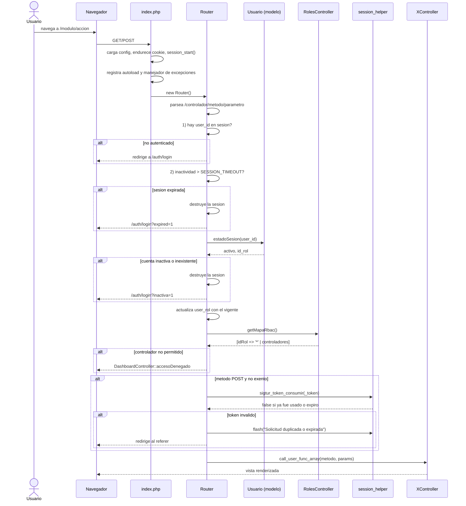
```mermaid
sequenceDiagram
    actor U as Usuario
    participant NAV as Navegador
    participant IDX as index.php
    participant RT as Router
    participant USU as Usuario (modelo)
    participant ROL as RolesController
    participant HLP as session_helper
    participant CTL as XController

    U->>NAV: navega a /modulo/accion
    NAV->>IDX: GET/POST
    IDX->>IDX: carga config, endurece cookie, session_start()
    IDX->>IDX: registra autoload y manejador de excepciones
    IDX->>RT: new Router()
    RT->>RT: parsea /controlador/metodo/parametro

    RT->>RT: 1) hay user_id en sesion?
    alt no autenticado
        RT-->>NAV: redirige a /auth/login
    end

    RT->>RT: 2) inactividad > SESSION_TIMEOUT?
    alt sesion expirada
        RT->>RT: destruye la sesion
        RT-->>NAV: /auth/login?expired=1
    end

    RT->>USU: estadoSesion(user_id)
    USU-->>RT: activo, id_rol
    alt cuenta inactiva o inexistente
        RT->>RT: destruye la sesion
        RT-->>NAV: /auth/login?inactiva=1
    end
    RT->>RT: actualiza user_rol con el vigente

    RT->>ROL: getMapaRbac()
    ROL-->>RT: [idRol => '*' | controladores]
    alt controlador no permitido
        RT-->>NAV: DashboardController::accesoDenegado
    end

    alt metodo POST y no exento
        RT->>HLP: sigtur_token_consumir(_token)
        HLP-->>RT: false si ya fue usado o expiro
        alt token invalido
            RT->>HLP: flash("Solicitud duplicada o expirada")
            RT-->>NAV: redirige al referer
        end
    end

    RT->>CTL: call_user_func_array(metodo, params)
    CTL-->>NAV: vista renderizada
```

> **Nota sobre el paso 3:** la sesión **no es prueba** de que la cuenta siga habilitada. Entre un
> clic y otro el Administrador pudo suspenderla, egresar a su titular o cambiarle el rol. Por eso
> se relee el estado en **cada petición** (una lectura por clave primaria).

---

## 2. CU-01 — Iniciar sesión

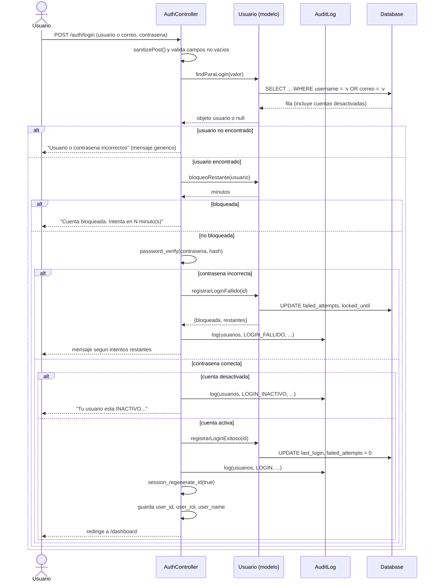
```mermaid
sequenceDiagram
    actor U as Usuario
    participant AC as AuthController
    participant USU as Usuario (modelo)
    participant AL as AuditLog
    participant DB as Database

    U->>AC: POST /auth/login (usuario o correo, contrasena)
    AC->>AC: sanitizePost() y valida campos no vacios
    AC->>USU: findParaLogin(valor)
    USU->>DB: SELECT ... WHERE username = :v OR correo = :v
    DB-->>USU: fila (incluye cuentas desactivadas)
    USU-->>AC: objeto usuario o null

    alt usuario no encontrado
        AC-->>U: "Usuario o contrasena incorrectos" (mensaje generico)
    else usuario encontrado
        AC->>USU: bloqueoRestante(usuario)
        USU-->>AC: minutos
        alt bloqueada
            AC-->>U: "Cuenta bloqueada. Intenta en N minuto(s)"
        else no bloqueada
            AC->>AC: password_verify(contrasena, hash)
            alt contrasena incorrecta
                AC->>USU: registrarLoginFallido(id)
                USU->>DB: UPDATE failed_attempts, locked_until
                USU-->>AC: {bloqueada, restantes}
                AC->>AL: log(usuarios, LOGIN_FALLIDO, ...)
                AC-->>U: mensaje segun intentos restantes
            else contrasena correcta
                alt cuenta desactivada
                    AC->>AL: log(usuarios, LOGIN_INACTIVO, ...)
                    AC-->>U: "Tu usuario esta INACTIVO..."
                else cuenta activa
                    AC->>USU: registrarLoginExitoso(id)
                    USU->>DB: UPDATE last_login, failed_attempts = 0
                    AC->>AL: log(usuarios, LOGIN, ...)
                    AC->>AC: session_regenerate_id(true)
                    AC->>AC: guarda user_id, user_rol, user_name
                    AC-->>U: redirige a /dashboard
                end
            end
        end
    end
```

**Decisiones de diseño visibles en el diagrama:**
- El mensaje de credenciales inválidas es **genérico a propósito**: no revela si el usuario existe.
- Una cuenta desactivada **con credenciales correctas** sí recibe explicación: de otro modo el
  usuario queda a ciegas.
- El identificador de sesión se **regenera** al autenticar (mitiga fijación de sesión).

---

## 3. CU-02 — Recuperar contraseña

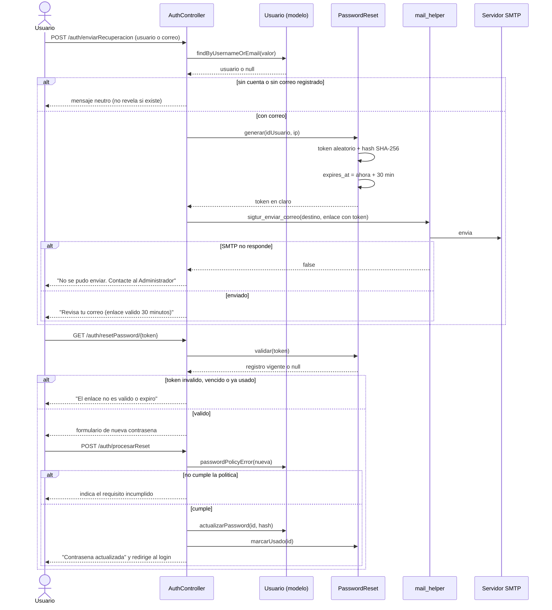
```mermaid
sequenceDiagram
    actor U as Usuario
    participant AC as AuthController
    participant USU as Usuario (modelo)
    participant PR as PasswordReset
    participant MH as mail_helper
    participant SMTP as Servidor SMTP

    U->>AC: POST /auth/enviarRecuperacion (usuario o correo)
    AC->>USU: findByUsernameOrEmail(valor)
    USU-->>AC: usuario o null
    alt sin cuenta o sin correo registrado
        AC-->>U: mensaje neutro (no revela si existe)
    else con correo
        AC->>PR: generar(idUsuario, ip)
        PR->>PR: token aleatorio + hash SHA-256
        PR->>PR: expires_at = ahora + 30 min
        PR-->>AC: token en claro
        AC->>MH: sigtur_enviar_correo(destino, enlace con token)
        MH->>SMTP: envia
        alt SMTP no responde
            MH-->>AC: false
            AC-->>U: "No se pudo enviar. Contacte al Administrador"
        else enviado
            AC-->>U: "Revisa tu correo (enlace valido 30 minutos)"
        end
    end

    U->>AC: GET /auth/resetPassword/{token}
    AC->>PR: validar(token)
    PR-->>AC: registro vigente o null
    alt token invalido, vencido o ya usado
        AC-->>U: "El enlace no es valido o expiro"
    else valido
        AC-->>U: formulario de nueva contrasena
        U->>AC: POST /auth/procesarReset
        AC->>USU: passwordPolicyError(nueva)
        alt no cumple la politica
            AC-->>U: indica el requisito incumplido
        else cumple
            AC->>USU: actualizarPassword(id, hash)
            AC->>PR: marcarUsado(id)
            AC-->>U: "Contrasena actualizada" y redirige al login
        end
    end
```

---

## 4. CU-10 — Registrar un trabajador

**Punto crítico: la atomicidad.** Nunca puede quedar una persona sin empleado ni al revés.

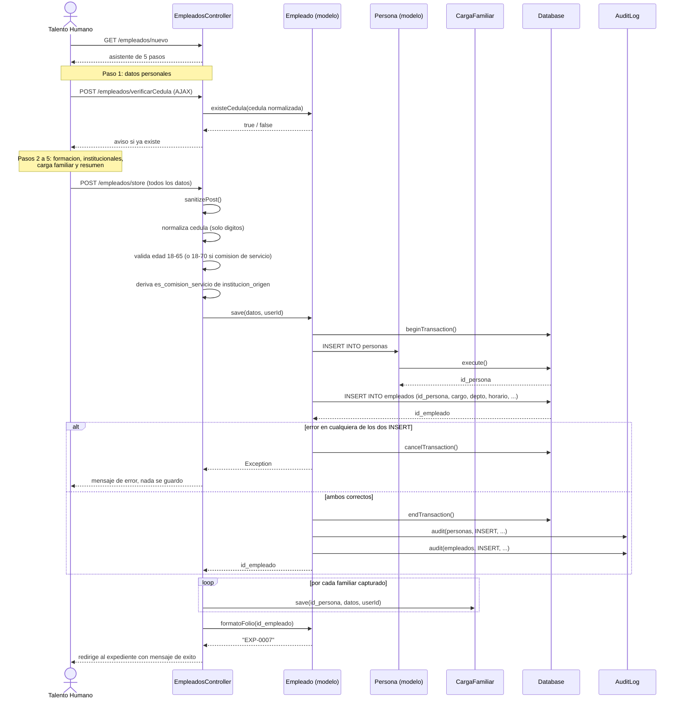
```mermaid
sequenceDiagram
    actor TH as Talento Humano
    participant EC as EmpleadosController
    participant EM as Empleado (modelo)
    participant PE as Persona (modelo)
    participant CF as CargaFamiliar
    participant DB as Database
    participant AL as AuditLog

    TH->>EC: GET /empleados/nuevo
    EC-->>TH: asistente de 5 pasos

    Note over TH,EC: Paso 1: datos personales
    TH->>EC: POST /empleados/verificarCedula (AJAX)
    EC->>EM: existeCedula(cedula normalizada)
    EM-->>EC: true / false
    EC-->>TH: aviso si ya existe

    Note over TH: Pasos 2 a 5: formacion, institucionales,<br/>carga familiar y resumen

    TH->>EC: POST /empleados/store (todos los datos)
    EC->>EC: sanitizePost()
    EC->>EC: normaliza cedula (solo digitos)
    EC->>EC: valida edad 18-65 (o 18-70 si comision de servicio)
    EC->>EC: deriva es_comision_servicio de institucion_origen

    EC->>EM: save(datos, userId)
    EM->>DB: beginTransaction()
    EM->>PE: INSERT INTO personas
    PE->>DB: execute()
    DB-->>PE: id_persona
    EM->>DB: INSERT INTO empleados (id_persona, cargo, depto, horario, ...)
    DB-->>EM: id_empleado

    alt error en cualquiera de los dos INSERT
        EM->>DB: cancelTransaction()
        EM-->>EC: Exception
        EC-->>TH: mensaje de error, nada se guardo
    else ambos correctos
        EM->>DB: endTransaction()
        EM->>AL: audit(personas, INSERT, ...)
        EM->>AL: audit(empleados, INSERT, ...)
        EM-->>EC: id_empleado
    end

    loop por cada familiar capturado
        EC->>CF: save(id_persona, datos, userId)
    end

    EC->>EM: formatoFolio(id_empleado)
    EM-->>EC: "EXP-0007"
    EC-->>TH: redirige al expediente con mensaje de exito
```

---

## 5. CU-23 — Marcar asistencia (patrón toggle)

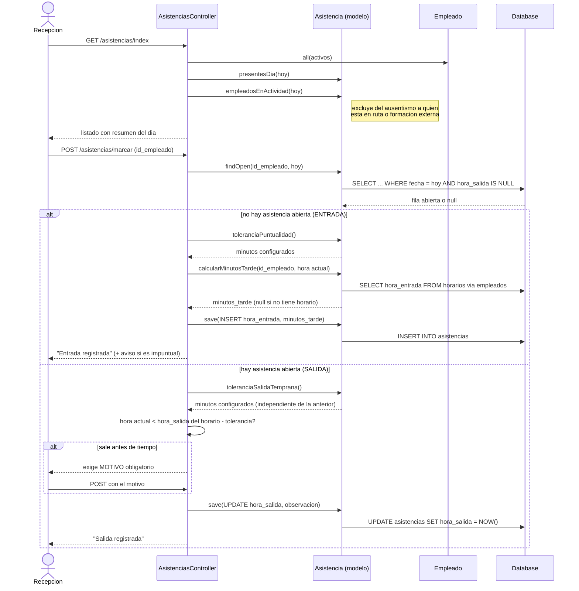
```mermaid
sequenceDiagram
    actor R as Recepcion
    participant AC as AsistenciasController
    participant AS as Asistencia (modelo)
    participant EM as Empleado
    participant DB as Database

    R->>AC: GET /asistencias/index
    AC->>EM: all(activos)
    AC->>AS: presentesDia(hoy)
    AC->>AS: empleadosEnActividad(hoy)
    Note right of AS: excluye del ausentismo a quien<br/>esta en ruta o formacion externa
    AC-->>R: listado con resumen del dia

    R->>AC: POST /asistencias/marcar (id_empleado)
    AC->>AS: findOpen(id_empleado, hoy)
    AS->>DB: SELECT ... WHERE fecha = hoy AND hora_salida IS NULL
    DB-->>AS: fila abierta o null

    alt no hay asistencia abierta (ENTRADA)
        AC->>AS: toleranciaPuntualidad()
        AS-->>AC: minutos configurados
        AC->>AS: calcularMinutosTarde(id_empleado, hora actual)
        AS->>DB: SELECT hora_entrada FROM horarios via empleados
        AS-->>AC: minutos_tarde (null si no tiene horario)
        AC->>AS: save(INSERT hora_entrada, minutos_tarde)
        AS->>DB: INSERT INTO asistencias
        AC-->>R: "Entrada registrada" (+ aviso si es impuntual)
    else hay asistencia abierta (SALIDA)
        AC->>AS: toleranciaSalidaTemprana()
        AS-->>AC: minutos configurados (independiente de la anterior)
        AC->>AC: hora actual < hora_salida del horario - tolerancia?
        alt sale antes de tiempo
            AC-->>R: exige MOTIVO obligatorio
            R->>AC: POST con el motivo
        end
        AC->>AS: save(UPDATE hora_salida, observacion)
        AS->>DB: UPDATE asistencias SET hora_salida = NOW()
        AC-->>R: "Salida registrada"
    end
```

> **Las asistencias son bitácora: no se eliminan.** No existe endpoint de borrado; si hay un error,
> se documenta en la observación.

---

## 6. CU-19 — Emitir una constancia

Muestra el mecanismo de **correlativo atómico**, común a todos los documentos oficiales.

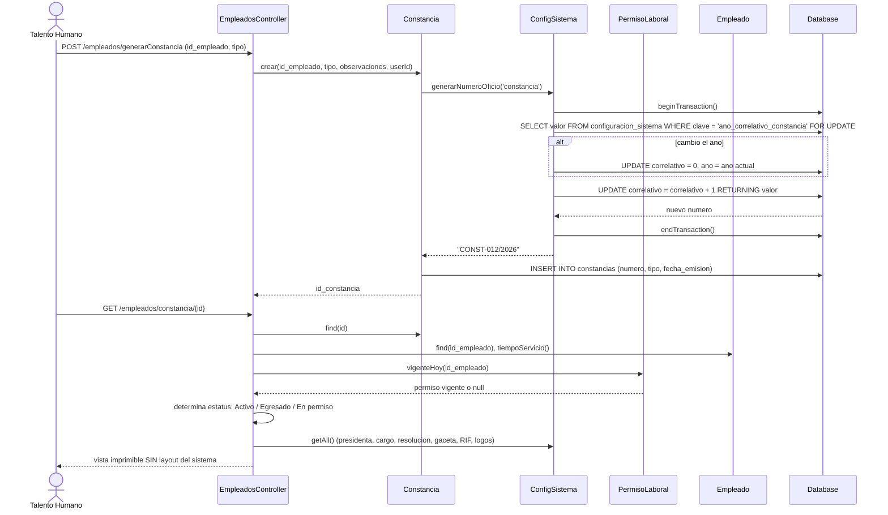
```mermaid
sequenceDiagram
    actor TH as Talento Humano
    participant EC as EmpleadosController
    participant CO as Constancia
    participant CS as ConfigSistema
    participant PL as PermisoLaboral
    participant EM as Empleado
    participant DB as Database

    TH->>EC: POST /empleados/generarConstancia (id_empleado, tipo)
    EC->>CO: crear(id_empleado, tipo, observaciones, userId)
    CO->>CS: generarNumeroOficio('constancia')
    CS->>DB: beginTransaction()
    CS->>DB: SELECT valor FROM configuracion_sistema WHERE clave = 'ano_correlativo_constancia' FOR UPDATE
    alt cambio el ano
        CS->>DB: UPDATE correlativo = 0, ano = ano actual
    end
    CS->>DB: UPDATE correlativo = correlativo + 1 RETURNING valor
    DB-->>CS: nuevo numero
    CS->>DB: endTransaction()
    CS-->>CO: "CONST-012/2026"
    CO->>DB: INSERT INTO constancias (numero, tipo, fecha_emision)
    CO-->>EC: id_constancia

    TH->>EC: GET /empleados/constancia/{id}
    EC->>CO: find(id)
    EC->>EM: find(id_empleado), tiempoServicio()
    EC->>PL: vigenteHoy(id_empleado)
    PL-->>EC: permiso vigente o null
    EC->>EC: determina estatus: Activo / Egresado / En permiso
    EC->>CS: getAll() (presidenta, cargo, resolucion, gaceta, RIF, logos)
    EC-->>TH: vista imprimible SIN layout del sistema
```

> **El correlativo no se recicla.** Anular una constancia no libera su número: el documento pudo
> haber salido del instituto.

---

## 7. CU-30 — Generar la nómina quincenal

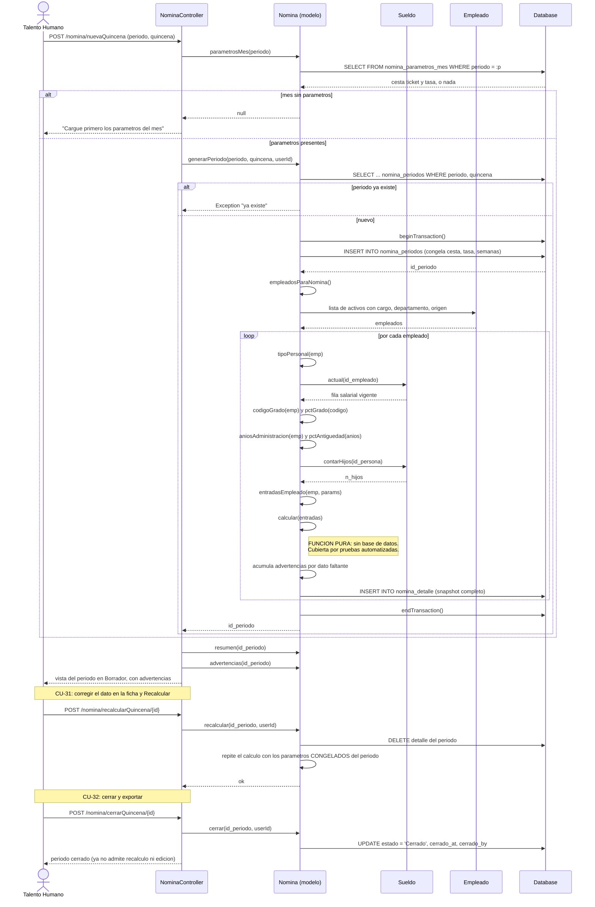
```mermaid
sequenceDiagram
    actor TH as Talento Humano
    participant NC as NominaController
    participant NM as Nomina (modelo)
    participant SU as Sueldo
    participant EM as Empleado
    participant DB as Database

    TH->>NC: POST /nomina/nuevaQuincena (periodo, quincena)
    NC->>NM: parametrosMes(periodo)
    NM->>DB: SELECT FROM nomina_parametros_mes WHERE periodo = :p
    DB-->>NM: cesta ticket y tasa, o nada
    alt mes sin parametros
        NM-->>NC: null
        NC-->>TH: "Cargue primero los parametros del mes"
    else parametros presentes
        NC->>NM: generarPeriodo(periodo, quincena, userId)
        NM->>DB: SELECT ... nomina_periodos WHERE periodo, quincena
        alt periodo ya existe
            NM-->>NC: Exception "ya existe"
        else nuevo
            NM->>DB: beginTransaction()
            NM->>DB: INSERT INTO nomina_periodos (congela cesta, tasa, semanas)
            DB-->>NM: id_periodo

            NM->>NM: empleadosParaNomina()
            NM->>EM: lista de activos con cargo, departamento, origen
            EM-->>NM: empleados

            loop por cada empleado
                NM->>NM: tipoPersonal(emp)
                NM->>SU: actual(id_empleado)
                SU-->>NM: fila salarial vigente
                NM->>NM: codigoGrado(emp) y pctGrado(codigo)
                NM->>NM: aniosAdministracion(emp) y pctAntiguedad(anios)
                NM->>SU: contarHijos(id_persona)
                SU-->>NM: n_hijos
                NM->>NM: entradasEmpleado(emp, params)
                NM->>NM: calcular(entradas)
                Note right of NM: FUNCION PURA: sin base de datos.<br/>Cubierta por pruebas automatizadas.
                NM->>NM: acumula advertencias por dato faltante
                NM->>DB: INSERT INTO nomina_detalle (snapshot completo)
            end

            NM->>DB: endTransaction()
            NM-->>NC: id_periodo
        end
    end

    NC->>NM: resumen(id_periodo)
    NC->>NM: advertencias(id_periodo)
    NC-->>TH: vista del periodo en Borrador, con advertencias

    Note over TH,NC: CU-31: corregir el dato en la ficha y Recalcular
    TH->>NC: POST /nomina/recalcularQuincena/{id}
    NC->>NM: recalcular(id_periodo, userId)
    NM->>DB: DELETE detalle del periodo
    NM->>NM: repite el calculo con los parametros CONGELADOS del periodo
    NM-->>NC: ok

    Note over TH,NC: CU-32: cerrar y exportar
    TH->>NC: POST /nomina/cerrarQuincena/{id}
    NC->>NM: cerrar(id_periodo, userId)
    NM->>DB: UPDATE estado = 'Cerrado', cerrado_at, cerrado_by
    NC-->>TH: periodo cerrado (ya no admite recalculo ni edicion)
```

> **En ningún punto se consulta internet.** La tasa del dólar se congela al generar el período;
> `TasaBcv` solo interviene cuando el usuario pide la sugerencia en la pantalla de parámetros.

---

## 8. CU-45 → CU-56 — Ciclo completo de una salida de ruta

Es el flujo más largo del sistema: **solicitud → aprobación → preparación → ejecución → cierre**.

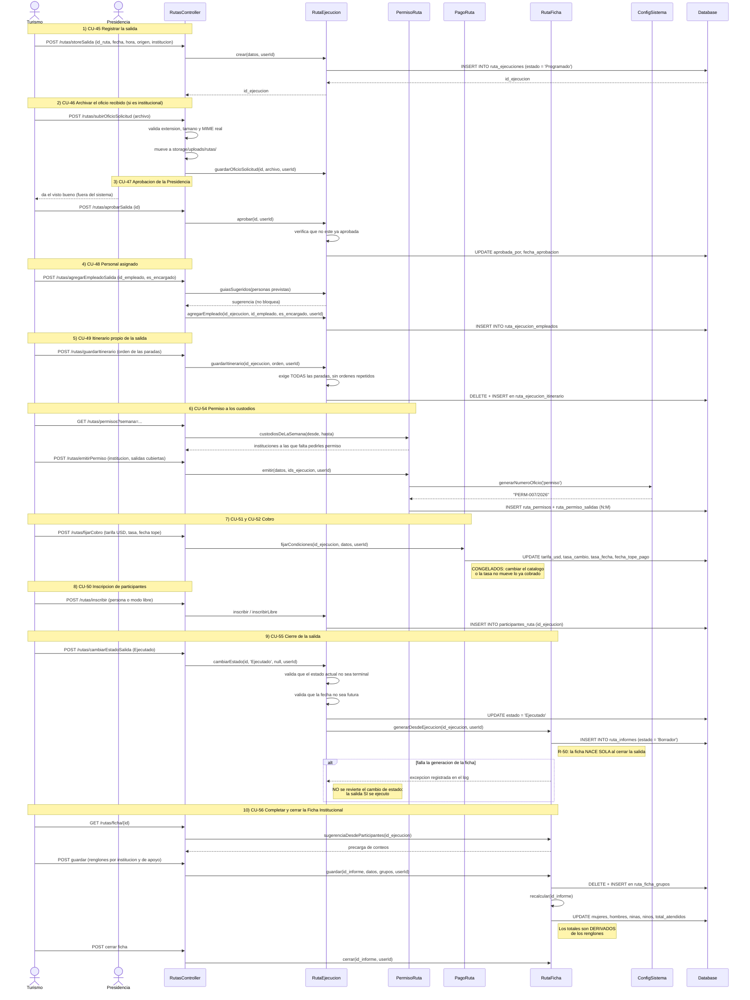
```mermaid
sequenceDiagram
    actor TU as Turismo
    actor PR as Presidencia
    participant RC as RutasController
    participant RE as RutaEjecucion
    participant PM as PermisoRuta
    participant PG as PagoRuta
    participant RF as RutaFicha
    participant CS as ConfigSistema
    participant DB as Database

    Note over TU,RC: 1) CU-45 Registrar la salida
    TU->>RC: POST /rutas/storeSalida (id_ruta, fecha, hora, origen, institucion)
    RC->>RE: crear(datos, userId)
    RE->>DB: INSERT INTO ruta_ejecuciones (estado = 'Programado')
    DB-->>RE: id_ejecucion
    RE-->>RC: id_ejecucion

    Note over TU,RC: 2) CU-46 Archivar el oficio recibido (si es institucional)
    TU->>RC: POST /rutas/subirOficioSolicitud (archivo)
    RC->>RC: valida extension, tamano y MIME real
    RC->>RC: mueve a storage/uploads/rutas/
    RC->>RE: guardarOficioSolicitud(id, archivo, userId)

    Note over PR,RC: 3) CU-47 Aprobacion de la Presidencia
    PR-->>TU: da el visto bueno (fuera del sistema)
    TU->>RC: POST /rutas/aprobarSalida (id)
    RC->>RE: aprobar(id, userId)
    RE->>RE: verifica que no este ya aprobada
    RE->>DB: UPDATE aprobada_por, fecha_aprobacion

    Note over TU,RC: 4) CU-48 Personal asignado
    TU->>RC: POST /rutas/agregarEmpleadoSalida (id_empleado, es_encargado)
    RC->>RE: guiasSugeridos(personas previstas)
    RE-->>RC: sugerencia (no bloquea)
    RC->>RE: agregarEmpleado(id_ejecucion, id_empleado, es_encargado, userId)
    RE->>DB: INSERT INTO ruta_ejecucion_empleados

    Note over TU,RC: 5) CU-49 Itinerario propio de la salida
    TU->>RC: POST /rutas/guardarItinerario (orden de las paradas)
    RC->>RE: guardarItinerario(id_ejecucion, orden, userId)
    RE->>RE: exige TODAS las paradas, sin ordenes repetidos
    RE->>DB: DELETE + INSERT en ruta_ejecucion_itinerario

    Note over TU,PM: 6) CU-54 Permiso a los custodios
    TU->>RC: GET /rutas/permisos?semana=...
    RC->>PM: custodiosDeLaSemana(desde, hasta)
    PM-->>RC: instituciones a las que falta pedirles permiso
    TU->>RC: POST /rutas/emitirPermiso (institucion, salidas cubiertas)
    RC->>PM: emitir(datos, ids_ejecucion, userId)
    PM->>CS: generarNumeroOficio('permiso')
    CS-->>PM: "PERM-007/2026"
    PM->>DB: INSERT ruta_permisos + ruta_permiso_salidas (N:M)

    Note over TU,PG: 7) CU-51 y CU-52 Cobro
    TU->>RC: POST /rutas/fijarCobro (tarifa USD, tasa, fecha tope)
    RC->>PG: fijarCondiciones(id_ejecucion, datos, userId)
    PG->>DB: UPDATE tarifa_usd, tasa_cambio, tasa_fecha, fecha_tope_pago
    Note right of PG: CONGELADOS: cambiar el catalogo<br/>o la tasa no mueve lo ya cobrado

    Note over TU,RC: 8) CU-50 Inscripcion de participantes
    TU->>RC: POST /rutas/inscribir (persona o modo libre)
    RC->>RE: inscribir / inscribirLibre
    RE->>DB: INSERT INTO participantes_ruta (id_ejecucion)

    Note over TU,RF: 9) CU-55 Cierre de la salida
    TU->>RC: POST /rutas/cambiarEstadoSalida (Ejecutado)
    RC->>RE: cambiarEstado(id, 'Ejecutado', null, userId)
    RE->>RE: valida que el estado actual no sea terminal
    RE->>RE: valida que la fecha no sea futura
    RE->>DB: UPDATE estado = 'Ejecutado'
    RE->>RF: generarDesdeEjecucion(id_ejecucion, userId)
    RF->>DB: INSERT INTO ruta_informes (estado = 'Borrador')
    Note right of RF: R-50: la ficha NACE SOLA al cerrar la salida
    alt falla la generacion de la ficha
        RF-->>RE: excepcion registrada en el log
        Note right of RE: NO se revierte el cambio de estado:<br/>la salida SI se ejecuto
    end

    Note over TU,RF: 10) CU-56 Completar y cerrar la Ficha Institucional
    TU->>RC: GET /rutas/ficha/{id}
    RC->>RF: sugerenciaDesdeParticipantes(id_ejecucion)
    RF-->>RC: precarga de conteos
    TU->>RC: POST guardar (renglones por institucion y de apoyo)
    RC->>RF: guardar(id_informe, datos, grupos, userId)
    RF->>DB: DELETE + INSERT en ruta_ficha_grupos
    RF->>RF: recalcular(id_informe)
    RF->>DB: UPDATE mujeres, hombres, ninas, ninos, total_atendidos
    Note right of RF: Los totales son DERIVADOS<br/>de los renglones
    TU->>RC: POST cerrar ficha
    RC->>RF: cerrar(id_informe, userId)
```

### 8.1 Variante: salida no ejecutada y reprogramación

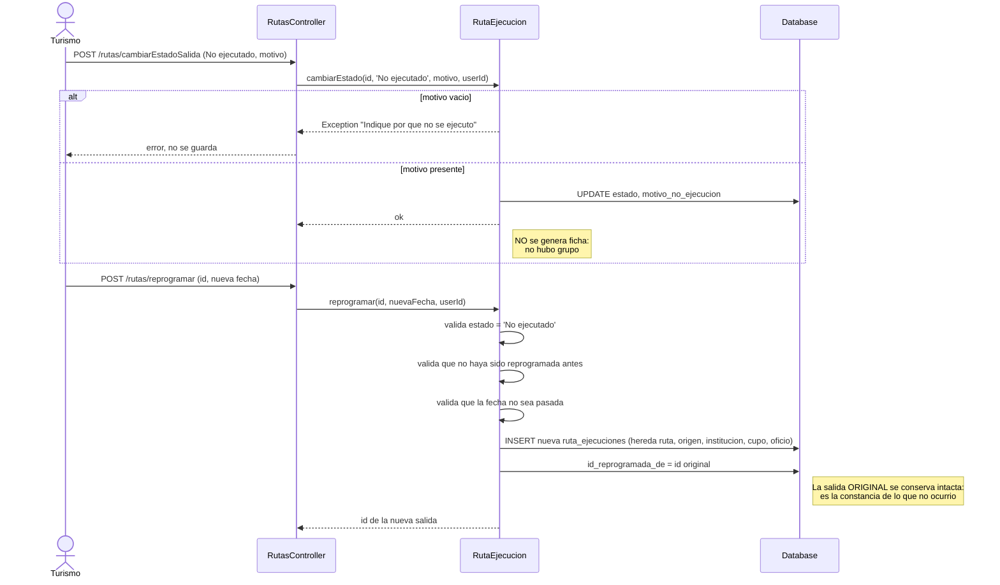
```mermaid
sequenceDiagram
    actor TU as Turismo
    participant RC as RutasController
    participant RE as RutaEjecucion
    participant DB as Database

    TU->>RC: POST /rutas/cambiarEstadoSalida (No ejecutado, motivo)
    RC->>RE: cambiarEstado(id, 'No ejecutado', motivo, userId)
    alt motivo vacio
        RE-->>RC: Exception "Indique por que no se ejecuto"
        RC-->>TU: error, no se guarda
    else motivo presente
        RE->>DB: UPDATE estado, motivo_no_ejecucion
        RE-->>RC: ok
        Note right of RE: NO se genera ficha:<br/>no hubo grupo
    end

    TU->>RC: POST /rutas/reprogramar (id, nueva fecha)
    RC->>RE: reprogramar(id, nuevaFecha, userId)
    RE->>RE: valida estado = 'No ejecutado'
    RE->>RE: valida que no haya sido reprogramada antes
    RE->>RE: valida que la fecha no sea pasada
    RE->>DB: INSERT nueva ruta_ejecuciones (hereda ruta, origen, institucion, cupo, oficio)
    RE->>DB: id_reprogramada_de = id original
    Note right of DB: La salida ORIGINAL se conserva intacta:<br/>es la constancia de lo que no ocurrio
    RE-->>RC: id de la nueva salida
```

---

## 9. CU-52 — Registrar un pago

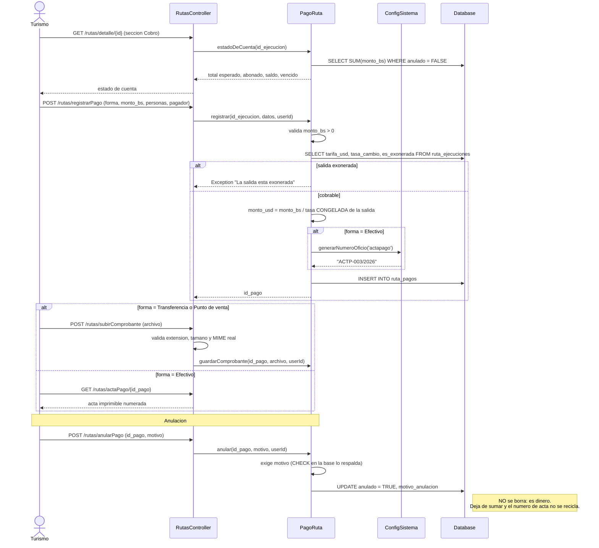
```mermaid
sequenceDiagram
    actor TU as Turismo
    participant RC as RutasController
    participant PG as PagoRuta
    participant CS as ConfigSistema
    participant DB as Database

    TU->>RC: GET /rutas/detalle/{id} (seccion Cobro)
    RC->>PG: estadoDeCuenta(id_ejecucion)
    PG->>DB: SELECT SUM(monto_bs) WHERE anulado = FALSE
    PG-->>RC: total esperado, abonado, saldo, vencido
    RC-->>TU: estado de cuenta

    TU->>RC: POST /rutas/registrarPago (forma, monto_bs, personas, pagador)
    RC->>PG: registrar(id_ejecucion, datos, userId)
    PG->>PG: valida monto_bs > 0
    PG->>DB: SELECT tarifa_usd, tasa_cambio, es_exonerada FROM ruta_ejecuciones
    alt salida exonerada
        PG-->>RC: Exception "La salida esta exonerada"
    else cobrable
        PG->>PG: monto_usd = monto_bs / tasa CONGELADA de la salida
        alt forma = Efectivo
            PG->>CS: generarNumeroOficio('actapago')
            CS-->>PG: "ACTP-003/2026"
        end
        PG->>DB: INSERT INTO ruta_pagos
        PG-->>RC: id_pago
    end

    alt forma = Transferencia o Punto de venta
        TU->>RC: POST /rutas/subirComprobante (archivo)
        RC->>RC: valida extension, tamano y MIME real
        RC->>PG: guardarComprobante(id_pago, archivo, userId)
    else forma = Efectivo
        TU->>RC: GET /rutas/actaPago/{id_pago}
        RC-->>TU: acta imprimible numerada
    end

    Note over TU,PG: Anulacion
    TU->>RC: POST /rutas/anularPago (id_pago, motivo)
    RC->>PG: anular(id_pago, motivo, userId)
    PG->>PG: exige motivo (CHECK en la base lo respalda)
    PG->>DB: UPDATE anulado = TRUE, motivo_anulacion
    Note right of DB: NO se borra: es dinero.<br/>Deja de sumar y el numero de acta no se recicla.
```

---

## 10. CU-54 — Permiso a institución custodia

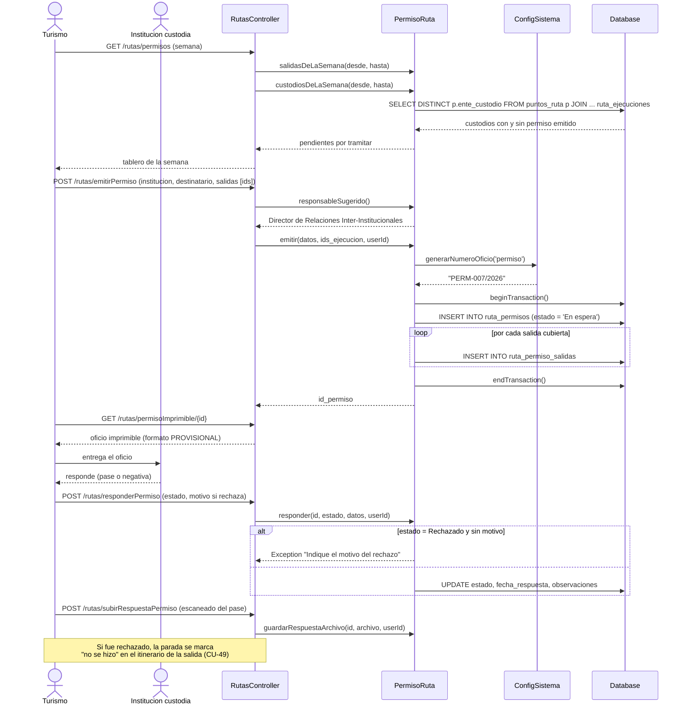
```mermaid
sequenceDiagram
    actor TU as Turismo
    actor IC as Institucion custodia
    participant RC as RutasController
    participant PM as PermisoRuta
    participant CS as ConfigSistema
    participant DB as Database

    TU->>RC: GET /rutas/permisos (semana)
    RC->>PM: salidasDeLaSemana(desde, hasta)
    RC->>PM: custodiosDeLaSemana(desde, hasta)
    PM->>DB: SELECT DISTINCT p.ente_custodio FROM puntos_ruta p JOIN ... ruta_ejecuciones
    DB-->>PM: custodios con y sin permiso emitido
    PM-->>RC: pendientes por tramitar
    RC-->>TU: tablero de la semana

    TU->>RC: POST /rutas/emitirPermiso (institucion, destinatario, salidas [ids])
    RC->>PM: responsableSugerido()
    PM-->>RC: Director de Relaciones Inter-Institucionales
    RC->>PM: emitir(datos, ids_ejecucion, userId)
    PM->>CS: generarNumeroOficio('permiso')
    CS-->>PM: "PERM-007/2026"
    PM->>DB: beginTransaction()
    PM->>DB: INSERT INTO ruta_permisos (estado = 'En espera')
    loop por cada salida cubierta
        PM->>DB: INSERT INTO ruta_permiso_salidas
    end
    PM->>DB: endTransaction()
    PM-->>RC: id_permiso

    TU->>RC: GET /rutas/permisoImprimible/{id}
    RC-->>TU: oficio imprimible (formato PROVISIONAL)
    TU->>IC: entrega el oficio

    IC-->>TU: responde (pase o negativa)
    TU->>RC: POST /rutas/responderPermiso (estado, motivo si rechaza)
    RC->>PM: responder(id, estado, datos, userId)
    alt estado = Rechazado y sin motivo
        PM-->>RC: Exception "Indique el motivo del rechazo"
    else
        PM->>DB: UPDATE estado, fecha_respuesta, observaciones
    end
    TU->>RC: POST /rutas/subirRespuestaPermiso (escaneado del pase)
    RC->>PM: guardarRespuestaArchivo(id, archivo, userId)

    Note over TU,RC: Si fue rechazado, la parada se marca<br/>"no se hizo" en el itinerario de la salida (CU-49)
```

---

## 11. CU-50 — Inscribir participante con validación de edad

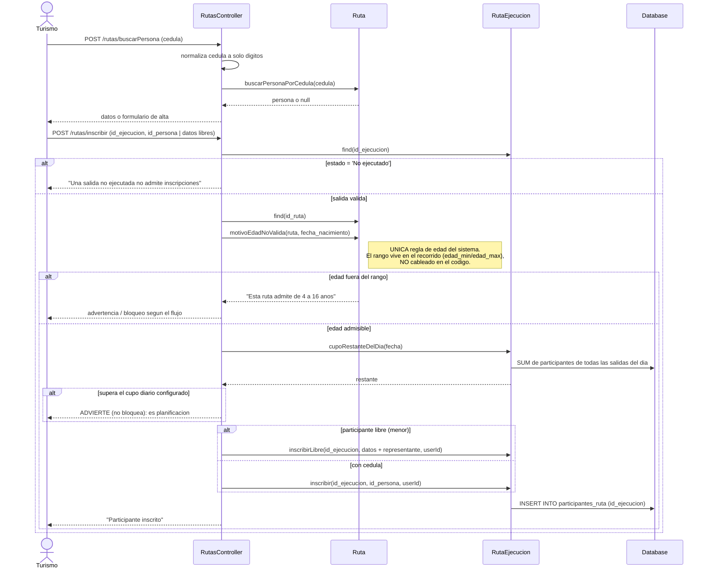
```mermaid
sequenceDiagram
    actor TU as Turismo
    participant RC as RutasController
    participant RU as Ruta
    participant RE as RutaEjecucion
    participant DB as Database

    TU->>RC: POST /rutas/buscarPersona (cedula)
    RC->>RC: normaliza cedula a solo digitos
    RC->>RU: buscarPersonaPorCedula(cedula)
    RU-->>RC: persona o null
    RC-->>TU: datos o formulario de alta

    TU->>RC: POST /rutas/inscribir (id_ejecucion, id_persona | datos libres)
    RC->>RE: find(id_ejecucion)
    alt estado = 'No ejecutado'
        RC-->>TU: "Una salida no ejecutada no admite inscripciones"
    else salida valida
        RC->>RU: find(id_ruta)
        RC->>RU: motivoEdadNoValida(ruta, fecha_nacimiento)
        Note right of RU: UNICA regla de edad del sistema.<br/>El rango vive en el recorrido (edad_min/edad_max),<br/>NO cableado en el codigo.
        alt edad fuera del rango
            RU-->>RC: "Esta ruta admite de 4 a 16 anos"
            RC-->>TU: advertencia / bloqueo segun el flujo
        else edad admisible
            RC->>RE: cupoRestanteDelDia(fecha)
            RE->>DB: SUM de participantes de todas las salidas del dia
            RE-->>RC: restante
            alt supera el cupo diario configurado
                RC-->>TU: ADVIERTE (no bloquea): es planificacion
            end
            alt participante libre (menor)
                RC->>RE: inscribirLibre(id_ejecucion, datos + representante, userId)
            else con cedula
                RC->>RE: inscribir(id_ejecucion, id_persona, userId)
            end
            RE->>DB: INSERT INTO participantes_ruta (id_ejecucion)
            RC-->>TU: "Participante inscrito"
        end
    end
```

---

## 12. CU-59 — Codificar un bien

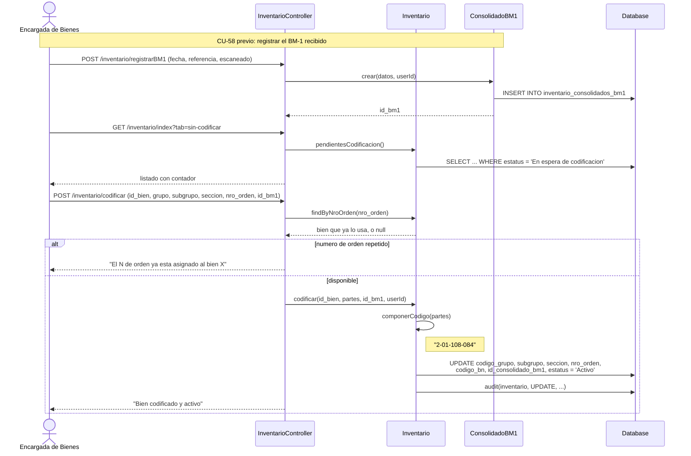
```mermaid
sequenceDiagram
    actor EB as Encargada de Bienes
    participant IC as InventarioController
    participant IN as Inventario
    participant BM as ConsolidadoBM1
    participant DB as Database

    Note over EB,BM: CU-58 previo: registrar el BM-1 recibido
    EB->>IC: POST /inventario/registrarBM1 (fecha, referencia, escaneado)
    IC->>BM: crear(datos, userId)
    BM->>DB: INSERT INTO inventario_consolidados_bm1
    BM-->>IC: id_bm1

    EB->>IC: GET /inventario/index?tab=sin-codificar
    IC->>IN: pendientesCodificacion()
    IN->>DB: SELECT ... WHERE estatus = 'En espera de codificacion'
    IC-->>EB: listado con contador

    EB->>IC: POST /inventario/codificar (id_bien, grupo, subgrupo, seccion, nro_orden, id_bm1)
    IC->>IN: findByNroOrden(nro_orden)
    IN-->>IC: bien que ya lo usa, o null
    alt numero de orden repetido
        IC-->>EB: "El N de orden ya esta asignado al bien X"
    else disponible
        IC->>IN: codificar(id_bien, partes, id_bm1, userId)
        IN->>IN: componerCodigo(partes)
        Note right of IN: "2-01-108-084"
        IN->>DB: UPDATE codigo_grupo, subgrupo, seccion, nro_orden,<br/>codigo_bn, id_consolidado_bm1, estatus = 'Activo'
        IN->>DB: audit(inventario, UPDATE, ...)
        IC-->>EB: "Bien codificado y activo"
    end
```

---

## 13. CU-66 — Acta de Desincorporación firmada

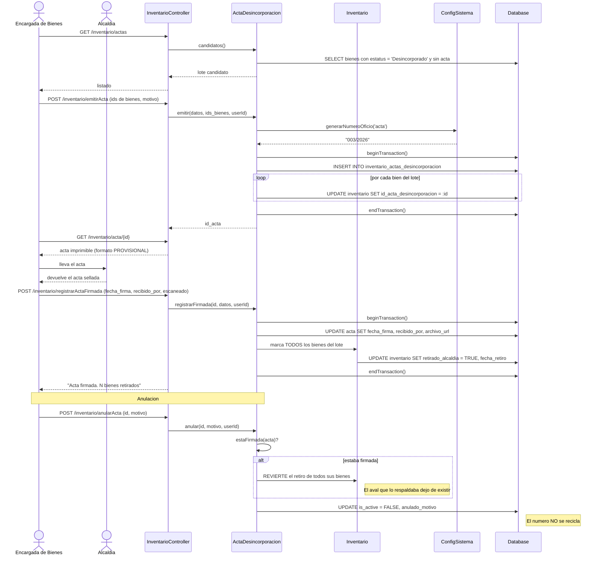
```mermaid
sequenceDiagram
    actor EB as Encargada de Bienes
    actor AL as Alcaldia
    participant IC as InventarioController
    participant AD as ActaDesincorporacion
    participant IN as Inventario
    participant CS as ConfigSistema
    participant DB as Database

    EB->>IC: GET /inventario/actas
    IC->>AD: candidatos()
    AD->>DB: SELECT bienes con estatus = 'Desincorporado' y sin acta
    AD-->>IC: lote candidato
    IC-->>EB: listado

    EB->>IC: POST /inventario/emitirActa (ids de bienes, motivo)
    IC->>AD: emitir(datos, ids_bienes, userId)
    AD->>CS: generarNumeroOficio('acta')
    CS-->>AD: "003/2026"
    AD->>DB: beginTransaction()
    AD->>DB: INSERT INTO inventario_actas_desincorporacion
    loop por cada bien del lote
        AD->>DB: UPDATE inventario SET id_acta_desincorporacion = :id
    end
    AD->>DB: endTransaction()
    AD-->>IC: id_acta

    EB->>IC: GET /inventario/acta/{id}
    IC-->>EB: acta imprimible (formato PROVISIONAL)
    EB->>AL: lleva el acta
    AL-->>EB: devuelve el acta sellada

    EB->>IC: POST /inventario/registrarActaFirmada (fecha_firma, recibido_por, escaneado)
    IC->>AD: registrarFirmada(id, datos, userId)
    AD->>DB: beginTransaction()
    AD->>DB: UPDATE acta SET fecha_firma, recibido_por, archivo_url
    AD->>IN: marca TODOS los bienes del lote
    IN->>DB: UPDATE inventario SET retirado_alcaldia = TRUE, fecha_retiro
    AD->>DB: endTransaction()
    IC-->>EB: "Acta firmada. N bienes retirados"

    Note over EB,AD: Anulacion
    EB->>IC: POST /inventario/anularActa (id, motivo)
    IC->>AD: anular(id, motivo, userId)
    AD->>AD: estaFirmada(acta)?
    alt estaba firmada
        AD->>IN: REVIERTE el retiro de todos sus bienes
        Note right of IN: El aval que lo respaldaba dejo de existir
    end
    AD->>DB: UPDATE is_active = FALSE, anulado_motivo
    Note right of DB: El numero NO se recicla
```

---

## 14. CU-70 — Registrar visita (patrón toggle)

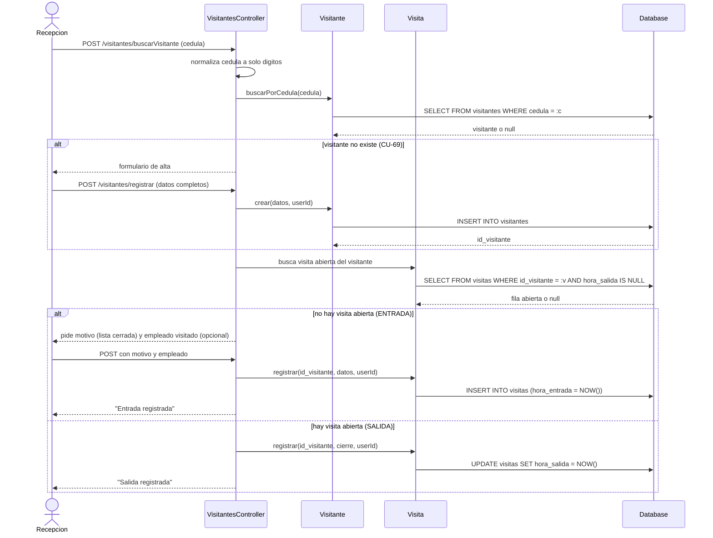
```mermaid
sequenceDiagram
    actor R as Recepcion
    participant VC as VisitantesController
    participant VI as Visitante
    participant VS as Visita
    participant DB as Database

    R->>VC: POST /visitantes/buscarVisitante (cedula)
    VC->>VC: normaliza cedula a solo digitos
    VC->>VI: buscarPorCedula(cedula)
    VI->>DB: SELECT FROM visitantes WHERE cedula = :c
    DB-->>VI: visitante o null

    alt visitante no existe (CU-69)
        VC-->>R: formulario de alta
        R->>VC: POST /visitantes/registrar (datos completos)
        VC->>VI: crear(datos, userId)
        VI->>DB: INSERT INTO visitantes
        DB-->>VI: id_visitante
    end

    VC->>VS: busca visita abierta del visitante
    VS->>DB: SELECT FROM visitas WHERE id_visitante = :v AND hora_salida IS NULL
    DB-->>VS: fila abierta o null

    alt no hay visita abierta (ENTRADA)
        VC-->>R: pide motivo (lista cerrada) y empleado visitado (opcional)
        R->>VC: POST con motivo y empleado
        VC->>VS: registrar(id_visitante, datos, userId)
        VS->>DB: INSERT INTO visitas (hora_entrada = NOW())
        VC-->>R: "Entrada registrada"
    else hay visita abierta (SALIDA)
        VC->>VS: registrar(id_visitante, cierre, userId)
        VS->>DB: UPDATE visitas SET hora_salida = NOW()
        VC-->>R: "Salida registrada"
    end
```

> **Las visitas son bitácora: no se eliminan.** El botón de borrado y su endpoint se retiraron; en
> su lugar hay *Ver detalles*.

---

## 15. Descarga de un archivo protegido

Mecanismo transversal: **ningún archivo subido es accesible por URL directa**.

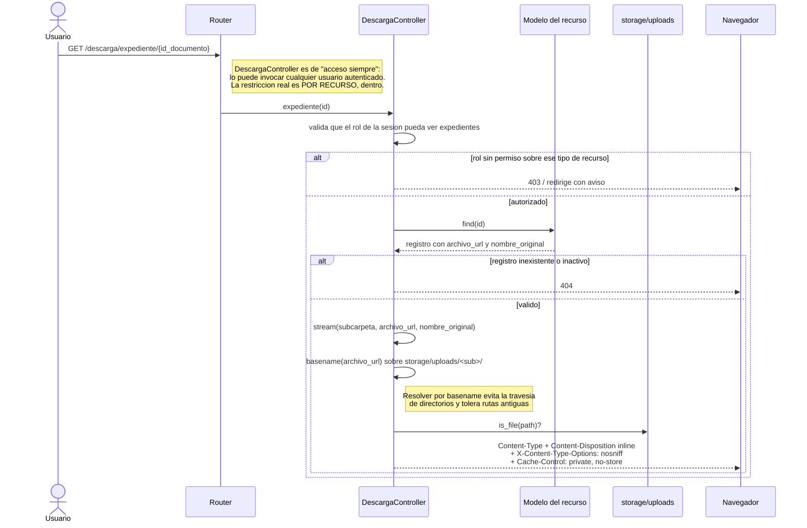
```mermaid
sequenceDiagram
    actor U as Usuario
    participant RT as Router
    participant DC as DescargaController
    participant MD as Modelo del recurso
    participant FS as storage/uploads
    participant NAV as Navegador

    U->>RT: GET /descarga/expediente/{id_documento}
    Note right of RT: DescargaController es de "acceso siempre":<br/>lo puede invocar cualquier usuario autenticado.<br/>La restriccion real es POR RECURSO, dentro.
    RT->>DC: expediente(id)
    DC->>DC: valida que el rol de la sesion pueda ver expedientes
    alt rol sin permiso sobre ese tipo de recurso
        DC-->>NAV: 403 / redirige con aviso
    else autorizado
        DC->>MD: find(id)
        MD-->>DC: registro con archivo_url y nombre_original
        alt registro inexistente o inactivo
            DC-->>NAV: 404
        else valido
            DC->>DC: stream(subcarpeta, archivo_url, nombre_original)
            DC->>DC: basename(archivo_url) sobre storage/uploads/<sub>/
            Note right of DC: Resolver por basename evita la travesia<br/>de directorios y tolera rutas antiguas
            DC->>FS: is_file(path)?
            DC-->>NAV: Content-Type + Content-Disposition inline<br/>+ X-Content-Type-Options: nosniff<br/>+ Cache-Control: private, no-store
        end
    end
```

**Endpoints de descarga, uno por tipo de recurso** (el identificador es del **recurso**, no del
archivo):

| Endpoint | Recurso | Roles autorizados |
|---|---|---|
| `expediente(idDoc)` | Recaudo del expediente | 1, 2 |
| `foto(idPersona)` | Foto de la persona (carnet) | 1, 2, 3 |
| `pasante(idDoc)` | Documento de pasante | 1, 3 |
| `taller(idEvidencia)` | Evidencia de formación | 1, 3 |
| `bien(idDoc)` · `bm1(id)` · `acta(id)` · `fotoBien(idBien)` | Documentos y fotos de bienes | 1, 4 |
| `oficioRuta(idEjecucion)` | Oficio de solicitud recibido | 1, 3 |
| `permisoRuta(idPermiso)` | Pase recibido del custodio | 1, 3 |
| `comprobantePago(idPago)` | Comprobante de pago | 1, 3 |

> Cada tipo tiene su propio método **a propósito**: si `bien()` sirviera también las actas, el
> identificador de una tabla resolvería contra otra y entregaría el archivo equivocado.

---

## 16. Exportación de un listado

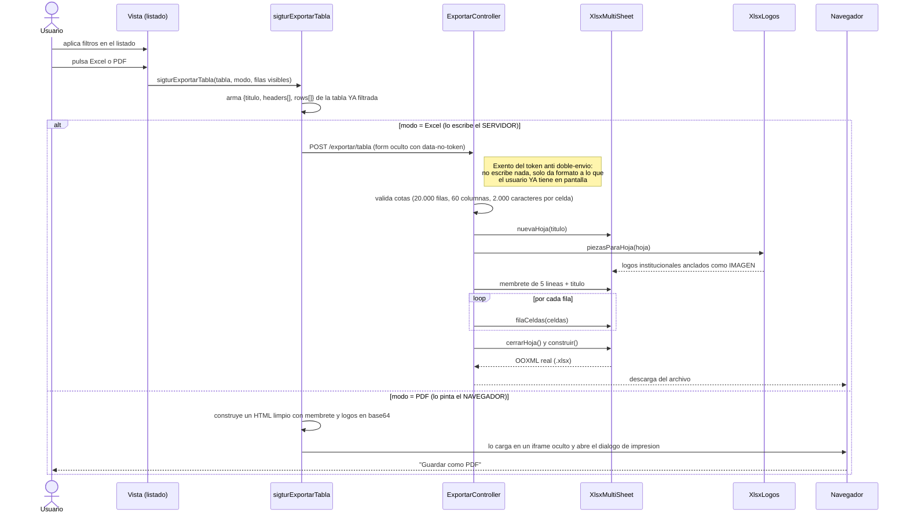
```mermaid
sequenceDiagram
    actor U as Usuario
    participant V as Vista (listado)
    participant JS as sigturExportarTabla
    participant EC as ExportarController
    participant XL as XlsxMultiSheet
    participant XLG as XlsxLogos
    participant NAV as Navegador

    U->>V: aplica filtros en el listado
    U->>V: pulsa Excel o PDF
    V->>JS: sigturExportarTabla(tabla, modo, filas visibles)
    JS->>JS: arma {titulo, headers[], rows[]} de la tabla YA filtrada

    alt modo = Excel (lo escribe el SERVIDOR)
        JS->>EC: POST /exportar/tabla (form oculto con data-no-token)
        Note right of EC: Exento del token anti doble-envio:<br/>no escribe nada, solo da formato a lo que<br/>el usuario YA tiene en pantalla
        EC->>EC: valida cotas (20.000 filas, 60 columnas, 2.000 caracteres por celda)
        EC->>XL: nuevaHoja(titulo)
        EC->>XLG: piezasParaHoja(hoja)
        XLG-->>XL: logos institucionales anclados como IMAGEN
        EC->>XL: membrete de 5 lineas + titulo
        loop por cada fila
            EC->>XL: filaCeldas(celdas)
        end
        EC->>XL: cerrarHoja() y construir()
        XL-->>EC: OOXML real (.xlsx)
        EC-->>NAV: descarga del archivo
    else modo = PDF (lo pinta el NAVEGADOR)
        JS->>JS: construye un HTML limpio con membrete y logos en base64
        JS->>NAV: lo carga en un iframe oculto y abre el dialogo de impresion
        NAV-->>U: "Guardar como PDF"
    end
```

> **Por qué el Excel lo escribe el servidor.** Antes se armaba en el navegador un HTML con
> extensión `.xls`. Excel lo abre, pero **no dibuja imágenes en `data:` URI**: el membrete salía con
> dos recuadros rotos y las celdas que los contenían estrechaban la primera y la última columna.
> Mandando las filas al servidor se obtiene un `.xlsx` de verdad, con los logos anclados como
> imagen. En el PDF, en cambio, los logos **sí** se incrustan: lo pinta el navegador.

> **`ExportarController` no expone datos nuevos:** solo da formato al listado que el propio módulo
> del usuario ya le mostró, **ya filtrado por el control de acceso de ese módulo**.

---

## 17. CU-S01 — Tarea programada de estados

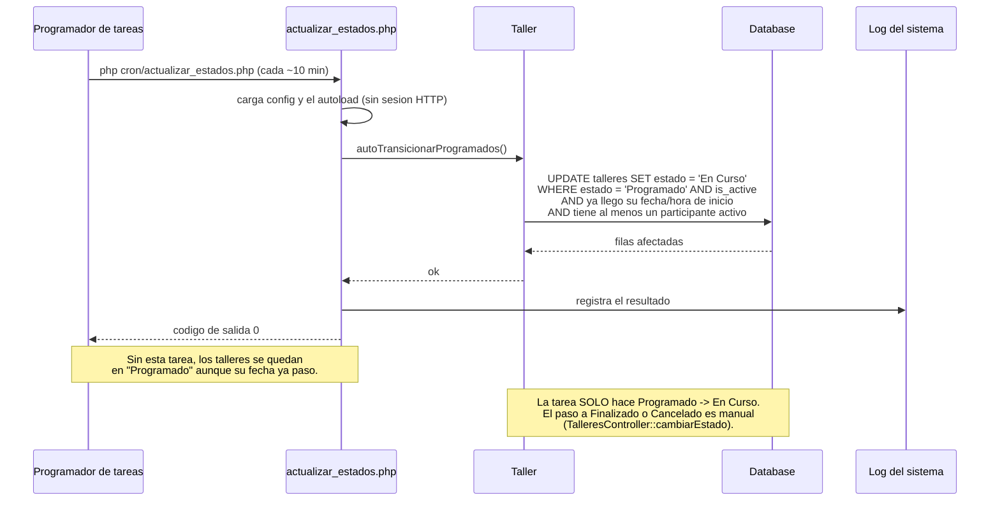
```mermaid
sequenceDiagram
    participant SCH as Programador de tareas
    participant CLI as actualizar_estados.php
    participant TA as Taller
    participant DB as Database
    participant LOG as Log del sistema

    SCH->>CLI: php cron/actualizar_estados.php (cada ~10 min)
    CLI->>CLI: carga config y el autoload (sin sesion HTTP)
    CLI->>TA: autoTransicionarProgramados()
    TA->>DB: UPDATE talleres SET estado = 'En Curso'<br/>WHERE estado = 'Programado' AND is_active<br/>AND ya llego su fecha/hora de inicio<br/>AND tiene al menos un participante activo
    DB-->>TA: filas afectadas
    TA-->>CLI: ok
    CLI->>LOG: registra el resultado
    CLI-->>SCH: codigo de salida 0

    Note over SCH,CLI: Sin esta tarea, los talleres se quedan<br/>en "Programado" aunque su fecha ya paso.
    Note over TA,DB: La tarea SOLO hace Programado -> En Curso.<br/>El paso a Finalizado o Cancelado es manual<br/>(TalleresController::cambiarEstado).
```

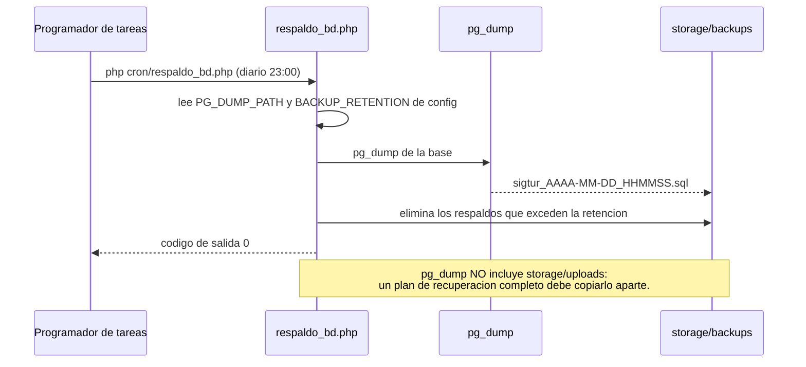
```mermaid
sequenceDiagram
    participant SCH as Programador de tareas
    participant CLI as respaldo_bd.php
    participant PGD as pg_dump
    participant FS as storage/backups

    SCH->>CLI: php cron/respaldo_bd.php (diario 23:00)
    CLI->>CLI: lee PG_DUMP_PATH y BACKUP_RETENTION de config
    CLI->>PGD: pg_dump de la base
    PGD-->>FS: sigtur_AAAA-MM-DD_HHMMSS.sql
    CLI->>FS: elimina los respaldos que exceden la retencion
    CLI-->>SCH: codigo de salida 0

    Note over CLI,FS: pg_dump NO incluye storage/uploads:<br/>un plan de recuperacion completo debe copiarlo aparte.
```

---

## 18. Auditoría automática (mecanismo transversal)

Ocurre **en toda escritura**, sin que el llamador lo pida.

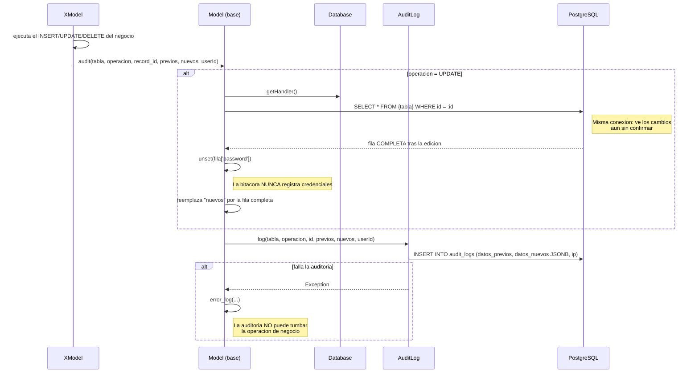
```mermaid
sequenceDiagram
    participant MD as XModel
    participant M as Model (base)
    participant DB as Database
    participant AL as AuditLog
    participant PG as PostgreSQL

    MD->>MD: ejecuta el INSERT/UPDATE/DELETE del negocio
    MD->>M: audit(tabla, operacion, record_id, previos, nuevos, userId)

    alt operacion = UPDATE
        M->>DB: getHandler()
        M->>PG: SELECT * FROM {tabla} WHERE id = :id
        Note right of PG: Misma conexion: ve los cambios<br/>aun sin confirmar
        PG-->>M: fila COMPLETA tras la edicion
        M->>M: unset(fila['password'])
        Note right of M: La bitacora NUNCA registra credenciales
        M->>M: reemplaza "nuevos" por la fila completa
    end

    M->>AL: log(tabla, operacion, id, previos, nuevos, userId)
    AL->>PG: INSERT INTO audit_logs (datos_previos, datos_nuevos JSONB, ip)

    alt falla la auditoria
        AL-->>M: Exception
        M->>M: error_log(...)
        Note right of M: La auditoria NO puede tumbar<br/>la operacion de negocio
    end
```

**Por qué se relee la fila completa en un UPDATE:** si se registrara solo el subconjunto de campos
que cada modelo arma a mano, el diff de la bitácora quedaría incompleto y la papelera no podría
restaurar el estado real. Releer garantiza que el registro refleje **todos** los campos.

---

## Anexo — Índice de flujos por módulo

| Módulo | Diagramas de este documento |
|---|---|
| Transversal | §1 flujo base · §15 descarga · §16 exportación · §18 auditoría |
| Seguridad | §2 inicio de sesión · §3 recuperación de contraseña |
| RRHH | §4 registro de trabajador · §5 asistencia · §6 constancia |
| Nómina | §7 nómina quincenal |
| Turismo | §8 ciclo de la salida · §8.1 reprogramación · §9 pago · §10 permiso · §11 inscripción |
| Bienes | §12 codificación · §13 acta de desincorporación |
| Recepción | §14 visita |
| Procesos por lotes | §17 tareas programadas |
