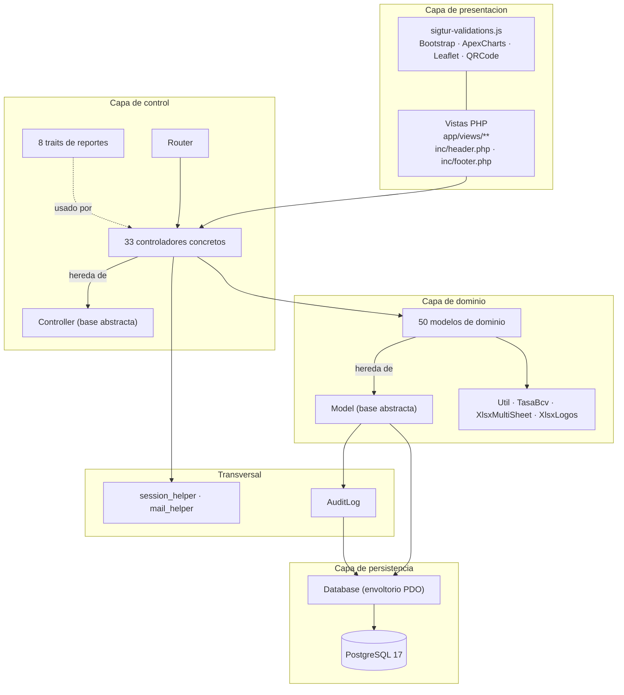
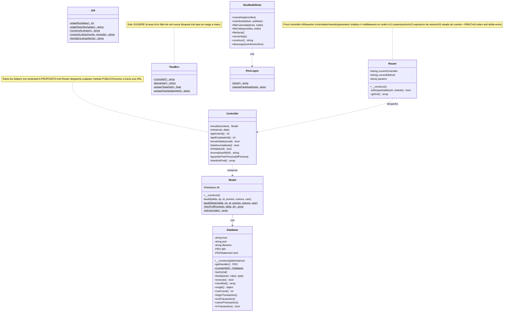
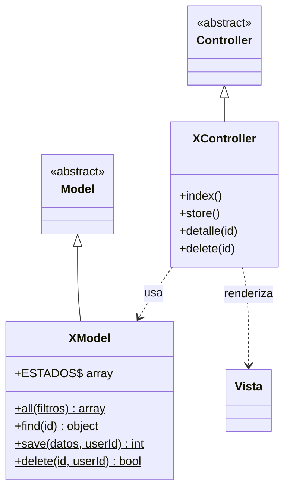
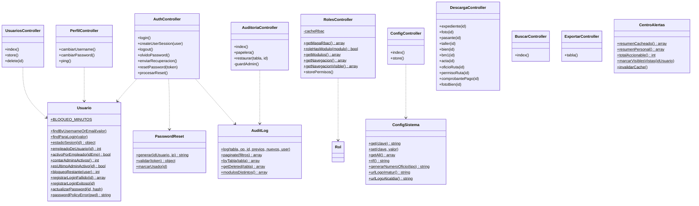
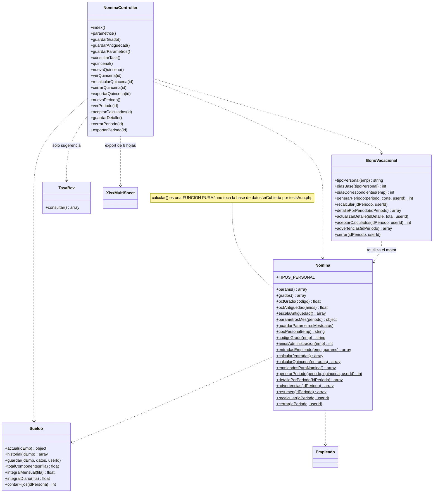
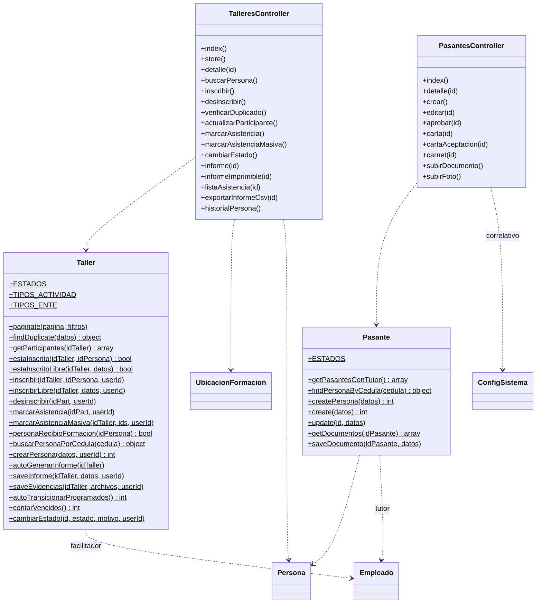
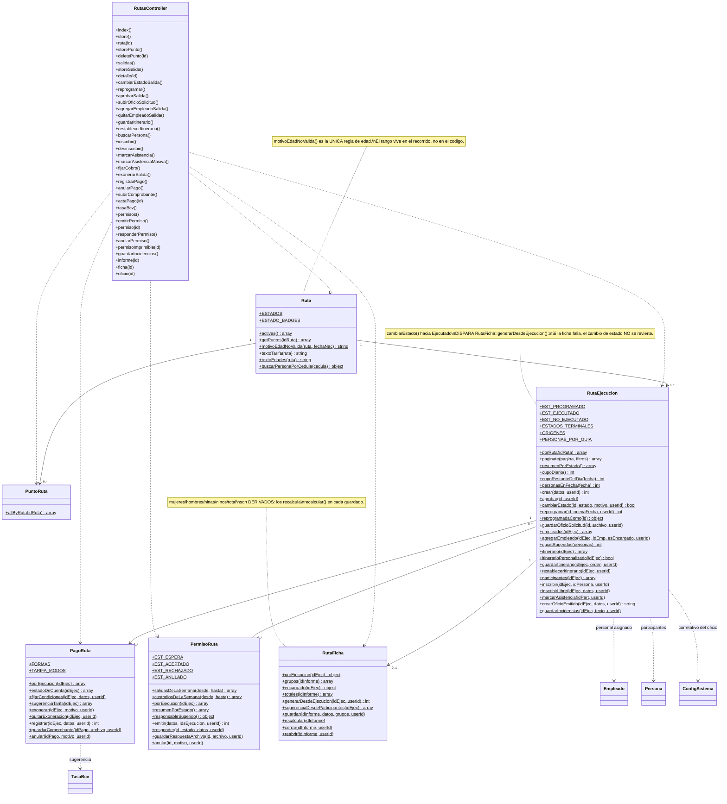
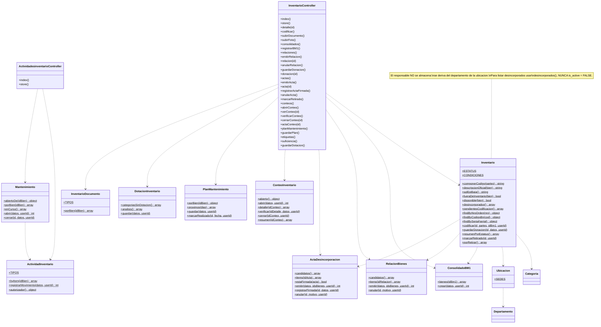

# Diagrama de Clases

**SIGTUR-IMATUR** · MVC en PHP 8 sin framework · **Última actualización:** 2026-09-19
**Inventario:** 8 clases de núcleo · 33 controladores (+8 traits de reportes) · 50 modelos

> **Para qué sirve.** Insumo para dibujar el **diagrama de clases** del sistema. Presenta primero
> la **arquitectura de capas** (las clases base que todo lo demás hereda), luego los diagramas por
> módulo con atributos y operaciones relevantes, y por último las tablas de referencia con **todas**
> las clases y sus responsabilidades.
>
> **Criterio de recorte:** se documentan los métodos **públicos que representan comportamiento de
> negocio**. Los CRUD homogéneos (`all`, `find`, `save`, `delete`) se declaran una sola vez en la
> plantilla de `Model` y no se repiten en cada clase.

---

## Índice

1. [Arquitectura de capas](#1-arquitectura-de-capas)
2. [Clases del núcleo](#2-clases-del-núcleo)
3. [Patrón de controlador y modelo](#3-patrón-de-controlador-y-modelo)
4. [Diagrama de clases — Seguridad y Sistema](#4-diagrama-de-clases--seguridad-y-sistema)
5. [Diagrama de clases — RRHH](#5-diagrama-de-clases--rrhh)
6. [Diagrama de clases — Nómina](#6-diagrama-de-clases--nómina)
7. [Diagrama de clases — Formación](#7-diagrama-de-clases--formación)
8. [Diagrama de clases — Turismo](#8-diagrama-de-clases--turismo)
9. [Diagrama de clases — Bienes](#9-diagrama-de-clases--bienes)
10. [Diagrama de clases — Recepción y Reportes](#10-diagrama-de-clases--recepción-y-reportes)
11. [Catálogo completo de clases](#11-catálogo-completo-de-clases)
12. [Patrones y convenciones de diseño](#12-patrones-y-convenciones-de-diseño)

---

## 1. Arquitectura de capas

**Reglas de la arquitectura:**
- La **vista nunca toca la base de datos**: recibe datos ya resueltos por el controlador.
- El **modelo nunca imprime**: devuelve datos u lanza excepciones.
- El **controlador no construye SQL**: delega en el modelo.
- `Database` es el **único** punto que habla con PDO.

---

## 2. Clases del núcleo

### 2.1 Middlewares del `Router` (orden de ejecución)

| # | Middleware | Efecto si falla |
|---|---|---|
| 1 | **Autenticación** — ¿hay `user_id` en sesión? | Redirige a `AuthController::login` |
| 2 | **Expiración por inactividad** (30 min) | Destruye la sesión y redirige con aviso |
| 3 | **Estado de cuenta** — relee `usuarios` por clave primaria en cada petición | Si la cuenta quedó inactiva, cierra sesión en el acto. Si cambió de rol, aplica el nuevo sin esperar a un nuevo inicio de sesión |
| 4 | **RBAC** — `RolesController::getMapaRbac()` | Redirige a `DashboardController::accesoDenegado` |
| 5 | **Token anti doble-envío** en POST | Ignora la operación y avisa *"Solicitud duplicada o expirada"* |

> **Exentos del token (a propósito):** `AuthController` (la vista de login no lleva footer),
> `ExportarController` (no escribe nada) y los métodos `marcarAsistencia`,
> `marcarAsistenciaMasiva` y `marcarAlertasVistas` (idempotentes por diseño).
>
> **Acceso siempre permitido a todo usuario autenticado:** `PerfilController`, `BuscarController`,
> `DescargaController` y `ExportarController` — cada uno aplica su propia restricción por recurso.

---

## 3. Patrón de controlador y modelo

Todo módulo del sistema instancia la misma estructura. En el diagrama de clases general basta con
dibujarla **una vez** como plantilla y luego listar las clases concretas.

**Convenciones que se repiten en todos los modelos:**

| Elemento | Convención |
|---|---|
| `all($filtros)` | Listado con `WHERE is_active = TRUE` y los JOIN necesarios |
| `paginate($pagina, $filtros)` | Variante paginada para listados extensos |
| `find($id)` | Un registro por clave primaria |
| `save($datos, $userId)` | INSERT o UPDATE según venga `id`; audita |
| `delete($id, $userId)` | **Borrado lógico** (`is_active = FALSE`) + auditoría |
| `const ESTADOS` / `const TIPOS` | Enumerados de negocio **centralizados en el modelo**, jamás cableados en vistas o SQL |
| `const ESTADO_BADGES` | Mapa estado → clase CSS, para que la vista no decida colores |

---

## 4. Diagrama de clases — Seguridad y Sistema

> **`ConfigSistema::generarNumeroOficio()` es el punto único de correlativos.** Incrementa de forma
> **atómica** (`UPDATE … RETURNING` dentro de una transacción) y **reinicia a `001` al cambiar de
> año**. Lo usan constancias, pasantes, oficios de ruta, permisos, relaciones y actas.

---

## 5. Diagrama de clases — RRHH

```mermaid
classDiagram
    class EmpleadosController {
        +index()
        +nuevo()
        +editar(id)
        +detalle(id)
        +store()
        +verificarCedula()
        +fichaTecnica(id)
        +carnet(id)
        +subirFoto()
        +trasladar()
        +egresar()
        +reingresar()
        +guardarFamiliar()
        +guardarCurso()
        +guardarExperiencia()
        +subirDocumento()
        +generarConstancia()
        +constancia(id)
        +guardarSueldo()
        +guardarDatosNomina()
    }
    class Persona {
        +save(datos, userId)$ int
        +actualizarFoto(id, archivo, userId)$
    }
    class Empleado {
        +TIPOS_CONTRATO$
        +INSTITUCIONES_ORIGEN$
        +UMBRAL_FIJO$
        +all(filtros)$
        +egresados()$
        +facilitadoresTalleres()$
        +existeCedula(cedula)$ bool
        +aniosServicio(emp)$ int
        +mesesServicio(emp)$ int
        +tiempoServicio(emp)$ string
        +elegibleParaFijo(emp)$ bool
        +formatoFolio(id)$ string
        +procesarEgreso(id, datos, userId)$
        +reingresar(id, datos, userId)$
        +historialEgresos(id)$ array
        +trasladar(id, datos, userId)$
        +historialTraslados(id)$ array
        +guardarDatosNomina(id, datos, userId)$
    }
    class Departamento {
        +arbol()$ array
    }
    class Cargo {
        +NIVELES$
        +ORDEN_NIVEL$
    }
    class Horario
    class CargaFamiliar {
        +porPersona(idPersona)$ array
        +existeCedulaEnPersona(ced, idPersona)$ bool
    }
    class CursoRealizado
    class ExperienciaLaboral
    class ExpedienteDocumento {
        +RECAUDOS$
        +recaudosEstado(idEmp)$ array
        +clavesObligatorias()$ array
        +faltantesObligatorios(idEmp)$ array
    }
    class Constancia {
        +TIPOS$
        +labelTipo(tipo)$ string
        +crear(idEmp, tipo, obs, userId)$ int
        +porEmpleado(idEmp)$ array
    }

    class AsistenciasController {
        +index()
        +marcar()
        +estadoMarcaje()
    }
    class Asistencia {
        +toleranciaPuntualidad()$ int
        +toleranciaSalidaTemprana()$ int
        +calcularMinutosTarde(idEmp, hora)$ int
        +empleadosEnActividad(fecha)$ array
        +presentesDia(fecha)$ array
        +findOpen(idEmp, fecha)$ object
    }
    class PermisosController {
        +index()
        +store()
        +aprobar(id)
        +rechazar(id)
        +anular(id)
    }
    class PermisoLaboral {
        +CATEGORIAS$
        +TIPOS$
        +ESTADOS$
        +vigenteHoy(idEmp)$ object
        +cambiarEstado(id, estado, userId)$
    }
    class VacacionesController {
        +index()
        +empleado(id)
        +registrar()
        +cambiarEstado()
        +guardarAjuste()
        +feriados()
        +generarFeriados()
    }
    class Vacacion {
        +fechaBaseServicio(emp)$ date
        +aniosServicio(emp)$ int
        +diasPorAnios(anios)$ int
        +derechoAnioActual(emp)$ int
        +derechoAcumulado(emp)$ int
        +totalDisfrutado(idEmp)$ int
        +saldo(emp)$ int
        +diasHabiles(desde, hasta)$ int
    }
    class Feriado {
        +pascua(anio)$ date
        +movibles(anio)$ array
        +generarAnio(anio)$ int
        +aniosSinMovibles()$ array
        +lookup(anio)$ array
    }
    class AmonestacionesController {
        +index()
        +empleado(id)
        +registrarFalta()
        +registrarAmonestacion()
        +amonestarDesdeFalta()
    }
    class Falta {
        +TIPOS$
        +porEmpleado(idEmp)$ array
    }
    class Amonestacion {
        +LIMITE_DESPIDO$
        +porEmpleado(idEmp)$ array
        +roster()$ array
    }

    EmpleadosController ..> Empleado
    EmpleadosController ..> Persona
    EmpleadosController ..> CargaFamiliar
    EmpleadosController ..> CursoRealizado
    EmpleadosController ..> ExperienciaLaboral
    EmpleadosController ..> ExpedienteDocumento
    EmpleadosController ..> Constancia
    Empleado ..> Persona
    Empleado ..> Cargo
    Empleado ..> Departamento
    Empleado ..> Horario
    AsistenciasController ..> Asistencia
    PermisosController ..> PermisoLaboral
    VacacionesController ..> Vacacion
    VacacionesController ..> Feriado
    Vacacion ..> Feriado
    AmonestacionesController ..> Falta
    AmonestacionesController ..> Amonestacion
    Amonestacion ..> Falta : escalado
```

---

## 6. Diagrama de clases — Nómina

> **La tasa del dólar nunca se consulta al calcular.** `generarPeriodo()` y `recalcular()` usan la
> tasa **congelada** en el período. `TasaBcv` solo interviene cuando el usuario pide la sugerencia
> en la pantalla de parámetros.

---

## 7. Diagrama de clases — Formación

---

## 8. Diagrama de clases — Turismo

> Es el módulo con más clases porque separa **catálogo** de **salida**, y cuelga de la salida
> cinco procesos distintos: personal, itinerario, participantes, cobro y cierre.

---

## 9. Diagrama de clases — Bienes

---

## 10. Diagrama de clases — Recepción y Reportes

```mermaid
classDiagram
    class VisitantesController {
        +index()
        +buscarVisitante()
        +registrar()
    }
    class VisitasController {
        +index()
    }
    class Visitante {
        +buscarPorCedula(cedula)$ object
        +crear(datos, userId)$ int
        +store(datos, userId)$
    }
    class Visita {
        +getRecientesToday()$ array
        +paginate(pagina, filtros)$ array
        +registrar(idVisitante, datos, userId)$
    }

    class ReportesController {
        +index()
        #requireModulo(modulos)
    }
    class ReportesRrhhTrait {
        <<trait>>
        +directorio()
        +asistencia()
        +permisos()
        +amonestaciones()
        +egresos()
        +constancias()
        +expedientesIncompletos()
        +cargaFamiliar()
        +vacacionesSaldo()
        +comisionServicio()
    }
    class ReportesFormacionTrait {
        <<trait>>
        +talleres()
        +coberturaFormacion()
        +formacionTrimestral()
        +dossier()
        +pasantes()
    }
    class ReportesTurismoTrait {
        <<trait>>
        +rutas()
        +ejecucionesRuta()
        +participacionRutas()
    }
    class ReportesInventarioTrait {
        <<trait>>
        +inventario()
        +kardex()
        +bienesAsignados()
        +bajasInventario()
    }
    class ReportesRecepcionTrait {
        <<trait>>
        +visitantes()
        +estadisticasVisitas()
    }
    class ReportesSistemaTrait {
        <<trait>>
        +alertas()
        +auditoria()
        +accesos()
        +duplicados()
    }
    class ReportesIndicadoresTrait {
        <<trait>>
        +indicadores()
    }
    class ReportesExportTrait {
        <<trait>>
    }
    class DashboardController {
        +index()
        +accesoDenegado()
        +marcarAlertasVistas()
    }

    VisitantesController ..> Visitante
    VisitantesController ..> Visita
    VisitasController ..> Visita
    Visitante ..> Persona
    Visita ..> Empleado

    ReportesController ..|> ReportesRrhhTrait
    ReportesController ..|> ReportesFormacionTrait
    ReportesController ..|> ReportesTurismoTrait
    ReportesController ..|> ReportesInventarioTrait
    ReportesController ..|> ReportesRecepcionTrait
    ReportesController ..|> ReportesSistemaTrait
    ReportesController ..|> ReportesIndicadoresTrait
    ReportesController ..|> ReportesExportTrait
    DashboardController ..> CentroAlertas
```

> **`ReportesController` usa composición por *traits*, no herencia.** Se partió en 8 traits
> (de 3.405 a 101 líneas) porque una sola clase con ~40 reportes era inmanejable. En el diagrama
> UML se representa como **8 interfaces/mixins realizados por la clase**.

---

## 11. Catálogo completo de clases

### 11.1 Núcleo (8)

| Clase | Responsabilidad |
|---|---|
| `Router` | Front controller: parseo de URL, middlewares de autenticación/RBAC/idempotencia, despacho |
| `Database` | Envoltorio PDO sobre PostgreSQL: sentencias preparadas, transacciones, conexión compartida por petición |
| `Controller` | Clase base: carga de modelos y vistas, sanitización de POST, validaciones (correo, teléfono, RIF), carga de fotos |
| `Model` | Clase base: acceso a `Database` y auditoría automática con diff completo |
| `Util` | Utilidades puras: edad, número y monto a letras, fecha en letras |
| `TasaBcv` | Consulta la tasa del BCV como **sugerencia**; degrada sin bloquear |
| `XlsxMultiSheet` | Generador de Excel multi-hoja sin dependencias externas |
| `XlsxLogos` | Inserta el membrete institucional en las hojas de Excel |

### 11.2 Controladores (33 + 8 traits)

| Grupo | Controladores |
|---|---|
| **Sistema** | `Auth`, `Usuarios`, `Roles`, `Auditoria`, `Config`, `Perfil`, `Descarga`, `Buscar`, `Exportar`, `Dashboard` |
| **RRHH** | `Empleados`, `Cargos`, `Departamentos`, `Horarios`, `Asistencias`, `Permisos`, `Vacaciones`, `Amonestaciones` |
| **Nómina** | `Nomina` |
| **Formación** | `Talleres`, `Ubicacionesformacion`, `Pasantes` |
| **Turismo** | `Rutas` |
| **Bienes** | `Inventario`, `Categorias`, `Ubicaciones`, `Actividadesinventario` |
| **Recepción** | `Visitantes`, `Visitas` |
| **Geografía** | `Municipio`, `Parroquia` |
| **Reportes** | `Reportes` + traits `Rrhh`, `Formacion`, `Turismo`, `Inventario`, `Recepcion`, `Sistema`, `Indicadores`, `Export` |

### 11.3 Modelos (50)

| Módulo | Modelos |
|---|---|
| **Sistema** (7) | `Usuario`, `Rol`, `AuditLog`, `ConfigSistema`, `PasswordReset`, `CentroAlertas`, `Persona` |
| **RRHH** (14) | `Empleado`, `Departamento`, `Cargo`, `Horario`, `Asistencia`, `PermisoLaboral`, `Vacacion`, `Feriado`, `Falta`, `Amonestacion`, `Constancia`, `ExpedienteDocumento`, `CargaFamiliar`, `CursoRealizado` |
| **RRHH (cont.)** (1) | `ExperienciaLaboral` |
| **Nómina** (3) | `Nomina`, `Sueldo`, `BonoVacacional` |
| **Formación** (3) | `Taller`, `UbicacionFormacion`, `Pasante` |
| **Turismo** (6) | `Ruta`, `PuntoRuta`, `RutaEjecucion`, `RutaFicha`, `PermisoRuta`, `PagoRuta` |
| **Bienes** (13) | `Inventario`, `ActividadInventario`, `Categoria`, `Ubicacion`, `InventarioDocumento`, `ConsolidadoBM1`, `RelacionBienes`, `ActaDesincorporacion`, `Mantenimiento`, `PlanMantenimiento`, `ConteoInventario`, `DotacionInventario`, `ActividadInventario` |
| **Recepción** (2) | `Visitante`, `Visita` |
| **Geografía** (2) | `Municipio`, `Parroquia` |

---

## 12. Patrones y convenciones de diseño

| Patrón | Dónde | Por qué |
|---|---|---|
| **Front Controller** | `public/index.php` + `Router` | Un único punto de entrada donde aplicar autenticación, RBAC e idempotencia |
| **MVC** | `controllers` / `models` / `views` | Separación de responsabilidades |
| **Template Method** | `Controller`, `Model` | Comportamiento común (vista, modelo, auditoría) heredado por todas las clases concretas |
| **Active Record (parcial)** | Modelos con `find`/`save`/`delete` estáticos | Simplicidad sin ORM |
| **Registry / Singleton por petición** | `Database::compartida()` | Abrir una conexión cuesta ~45 ms; la consulta, < 1 ms |
| **Traits (mixins)** | `ReportesController` | Partir una clase de 3.400 líneas sin inventar una jerarquía artificial |
| **Strategy implícito** | `ConfigSistema::generarNumeroOficio($tipo)` | Un solo algoritmo de correlativo parametrizado por tipo de documento |
| **Función pura + snapshot** | `Nomina::calcular()` y `nomina_periodos` | El cálculo es determinista y reproducible porque las entradas quedan congeladas |
| **Observer implícito** | `Model::audit()` | Toda escritura genera su registro en la bitácora sin que el llamador lo pida |
| **Soft delete** | `is_active` en todos los modelos | Ninguna operación destruye información |
| **Token de un solo uso** | `sigtur_token_emitir/consumir` | Idempotencia de formularios sin librerías |

### 12.1 Reglas de codificación que el diagrama debe reflejar

1. **Los métodos públicos de un controlador son URLs.** Por eso los helpers de `Controller` son
   `protected`: si fueran públicos quedarían expuestos como endpoints.
2. **Los enumerados de negocio viven en constantes del modelo**, nunca cableados en vistas o SQL.
   Ejemplos: `Ruta::ESTADOS`, `RutaEjecucion::ESTADOS_TERMINALES`, `Amonestacion::LIMITE_DESPIDO`,
   `Inventario::ESTATUS`, `PagoRuta::FORMAS`, `Constancia::TIPOS`, `Cargo::NIVELES`.
3. **Los parámetros configurables viven en `configuracion_sistema`**, no en constantes: tolerancias,
   metas, cupo diario, días de preaviso, días de bono por tipo de personal.
4. **Los modelos no imprimen ni redirigen**: devuelven datos o lanzan `Exception` con un mensaje
   apto para el usuario, que el controlador convierte en mensaje flash.
5. **La auditoría es automática**: en un UPDATE, `Model::audit()` relee la fila completa en la misma
   conexión para que el diff refleje todos los campos, no solo los que el modelo armó a mano.
   **Nunca registra la columna `password`.**
