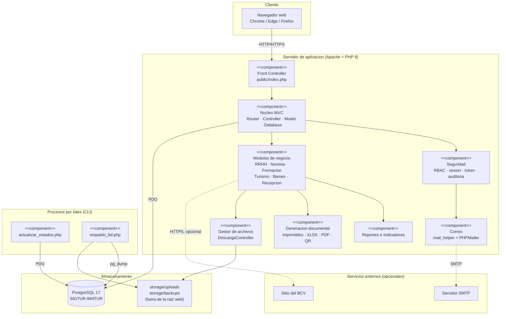
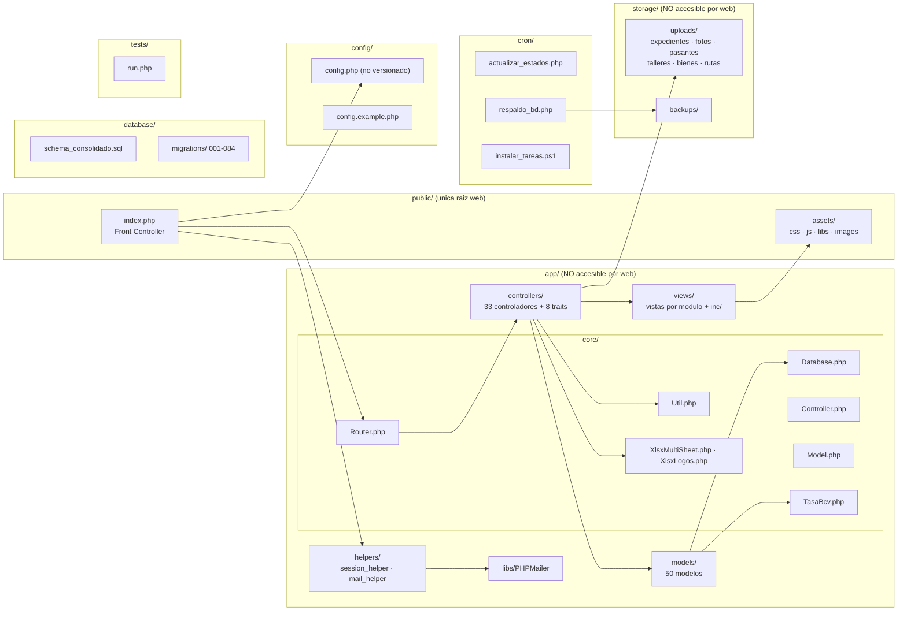
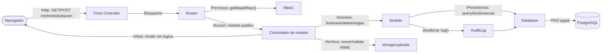
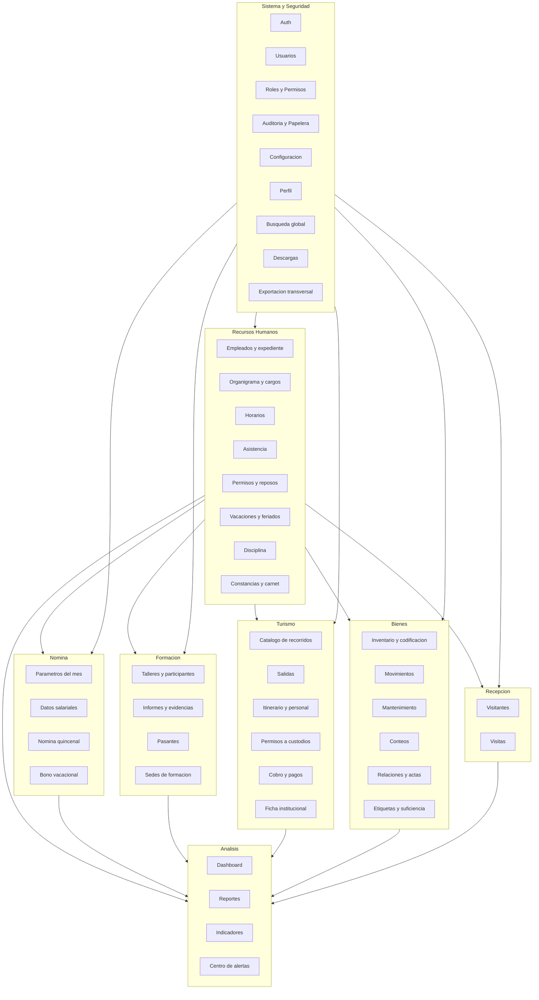
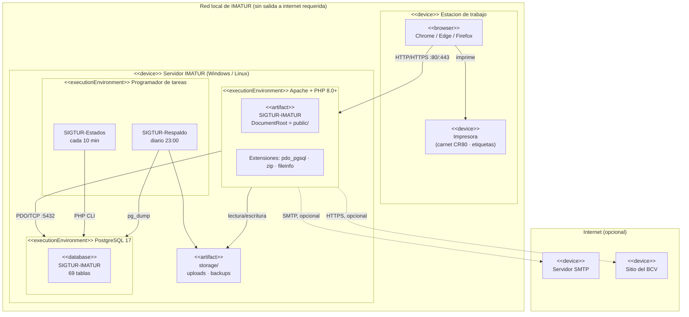

# Diagrama de Componentes y Despliegue

**SIGTUR-IMATUR** · **Última actualización:** 2026-09-19

> **Para qué sirve.** Insumo para dibujar el **diagrama de componentes** (UML) y el **diagrama de
> despliegue**. Muestra cómo está dividido el sistema en piezas desplegables, qué interfaces expone
> y consume cada una, y en qué nodos físicos se ejecutan.

---

## Índice

1. [Vista de componentes de alto nivel](#1-vista-de-componentes-de-alto-nivel)
2. [Componentes internos de la aplicación](#2-componentes-internos-de-la-aplicación)
3. [Interfaces entre componentes](#3-interfaces-entre-componentes)
4. [Componentes por módulo funcional](#4-componentes-por-módulo-funcional)
5. [Componentes de terceros (vendorizados)](#5-componentes-de-terceros-vendorizados)
6. [Diagrama de despliegue](#6-diagrama-de-despliegue)
7. [Estructura física de directorios](#7-estructura-física-de-directorios)
8. [Dependencias externas y degradación](#8-dependencias-externas-y-degradación)

---

## 1. Vista de componentes de alto nivel



**Lectura:** el sistema es un **monolito modular**. No hay microservicios ni API pública: la única
frontera de red es el navegador contra Apache, más dos salidas **opcionales** (SMTP y BCV) que
degradan sin interrumpir el servicio.

---

## 2. Componentes internos de la aplicación



### 2.1 Responsabilidad de cada componente

| Componente | Responsabilidad | Interfaz que expone |
|---|---|---|
| **Front Controller** (`public/index.php`) | Cargar configuración, endurecer la cookie de sesión, registrar el autoload, capturar excepciones no controladas y arrancar el `Router` | HTTP |
| **Router** | Parsear `/controlador/metodo/parametro`, aplicar los 5 middlewares y despachar | Interna: `call_user_func_array` |
| **Controller (base)** | Cargar vistas y modelos, sanitizar POST, validar correo/teléfono/RIF, guardar fotos | `model()`, `view()`, `getUserId()` |
| **Model (base)** | Acceso a `Database` y **auditoría automática** con diff completo | `audit()`, `auditStatic()` |
| **Database** | Único punto de acceso a PostgreSQL: sentencias preparadas y transacciones | `query`, `bind`, `execute`, `resultSet`, `single`, `beginTransaction` |
| **Seguridad** | RBAC dinámico, expiración de sesión, revalidación de cuenta, token anti doble-envío, bitácora | `RolesController::getMapaRbac()`, `sigtur_token_*`, `AuditLog::log()` |
| **Módulos de negocio** | Cada uno: un controlador, N modelos y sus vistas | URLs `/modulo/accion` |
| **Reportes** | ~40 consultas agregadas con filtros, KPIs e indicadores | URLs `/reportes/*` |
| **Generación documental** | Vistas imprimibles sin layout, Excel multi-hoja, PDF, etiquetas QR | URLs + descarga de archivo |
| **Gestor de archivos** | Servir archivos de `storage/uploads/` **validando el rol** por tipo de recurso | `DescargaController::{expediente,foto,pasante,taller,bien,bm1,acta,oficioRuta,permisoRuta,comprobantePago,fotoBien}` |
| **Correo** | Envío SMTP con PHPMailer vendorizado (sin Composer) | `sigtur_enviar_correo()` |
| **Procesos por lotes** | Auto-transición de estados de talleres y respaldo diario | CLI |

> ⚠️ **`public/uploads/` no existe y no debe reintroducirse.** Todo archivo subido va a
> `storage/uploads/` y se sirve por `DescargaController`, que valida el rol. Dentro de `public/`
> sería legible por URL sin control de acceso alguno.

---

## 3. Interfaces entre componentes



| Interfaz | Provee | Consume | Contrato |
|---|---|---|---|
| **IHttp** | Front Controller | Navegador | URL amigable `/controlador/metodo/parametro`; sesión por cookie endurecida |
| **IPermisos** | `RolesController` | `Router`, `header.php` | `getMapaRbac()` devuelve `[idRol => '*' \| [controladores]]`. **Fuente única**: el menú y el control de acceso usan el mismo mapa |
| **IAccion** | Controladores | `Router` | Solo métodos **públicos, no estáticos y no mágicos** son despachables |
| **IDominio** | Modelos | Controladores | Devuelven datos o lanzan `Exception` con mensaje apto para el usuario. **Nunca imprimen ni redirigen** |
| **IPersistencia** | `Database` | Modelos | Sentencias preparadas obligatorias; transacciones explícitas |
| **IAuditoria** | `AuditLog` | `Model` | Toda escritura registra estado previo y posterior. **Nunca registra contraseñas** |
| **IArchivo** | `DescargaController` | Navegador | Valida rol por tipo de recurso antes de entregar el archivo |
| **IVista** | `views/` | Controladores | Recibe datos ya resueltos; **no consulta la base de datos** |

---

## 4. Componentes por módulo funcional



> **La dependencia crítica es RRHH.** Todos los módulos operativos referencian `empleados`
> (facilitador, tutor, guía, encargado, responsable, aprobador, empleado visitado). Sin personal
> cargado, el resto del sistema no puede operar.

---

## 5. Componentes de terceros (vendorizados)

**Restricción de arquitectura: despliegue sin internet ⇒ ninguna dependencia por CDN.**
Todo vive en el repositorio, sin Composer ni npm.

| Componente | Versión / archivo | Uso | Ubicación |
|---|---|---|---|
| **Bootstrap** | 5.3 — `bootstrap.min.css`, `bootstrap.bundle.min.js` | Maquetación y componentes de interfaz | `public/assets/libs/` |
| **Bootstrap Icons** | `bootstrap-icons.min.css` + `.woff`, `.woff2`, `.svg` | Iconografía **100 % local** | `public/assets/libs/` |
| **ApexCharts** | `apexcharts.min.js` | Gráficos de indicadores y dashboard | `public/assets/libs/` |
| **Leaflet + OSM** | `leaflet.min.js`, `leaflet.min.css` | Mapa de las paradas de las rutas | `public/assets/` |
| **QRCode.js** | `qrcode.min.js` | Etiquetas QR de bienes, **generadas en el navegador sin internet** | `public/assets/libs/` |
| **PHPMailer** | `app/libs/PHPMailer/` | Envío SMTP del correo de recuperación | `app/libs/` |

**Componentes propios que sustituyen a librerías externas:**

| Componente | Sustituye a | Motivo |
|---|---|---|
| `XlsxMultiSheet` / `XlsxLogos` | PhpSpreadsheet | Generar XLSX multi-hoja con membrete sin Composer |
| `sigtur-validations.js` | Librería de validación | Validación de cédula, teléfono, correo y RIF con **el mismo criterio** que el servidor |
| `sigturExportarTabla` | DataTables Buttons | Exportación Excel/PDF transversal de cualquier listado `data-tabla-buscable` |
| `sigtur_token_emitir/consumir` | Middleware CSRF de framework | Idempotencia de formularios |

---

## 6. Diagrama de despliegue



### 6.1 Especificación de nodos

| Nodo | Requisitos | Notas |
|---|---|---|
| **Estación de trabajo** | Navegador actualizado; JavaScript habilitado | Impresora con soporte **CR80 vertical (54 × 85,6 mm)** para carnets |
| **Servidor de aplicación** | PHP **8.0+** con `pdo_pgsql`, `zip`, `fileinfo`; Apache con `DocumentRoot` apuntando a **`public/`** | En desarrollo se usa Laragon (Windows) |
| **Servidor de base de datos** | **PostgreSQL 16/17**, puerto 5432 | Puede convivir en el mismo equipo |
| **Programador de tareas** | `schtasks` (Windows) o `cron` (Linux); PHP CLI y `pg_dump` accesibles | Se instala con `cron/instalar_tareas.ps1` (idempotente) |
| **Almacenamiento** | `storage/uploads/` y `storage/backups/`, **fuera de la raíz web**, con permisos de escritura del usuario del servicio web | No versionados |

### 6.2 Configuración por entorno

Todo lo específico del entorno vive en **`config/config.php`**, que **no se versiona**:

| Constante | Qué define |
|---|---|
| `URL_ROOT` | URL base del sitio, sin barra final |
| `DB_HOST` · `DB_PORT` · `DB_NAME` · `DB_USER` · `DB_PASS` | Conexión a PostgreSQL |
| `APP_DEBUG` | **`false` en producción** — oculta errores al usuario y los registra en el log |
| `SESSION_TIMEOUT` | Expiración por inactividad (1800 s = 30 min) |
| `PG_DUMP_PATH` · `BACKUP_RETENTION` | Respaldo automático y rotación |
| `SMTP_*` | Servidor de correo saliente |

### 6.3 Procedimiento de despliegue

```bash
# 1. Crear la base
createdb -U postgres "SIGTUR-IMATUR"

# 2. Importar el esquema consolidado — UN SOLO ARCHIVO, es toda la base
psql -U postgres -d "SIGTUR-IMATUR" -f database/schema_consolidado.sql

# 3. Configurar el entorno
cp config/config.example.php config/config.php     # y editarlo

# 4. Apuntar el DocumentRoot del servidor web a public/

# 5. Instalar las dos tareas programadas
powershell -ExecutionPolicy Bypass -File cron\instalar_tareas.ps1

# 6. Ingresar y CAMBIAR la contraseña del administrador de arranque
```

> **No hay paso de migraciones.** `schema_consolidado.sql` es autosuficiente: incluye el esquema
> base, todas las migraciones, los catálogos institucionales sembrados y un usuario administrador
> de arranque. `database/migrations/` queda como historial y para **actualizar** instalaciones
> antiguas.

---

## 7. Estructura física de directorios

```
SIGTUR-IMATUR/
├── public/                  ← ÚNICA raíz web
│   ├── index.php            Front Controller
│   └── assets/
│       ├── css/             sigtur-tokens · sigtur-components · login · leaflet
│       ├── js/              sigtur-validations · leaflet
│       ├── libs/            bootstrap · bootstrap-icons · apexcharts · qrcode
│       └── images/
├── app/                     ← NO accesible por web
│   ├── core/                Router · Database · Controller · Model · Util · TasaBcv · Xlsx*
│   ├── controllers/         33 controladores
│   │   └── reportes/        8 traits
│   ├── models/              50 modelos
│   ├── views/               vistas por módulo + inc/header.php · inc/footer.php
│   ├── helpers/             session_helper · mail_helper
│   └── libs/PHPMailer/
├── config/
│   ├── config.example.php   plantilla versionada
│   └── config.php           ← NO versionado (credenciales)
├── database/
│   ├── schema_consolidado.sql
│   └── migrations/          001 … 083
├── cron/
│   ├── actualizar_estados.php
│   ├── respaldo_bd.php
│   └── instalar_tareas.ps1
├── storage/                 ← NO accesible por web, NO versionado
│   ├── uploads/             expedientes · fotos · pasantes · talleres · bienes · rutas
│   └── backups/
├── tests/run.php
└── docs/                    documentación técnica y de negocio
```

### 7.1 Reglas de seguridad de la estructura

1. El servidor web debe servir **solo `public/`**. Si `app/`, `config/`, `storage/` o `database/`
   quedan accesibles por URL, se exponen credenciales, documentos personales y el esquema completo.
2. **`config/config.php` no se versiona** (`.gitignore`): contiene credenciales.
3. **`storage/uploads/` nunca dentro de `public/`.** Se sirve por `DescargaController`, que valida
   el rol antes de entregar cada archivo.
4. Las subidas validan **extensión, tamaño (≤ 5 MB) y tipo MIME real**.

---

## 8. Dependencias externas y degradación

| Dependencia | Criticidad | Si falla |
|---|---|---|
| **PostgreSQL** | 🔴 **Crítica** | El sistema no opera. El error se registra en el log y al usuario se le muestra un mensaje genérico (nunca el detalle de conexión) |
| **Tarea `SIGTUR-Estados`** | 🟡 Alta | Los talleres se quedan en *Programado* aunque su fecha ya pasó |
| **Tarea `SIGTUR-Respaldo`** | 🟡 Alta | No hay copias automáticas de la base |
| **Servidor SMTP** | 🟢 Baja | Solo falla la recuperación de contraseña por correo; el Administrador puede restablecerla desde *Sistema → Usuarios* |
| **Sitio del BCV** | 🟢 Muy baja | La tasa del dólar **se carga a mano**. El cálculo de nómina **nunca** sale a internet: usa la tasa congelada del período |
| **Internet** | 🟢 No requerida | Todas las librerías, el mapa y la generación de QR funcionan **en local** |

### 8.1 Puntos únicos de fallo y su mitigación

| Punto | Mitigación |
|---|---|
| Base de datos | Respaldo diario con rotación; restauración con un solo comando `psql` |
| `config/config.php` | Plantilla versionada (`config.example.php`) para reconstruirlo |
| Archivos subidos | Incluir `storage/uploads/` en el respaldo del servidor (**no** lo cubre `pg_dump`) |
| Correlativos de oficio | Incremento atómico dentro de transacción: dos usuarios simultáneos no obtienen el mismo número |
| Sesión del usuario | Revalidación del estado de la cuenta en **cada petición**: suspender a alguien tiene efecto inmediato |

> ⚠️ **El respaldo de `pg_dump` NO incluye los archivos subidos.** Un plan de recuperación completo
> debe copiar también `storage/uploads/`.
