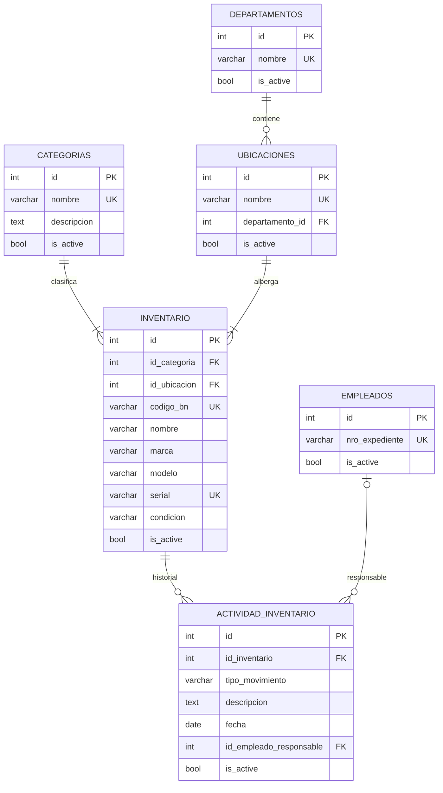
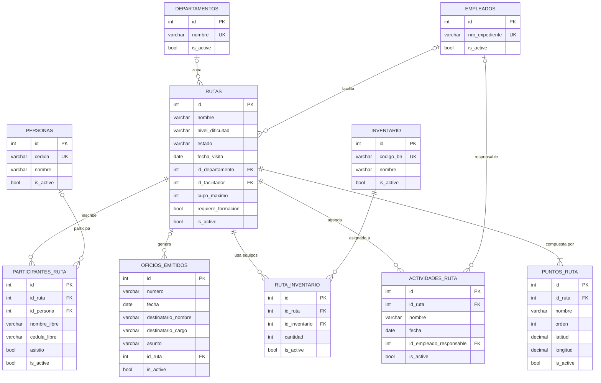
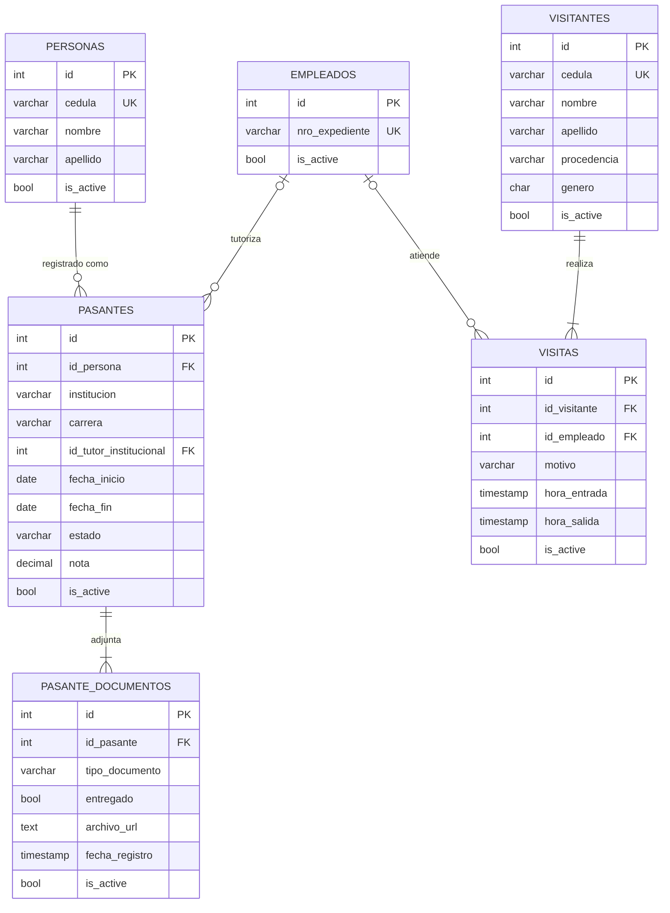

# Diagrama Entidad-Relación — SIGTUR-IMATUR

**Sistema:** Sistema de Gestión Turística — IMATUR  
**Fecha:** 2026-05-23  
**Tablas:** 34 | **Módulos:** 8  
**Motor BD:** PostgreSQL  

> **Nota de auditoría:** Todas las tablas (excepto `audit_logs`, `configuracion_sistema`, `visitantes` y `visitas`)
> incluyen las columnas de auditoría: `created_at TIMESTAMP`, `updated_at TIMESTAMP`, `deleted_at TIMESTAMP`,
> `created_by INT`, `updated_by INT`, `deleted_by INT`.

---

## Leyenda de notación (Crow's Foot)

| Símbolo | Significado |
|---------|-------------|
| `\|\|` | Exactamente uno (obligatorio) |
| `o\|` | Cero o uno (opcional) |
| `\|\|--\|\|` | Uno a uno (1:1) |
| `\|\|--o{` | Uno a muchos (1:N, lado N opcional) |
| `\|\|--\|{` | Uno a muchos (1:N, lado N obligatorio) |
| `o{--o{` | Muchos a muchos (N:N) |
| `PK` | Clave primaria |
| `FK` | Clave foránea |
| `UK` | Restricción UNIQUE |

---

## 1. Diagrama ER Completo — PlantUML

> Para renderizar: https://www.plantuml.com/plantuml/uml/

```plantuml
@startuml SIGTUR-IMATUR_ER
!theme plain
skinparam linetype ortho
skinparam shadowing false
skinparam classBorderColor #555555
skinparam classBackgroundColor #FEFEFE
skinparam arrowColor #333333
skinparam arrowThickness 1.2
skinparam packageBorderColor #AAAAAA

hide circle
hide empty methods

title "SIGTUR-IMATUR — Diagrama Entidad-Relación\n<size:11><color:#666>PostgreSQL | 2026</color></size>"

' ══════════════════════════════════════════════
' GEOGRAFÍA
' ══════════════════════════════════════════════
package "Geografía" #E8F4FD {
    entity municipio {
        * **id** : INT <<PK>>
        ==
        * nombre : VARCHAR(55)
        * codigo_postal : VARCHAR(4)
        is_active : BOOL DEFAULT TRUE
        created_at / updated_at / deleted_at : TIMESTAMP
        created_by / updated_by / deleted_by : INT
    }
    entity parroquia {
        * **id** : INT <<PK>>
        ==
        * nombre : VARCHAR(100)
        * /id_municipio/ : INT <<FK>>
        is_active : BOOL DEFAULT TRUE
        create_at / update_at / delete_at : TIMESTAMP
        create_by / update_by / delete_by : INT
    }
}

' ══════════════════════════════════════════════
' RECURSOS HUMANOS
' ══════════════════════════════════════════════
package "Recursos Humanos" #FEF9E7 {
    entity personas {
        * **id** : INT <<PK>>
        ==
        * __cedula__ : VARCHAR(15) <<UK>>
        * nombre : VARCHAR(100)
        * apellido : VARCHAR(100)
        telefono : VARCHAR(15)
        correo : VARCHAR(100)
        genero : CHAR(1) CHECK(M|F|O)
        fecha_nacimiento : DATE
        direccion : TEXT
        * /parroquia_id/ : INT <<FK>>
        is_active : BOOL DEFAULT TRUE
        [audit columns]
    }
    entity cargos {
        * **id** : INT <<PK>>
        ==
        * __nombre__ : VARCHAR(100) <<UK>>
        descripcion : TEXT
        * sueldo_base : DECIMAL(12,2)
        is_active : BOOL DEFAULT TRUE
        [audit columns]
    }
    entity departamentos {
        * **id** : INT <<PK>>
        ==
        * __nombre__ : VARCHAR(100) <<UK>>
        descripcion : TEXT
        is_active : BOOL DEFAULT TRUE
        [audit columns]
    }
    entity horarios {
        * **id** : INT <<PK>>
        ==
        * nombre : VARCHAR(100)
        * hora_entrada : TIME
        * hora_salida : TIME
        dias_laborales : VARCHAR(50) DEFAULT 'L-V'
        descripcion : TEXT
        is_active : BOOL DEFAULT TRUE
        [audit columns]
    }
    entity empleados {
        * **id** : INT <<PK>>
        ==
        * /id_persona/ : INT <<FK, UK>>
        * /id_cargo/ : INT <<FK>>
        * /id_departamento/ : INT <<FK>>
        /id_horario/ : INT <<FK, nullable>>
        * __nro_expediente__ : VARCHAR(20) <<UK>>
        * fecha_ingreso : DATE
        * tipo_contrato : VARCHAR(30) CHECK(Fijo|Contratado|Suplente|Comisión de Servicio)
        fecha_egreso : DATE
        is_active : BOOL DEFAULT TRUE
        [audit columns]
    }
    entity asistencias {
        * **id** : INT <<PK>>
        ==
        * /id_empleado/ : INT <<FK>>
        * fecha : DATE DEFAULT CURRENT_DATE
        * hora_entrada : TIME
        hora_salida : TIME
        observacion : TEXT
        is_active : BOOL DEFAULT TRUE
        [audit columns]
    }
    entity permisos_laborales {
        * **id** : INT <<PK>>
        ==
        * /id_empleado/ : INT <<FK>>
        * tipo_permiso : VARCHAR(50) CHECK(Médico|Personal|Duelo|Lactancia|Estudio|Otro)
        * fecha_inicio : DATE
        * fecha_fin : DATE
        * dias_solicitados : INT
        motivo : TEXT
        * estado : VARCHAR(20) DEFAULT 'Pendiente' CHECK(Pendiente|Aprobado|Rechazado|Anulado)
        /id_aprobador/ : INT <<FK, nullable>>
        fecha_aprobacion : TIMESTAMP
        observaciones : TEXT
        is_active : BOOL DEFAULT TRUE
        [audit columns]
    }
    entity vacaciones {
        * **id** : INT <<PK>>
        ==
        * /id_empleado/ : INT <<FK>>
        * anio : INT
        dias_correspondientes : INT DEFAULT 15
        dias_tomados : INT DEFAULT 0
        fecha_inicio : DATE
        fecha_fin : DATE
        * estado : VARCHAR(20) DEFAULT 'Pendiente'
        observaciones : TEXT
        is_active : BOOL DEFAULT TRUE
        UNIQUE(id_empleado, anio)
        [audit columns]
    }
}

' ══════════════════════════════════════════════
' AUTENTICACIÓN & SEGURIDAD
' ══════════════════════════════════════════════
package "Autenticación & Seguridad" #EAFAF1 {
    entity roles {
        * **id** : INT <<PK>>
        ==
        * __nombre__ : VARCHAR(50) <<UK>>
        descripcion : TEXT
        is_active : BOOL DEFAULT TRUE
        [audit columns]
    }
    entity usuarios {
        * **id** : INT <<PK>>
        ==
        * /id_empleado/ : INT <<FK, UK>>
        * /id_rol/ : INT <<FK>>
        * __username__ : VARCHAR(50) <<UK>>
        * password : TEXT
        ultimo_login : TIMESTAMP
        is_active : BOOL DEFAULT TRUE
        [audit columns]
    }
    entity audit_logs {
        * **id** : INT <<PK>>
        ==
        * tabla_afectada : VARCHAR(100)
        * operacion : VARCHAR(20) CHECK(INSERT|UPDATE|DELETE)
        record_id : INT
        datos_previos : JSONB
        datos_nuevos : JSONB
        /id_usuario/ : INT <<FK, nullable>>
        * fecha : TIMESTAMP DEFAULT NOW()
        ip_direccion : VARCHAR(45)
    }
}

' ══════════════════════════════════════════════
' INVENTARIO
' ══════════════════════════════════════════════
package "Inventario" #F8F9FA {
    entity categorias {
        * **id** : INT <<PK>>
        ==
        * __nombre__ : VARCHAR(100) <<UK>>
        descripcion : TEXT
        is_active : BOOL DEFAULT TRUE
        [audit columns]
    }
    entity ubicaciones {
        * **id** : INT <<PK>>
        ==
        * __nombre__ : VARCHAR(100) <<UK>>
        descripcion : TEXT
        /departamento_id/ : INT <<FK>>
        is_active : BOOL DEFAULT TRUE
        [audit columns]
    }
    entity inventario {
        * **id** : INT <<PK>>
        ==
        * /id_categoria/ : INT <<FK>>
        * /id_ubicacion/ : INT <<FK>>
        * __codigo_bn__ : VARCHAR(50) <<UK>>
        * nombre : VARCHAR(255)
        descripcion : TEXT
        marca : VARCHAR(100)
        modelo : VARCHAR(100)
        __serial__ : VARCHAR(100) <<UK>>
        * condicion : VARCHAR(20) CHECK(Nuevo|Bueno|Regular|Dañado|Inservible)
        observaciones : TEXT
        is_active : BOOL DEFAULT TRUE
        [audit columns]
    }
    entity actividad_inventario {
        * **id** : INT <<PK>>
        ==
        * /id_inventario/ : INT <<FK>>
        * tipo_movimiento : VARCHAR(30) CHECK(Asignacion|Devolucion|Traslado|Baja|Mantenimiento)
        descripcion : TEXT
        * fecha : DATE DEFAULT CURRENT_DATE
        /id_empleado_responsable/ : INT <<FK, nullable>>
        is_active : BOOL DEFAULT TRUE
        [audit columns]
    }
}

' ══════════════════════════════════════════════
' FORMACIÓN
' ══════════════════════════════════════════════
package "Formación" #FFFDE7 {
    entity ubicaciones_formacion {
        * **id** : INT <<PK>>
        ==
        * nombre : VARCHAR(150)
        tipo : VARCHAR(50)
        direccion : TEXT
        /parroquia/ : INT <<FK>>
        es_sede_propia : BOOL DEFAULT FALSE
        is_active : BOOL DEFAULT TRUE
        [audit columns]
    }
    entity oficios {
        * **id** : INT <<PK>>
        ==
        * numero : VARCHAR(50)
        * fecha : DATE
        /id_institucion/ : INT <<FK, nullable>>
        asunto : VARCHAR(255)
        is_active : BOOL DEFAULT TRUE
        [audit columns]
    }
    entity talleres {
        * **id** : INT <<PK>>
        ==
        * nombre : VARCHAR(200)
        descripcion : TEXT
        * fecha_inicio : DATE
        fecha_fin : DATE
        hora_inicio : TIME
        hora_fin : TIME
        /id_ubicacion_formacion/ : INT <<FK, nullable>>
        * /id_facilitador/ : INT <<FK>>
        /id_oficio/ : INT <<FK, nullable>>
        cupo_maximo : INT DEFAULT 30
        * estado : VARCHAR(20) CHECK(Programado|En Curso|Finalizado|Cancelado)
        * tipo_actividad : VARCHAR(30) CHECK(Taller|Charla|Inducción)
        es_interna : BOOL DEFAULT FALSE
        tipo_ente : VARCHAR(50) [nullable]
        is_active : BOOL DEFAULT TRUE
        [audit columns]
    }
    entity taller_informes {
        * **id** : INT <<PK>>
        ==
        * /id_taller/ : INT <<FK, UK>>
        unidad_estadal : VARCHAR(255) DEFAULT 'Sucre'
        lugar_exacto : VARCHAR(255)
        instituciones_presentes : TEXT
        mujeres : INT DEFAULT 0
        hombres : INT DEFAULT 0
        ninas : INT DEFAULT 0
        ninos : INT DEFAULT 0
        total_atendidas : INT DEFAULT 0 [DERIVADO]
        resumen_actividad : TEXT
        is_active : BOOL DEFAULT TRUE
        [audit columns]
    }
    entity participantes_taller {
        * **id** : INT <<PK>>
        ==
        * /id_taller/ : INT <<FK>>
        /id_persona/ : INT <<FK, nullable>>
        nombre_libre : VARCHAR(100) [nullable]
        apellido_libre : VARCHAR(100) [nullable]
        cedula_libre : VARCHAR(20) [nullable]
        asistio : BOOL DEFAULT FALSE
        observaciones : TEXT
        es_brigadista : BOOL DEFAULT FALSE
        nombre_docente : VARCHAR(100) [nullable]
        cedula_docente : VARCHAR(20) [nullable]
        is_active : BOOL DEFAULT TRUE
        CHECK: id_persona IS NOT NULL OR nombre_libre IS NOT NULL
        UNIQUE(id_taller, id_persona)
        [audit columns]
    }
    entity taller_inventario {
        * **id** : INT <<PK>>
        ==
        * /id_taller/ : INT <<FK>>
        * /id_inventario/ : INT <<FK>>
        cantidad : INT DEFAULT 1
        observaciones : TEXT
        is_active : BOOL DEFAULT TRUE
        UNIQUE(id_taller, id_inventario)
        [audit columns]
    }
}

' ══════════════════════════════════════════════
' TURISMO — RUTAS
' ══════════════════════════════════════════════
package "Turismo — Rutas" #FDF2F8 {
    entity rutas {
        * **id** : INT <<PK>>
        ==
        * nombre : VARCHAR(200)
        descripcion : TEXT
        duracion_estimada : VARCHAR(50)
        nivel_dificultad : VARCHAR(20) DEFAULT 'Fácil' CHECK(Fácil|Moderado|Difícil|Extremo)
        estado : VARCHAR(20) DEFAULT 'Activa' CHECK(Activa|Inactiva|En Mantenimiento)
        fecha_visita : DATE
        hora_visita : TIME
        /id_departamento/ : INT <<FK, nullable>>
        /id_facilitador/ : INT <<FK, nullable>>
        cupo_maximo : INT DEFAULT 20
        requiere_formacion : BOOL DEFAULT FALSE
        is_active : BOOL DEFAULT TRUE
        [audit columns]
    }
    entity puntos_ruta {
        * **id** : INT <<PK>>
        ==
        * /id_ruta/ : INT <<FK>>
        * nombre : VARCHAR(200)
        descripcion : TEXT
        orden : INT DEFAULT 1
        latitud : DECIMAL(10,7) [nullable]
        longitud : DECIMAL(10,7) [nullable]
        is_active : BOOL DEFAULT TRUE
        [audit columns]
    }
    entity actividades_ruta {
        * **id** : INT <<PK>>
        ==
        * /id_ruta/ : INT <<FK>>
        * nombre : VARCHAR(200)
        descripcion : TEXT
        fecha : DATE
        /id_empleado_responsable/ : INT <<FK, nullable>>
        is_active : BOOL DEFAULT TRUE
        [audit columns]
    }
    entity participantes_ruta {
        * **id** : INT <<PK>>
        ==
        * /id_ruta/ : INT <<FK>>
        /id_persona/ : INT <<FK, nullable>>
        nombre_libre : VARCHAR(100) [nullable]
        apellido_libre : VARCHAR(100) [nullable]
        cedula_libre : VARCHAR(20) [nullable]
        asistio : BOOL DEFAULT FALSE
        observaciones : TEXT
        is_active : BOOL DEFAULT TRUE
        CHECK: id_persona IS NOT NULL OR nombre_libre IS NOT NULL
        [audit columns]
    }
    entity ruta_inventario {
        * **id** : INT <<PK>>
        ==
        * /id_ruta/ : INT <<FK>>
        * /id_inventario/ : INT <<FK>>
        cantidad : INT DEFAULT 1
        observaciones : TEXT
        is_active : BOOL DEFAULT TRUE
        UNIQUE(id_ruta, id_inventario)
        [audit columns]
    }
    entity oficios_emitidos {
        * **id** : INT <<PK>>
        ==
        * numero : VARCHAR(20)
        * fecha : DATE DEFAULT CURRENT_DATE
        * destinatario_nombre : VARCHAR(200)
        * destinatario_cargo : VARCHAR(200)
        * asunto : VARCHAR(500)
        /id_ruta/ : INT <<FK, nullable>>
        is_active : BOOL DEFAULT TRUE
        created_at : TIMESTAMP DEFAULT NOW()
        created_by : INT <<FK>>
    }
}

' ══════════════════════════════════════════════
' PASANTES
' ══════════════════════════════════════════════
package "Pasantes" #EAF4FB {
    entity pasantes {
        * **id** : INT <<PK>>
        ==
        * /id_persona/ : INT <<FK>>
        * institucion : VARCHAR(200)
        * carrera : VARCHAR(200)
        /id_tutor_institucional/ : INT <<FK, nullable>>
        fecha_inicio : DATE
        fecha_fin : DATE
        * estado : VARCHAR(50) DEFAULT 'Postulado' CHECK(Postulado|Aceptado|En Curso|Culminado|Rechazado|Abandonado)
        evaluacion : TEXT
        nota : DECIMAL(5,2) [nullable]
        is_active : BOOL DEFAULT TRUE
        [audit columns]
    }
    entity pasante_documentos {
        * **id** : INT <<PK>>
        ==
        * /id_pasante/ : INT <<FK>>
        * tipo_documento : VARCHAR(100) CHECK(Carta de Postulación|Carta de Aceptación|Evaluación|Otro)
        entregado : BOOL DEFAULT FALSE
        archivo_url : TEXT [nullable]
        observaciones : TEXT
        fecha_registro : TIMESTAMP DEFAULT NOW()
        /created_by/ : INT <<FK, nullable>>
        is_active : BOOL DEFAULT TRUE
        [audit columns]
    }
}

' ══════════════════════════════════════════════
' VISITANTES
' ══════════════════════════════════════════════
package "Visitantes" #FDEDEC {
    entity visitantes {
        * **id** : INT <<PK>>
        ==
        * __cedula__ : VARCHAR(20) <<UK>>
        * nombre : VARCHAR(100)
        * apellido : VARCHAR(100)
        procedencia : VARCHAR(100)
        telefono : VARCHAR(20)
        genero : CHAR(1) CHECK(M|F|O)
        correo : VARCHAR(100)
        motivo_frecuente : TEXT
        is_active : BOOL DEFAULT TRUE
        [audit columns]
    }
    entity visitas {
        * **id** : INT <<PK>>
        ==
        * /id_visitante/ : INT <<FK>>
        /id_empleado/ : INT <<FK, nullable>>
        motivo : VARCHAR(255)
        * hora_entrada : TIMESTAMP DEFAULT NOW()
        hora_salida : TIMESTAMP [toggle — nullable]
        observaciones : TEXT
        is_active : BOOL DEFAULT TRUE
        created_at : TIMESTAMP DEFAULT NOW()
        /created_by/ : INT <<FK>>
    }
}

' ══════════════════════════════════════════════
' CONFIGURACIÓN
' ══════════════════════════════════════════════
package "Configuración" #F0F0F0 {
    entity configuracion_sistema {
        * **id** : INT <<PK>>
        ==
        * __clave__ : VARCHAR(100) <<UK>>
        * valor : TEXT DEFAULT ''
        descripcion : VARCHAR(255)
        updated_at : TIMESTAMP DEFAULT NOW()
        /updated_by/ : INT <<FK>>
    }
}

' ══════════════════════════════════════════════
' RELACIONES
' ══════════════════════════════════════════════

' Geografía
municipio ||--o{ parroquia : "id_municipio"
parroquia ||--o{ personas : "parroquia_id"
parroquia ||--o{ ubicaciones_formacion : "parroquia"

' RRHH
personas ||--|| empleados : "id_persona"
cargos ||--o{ empleados : "id_cargo"
departamentos ||--o{ empleados : "id_departamento"
horarios |o--o{ empleados : "id_horario"
empleados ||--o{ asistencias : "id_empleado"
empleados ||--o{ permisos_laborales : "id_empleado (solicitante)"
empleados |o--o{ permisos_laborales : "id_aprobador (aprobador)"
empleados ||--o{ vacaciones : "id_empleado"

' Auth
empleados ||--o| usuarios : "id_empleado"
roles ||--o{ usuarios : "id_rol"
usuarios |o--o{ audit_logs : "id_usuario"

' Inventario
departamentos ||--o{ ubicaciones : "departamento_id"
categorias ||--o{ inventario : "id_categoria"
ubicaciones ||--o{ inventario : "id_ubicacion"
inventario ||--o{ actividad_inventario : "id_inventario"
empleados |o--o{ actividad_inventario : "id_empleado_responsable"

' Formación
ubicaciones_formacion |o--o{ oficios : "id_institucion"
ubicaciones_formacion |o--o{ talleres : "id_ubicacion_formacion"
oficios |o--o{ talleres : "id_oficio"
empleados ||--o{ talleres : "id_facilitador"
talleres ||--o| taller_informes : "id_taller"
talleres ||--o{ participantes_taller : "id_taller"
personas |o--o{ participantes_taller : "id_persona"
talleres ||--o{ taller_inventario : "id_taller"
inventario ||--o{ taller_inventario : "id_inventario"

' Turismo
departamentos |o--o{ rutas : "id_departamento"
empleados |o--o{ rutas : "id_facilitador"
rutas ||--o{ puntos_ruta : "id_ruta"
rutas ||--o{ actividades_ruta : "id_ruta"
empleados |o--o{ actividades_ruta : "id_empleado_responsable"
rutas ||--o{ participantes_ruta : "id_ruta"
personas |o--o{ participantes_ruta : "id_persona"
rutas ||--o{ ruta_inventario : "id_ruta"
inventario ||--o{ ruta_inventario : "id_inventario"
rutas |o--o{ oficios_emitidos : "id_ruta"

' Pasantes
personas ||--o{ pasantes : "id_persona"
empleados |o--o{ pasantes : "id_tutor_institucional"
pasantes ||--o{ pasante_documentos : "id_pasante"

' Visitantes
visitantes ||--o{ visitas : "id_visitante"
empleados |o--o{ visitas : "id_empleado"

@enduml
```

---

## 2. Diagrama ER Completo — Mermaid

> Para GitHub, Notion, Obsidian, Mermaid Live (https://mermaid.live)

```mermaid
erDiagram

    %% ══ GEOGRAFÍA ══
    MUNICIPIO {
        int id PK
        varchar nombre
        varchar codigo_postal
        bool is_active
    }
    PARROQUIA {
        int id PK
        varchar nombre
        int id_municipio FK
        bool is_active
    }

    %% ══ RRHH ══
    PERSONAS {
        int id PK
        varchar cedula UK
        varchar nombre
        varchar apellido
        varchar telefono
        varchar correo
        char genero
        date fecha_nacimiento
        text direccion
        int parroquia_id FK
        bool is_active
    }
    CARGOS {
        int id PK
        varchar nombre UK
        text descripcion
        decimal sueldo_base
        bool is_active
    }
    DEPARTAMENTOS {
        int id PK
        varchar nombre UK
        text descripcion
        bool is_active
    }
    HORARIOS {
        int id PK
        varchar nombre
        time hora_entrada
        time hora_salida
        varchar dias_laborales
        text descripcion
        bool is_active
    }
    EMPLEADOS {
        int id PK
        int id_persona FK UK
        int id_cargo FK
        int id_departamento FK
        int id_horario FK
        varchar nro_expediente UK
        date fecha_ingreso
        varchar tipo_contrato
        date fecha_egreso
        bool is_active
    }
    ASISTENCIAS {
        int id PK
        int id_empleado FK
        date fecha
        time hora_entrada
        time hora_salida
        text observacion
        bool is_active
    }
    PERMISOS_LABORALES {
        int id PK
        int id_empleado FK
        varchar tipo_permiso
        date fecha_inicio
        date fecha_fin
        int dias_solicitados
        text motivo
        varchar estado
        int id_aprobador FK
        bool is_active
    }
    VACACIONES {
        int id PK
        int id_empleado FK
        int anio
        int dias_correspondientes
        int dias_tomados
        date fecha_inicio
        date fecha_fin
        varchar estado
        bool is_active
    }

    %% ══ AUTENTICACIÓN ══
    ROLES {
        int id PK
        varchar nombre UK
        text descripcion
        bool is_active
    }
    USUARIOS {
        int id PK
        int id_empleado FK UK
        int id_rol FK
        varchar username UK
        text password
        timestamp ultimo_login
        bool is_active
    }
    AUDIT_LOGS {
        int id PK
        varchar tabla_afectada
        varchar operacion
        int record_id
        jsonb datos_previos
        jsonb datos_nuevos
        int id_usuario FK
        timestamp fecha
        varchar ip_direccion
    }

    %% ══ INVENTARIO ══
    CATEGORIAS {
        int id PK
        varchar nombre UK
        text descripcion
        bool is_active
    }
    UBICACIONES {
        int id PK
        varchar nombre UK
        text descripcion
        int departamento_id FK
        bool is_active
    }
    INVENTARIO {
        int id PK
        int id_categoria FK
        int id_ubicacion FK
        varchar codigo_bn UK
        varchar nombre
        text descripcion
        varchar marca
        varchar modelo
        varchar serial UK
        varchar condicion
        text observaciones
        bool is_active
    }
    ACTIVIDAD_INVENTARIO {
        int id PK
        int id_inventario FK
        varchar tipo_movimiento
        text descripcion
        date fecha
        int id_empleado_responsable FK
        bool is_active
    }

    %% ══ FORMACIÓN ══
    UBICACIONES_FORMACION {
        int id PK
        varchar nombre
        varchar tipo
        text direccion
        int parroquia FK
        bool es_sede_propia
        bool is_active
    }
    OFICIOS {
        int id PK
        varchar numero
        date fecha
        int id_institucion FK
        varchar asunto
        bool is_active
    }
    TALLERES {
        int id PK
        varchar nombre
        text descripcion
        date fecha_inicio
        date fecha_fin
        time hora_inicio
        time hora_fin
        int id_ubicacion_formacion FK
        int id_facilitador FK
        int id_oficio FK
        int cupo_maximo
        varchar estado
        varchar tipo_actividad
        bool es_interna
        varchar tipo_ente
        bool is_active
    }
    TALLER_INFORMES {
        int id PK
        int id_taller FK UK
        varchar unidad_estadal
        varchar lugar_exacto
        text instituciones_presentes
        int mujeres
        int hombres
        int ninas
        int ninos
        int total_atendidas
        text resumen_actividad
        bool is_active
    }
    PARTICIPANTES_TALLER {
        int id PK
        int id_taller FK
        int id_persona FK
        varchar nombre_libre
        varchar apellido_libre
        varchar cedula_libre
        bool asistio
        bool es_brigadista
        varchar nombre_docente
        varchar cedula_docente
        bool is_active
    }
    TALLER_INVENTARIO {
        int id PK
        int id_taller FK
        int id_inventario FK
        int cantidad
        text observaciones
        bool is_active
    }

    %% ══ TURISMO ══
    RUTAS {
        int id PK
        varchar nombre
        text descripcion
        varchar duracion_estimada
        varchar nivel_dificultad
        varchar estado
        date fecha_visita
        time hora_visita
        int id_departamento FK
        int id_facilitador FK
        int cupo_maximo
        bool requiere_formacion
        bool is_active
    }
    PUNTOS_RUTA {
        int id PK
        int id_ruta FK
        varchar nombre
        text descripcion
        int orden
        decimal latitud
        decimal longitud
        bool is_active
    }
    ACTIVIDADES_RUTA {
        int id PK
        int id_ruta FK
        varchar nombre
        text descripcion
        date fecha
        int id_empleado_responsable FK
        bool is_active
    }
    PARTICIPANTES_RUTA {
        int id PK
        int id_ruta FK
        int id_persona FK
        varchar nombre_libre
        varchar apellido_libre
        varchar cedula_libre
        bool asistio
        text observaciones
        bool is_active
    }
    RUTA_INVENTARIO {
        int id PK
        int id_ruta FK
        int id_inventario FK
        int cantidad
        text observaciones
        bool is_active
    }
    OFICIOS_EMITIDOS {
        int id PK
        varchar numero
        date fecha
        varchar destinatario_nombre
        varchar destinatario_cargo
        varchar asunto
        int id_ruta FK
        bool is_active
    }

    %% ══ PASANTES ══
    PASANTES {
        int id PK
        int id_persona FK
        varchar institucion
        varchar carrera
        int id_tutor_institucional FK
        date fecha_inicio
        date fecha_fin
        varchar estado
        text evaluacion
        decimal nota
        bool is_active
    }
    PASANTE_DOCUMENTOS {
        int id PK
        int id_pasante FK
        varchar tipo_documento
        bool entregado
        text archivo_url
        text observaciones
        timestamp fecha_registro
        bool is_active
    }

    %% ══ VISITANTES ══
    VISITANTES {
        int id PK
        varchar cedula UK
        varchar nombre
        varchar apellido
        varchar procedencia
        varchar telefono
        char genero
        varchar correo
        text motivo_frecuente
        bool is_active
    }
    VISITAS {
        int id PK
        int id_visitante FK
        int id_empleado FK
        varchar motivo
        timestamp hora_entrada
        timestamp hora_salida
        text observaciones
        bool is_active
    }

    %% ══ CONFIGURACIÓN ══
    CONFIGURACION_SISTEMA {
        int id PK
        varchar clave UK
        text valor
        varchar descripcion
        timestamp updated_at
        int updated_by FK
    }

    %% ══════════════════════════════
    %% RELACIONES
    %% ══════════════════════════════

    MUNICIPIO       ||--|{ PARROQUIA              : "contiene"
    PARROQUIA       ||--o{ PERSONAS               : "registrada en"
    PARROQUIA       ||--o{ UBICACIONES_FORMACION  : "ubicada en"

    PERSONAS        ||--|| EMPLEADOS              : "es empleado"
    CARGOS          ||--|{ EMPLEADOS              : "clasifica"
    DEPARTAMENTOS   ||--|{ EMPLEADOS              : "agrupa"
    HORARIOS        |o--o{ EMPLEADOS              : "asigna"
    EMPLEADOS       ||--o{ ASISTENCIAS            : "registra"
    EMPLEADOS       ||--o{ PERMISOS_LABORALES     : "solicita"
    EMPLEADOS       |o--o{ PERMISOS_LABORALES     : "aprueba"
    EMPLEADOS       ||--o{ VACACIONES             : "toma"

    EMPLEADOS       ||--o| USUARIOS               : "tiene acceso"
    ROLES           ||--|{ USUARIOS               : "asigna rol"
    USUARIOS        |o--o{ AUDIT_LOGS             : "genera"

    DEPARTAMENTOS   ||--o{ UBICACIONES            : "contiene"
    CATEGORIAS      ||--|{ INVENTARIO             : "clasifica"
    UBICACIONES     ||--|{ INVENTARIO             : "alberga"
    INVENTARIO      ||--o{ ACTIVIDAD_INVENTARIO   : "historial"
    EMPLEADOS       |o--o{ ACTIVIDAD_INVENTARIO   : "responsable"

    UBICACIONES_FORMACION |o--o{ OFICIOS          : "destino"
    UBICACIONES_FORMACION |o--o{ TALLERES         : "sede"
    OFICIOS         |o--o{ TALLERES               : "emitido para"
    EMPLEADOS       ||--|{ TALLERES               : "facilita"
    TALLERES        ||--o| TALLER_INFORMES        : "genera informe"
    TALLERES        ||--o{ PARTICIPANTES_TALLER   : "inscribe"
    PERSONAS        |o--o{ PARTICIPANTES_TALLER   : "participa"
    TALLERES        ||--o{ TALLER_INVENTARIO      : "usa equipos"
    INVENTARIO      ||--o{ TALLER_INVENTARIO      : "asignado a"

    DEPARTAMENTOS   |o--o{ RUTAS                  : "zona"
    EMPLEADOS       |o--o{ RUTAS                  : "facilita"
    RUTAS           ||--|{ PUNTOS_RUTA            : "compuesta por"
    RUTAS           ||--o{ ACTIVIDADES_RUTA       : "agenda"
    EMPLEADOS       |o--o{ ACTIVIDADES_RUTA       : "responsable"
    RUTAS           ||--o{ PARTICIPANTES_RUTA     : "inscribe"
    PERSONAS        |o--o{ PARTICIPANTES_RUTA     : "participa"
    RUTAS           ||--o{ RUTA_INVENTARIO        : "usa equipos"
    INVENTARIO      ||--o{ RUTA_INVENTARIO        : "asignado a"
    RUTAS           |o--o{ OFICIOS_EMITIDOS       : "genera"

    PERSONAS        ||--o{ PASANTES               : "registrado como"
    EMPLEADOS       |o--o{ PASANTES               : "tutoriza"
    PASANTES        ||--|{ PASANTE_DOCUMENTOS     : "adjunta"

    VISITANTES      ||--|{ VISITAS                : "realiza"
    EMPLEADOS       |o--o{ VISITAS                : "atiende"
```

---

## 3. Diagramas ER por Módulo

### 3.1 Geografía & RRHH

```mermaid
erDiagram
    MUNICIPIO {
        int id PK
        varchar nombre
        varchar codigo_postal
        bool is_active
    }
    PARROQUIA {
        int id PK
        varchar nombre
        int id_municipio FK
        bool is_active
    }
    PERSONAS {
        int id PK
        varchar cedula UK
        varchar nombre
        varchar apellido
        char genero
        date fecha_nacimiento
        int parroquia_id FK
        bool is_active
    }
    CARGOS {
        int id PK
        varchar nombre UK
        decimal sueldo_base
        bool is_active
    }
    DEPARTAMENTOS {
        int id PK
        varchar nombre UK
        bool is_active
    }
    HORARIOS {
        int id PK
        varchar nombre
        time hora_entrada
        time hora_salida
        varchar dias_laborales
        bool is_active
    }
    EMPLEADOS {
        int id PK
        int id_persona FK UK
        int id_cargo FK
        int id_departamento FK
        int id_horario FK
        varchar nro_expediente UK
        date fecha_ingreso
        varchar tipo_contrato
        bool is_active
    }
    ASISTENCIAS {
        int id PK
        int id_empleado FK
        date fecha
        time hora_entrada
        time hora_salida
        text observacion
        bool is_active
    }
    PERMISOS_LABORALES {
        int id PK
        int id_empleado FK
        varchar tipo_permiso
        date fecha_inicio
        date fecha_fin
        int dias_solicitados
        varchar estado
        int id_aprobador FK
        bool is_active
    }
    VACACIONES {
        int id PK
        int id_empleado FK
        int anio
        int dias_correspondientes
        int dias_tomados
        varchar estado
        bool is_active
    }

    MUNICIPIO     ||--|{ PARROQUIA          : "contiene"
    PARROQUIA     ||--o{ PERSONAS           : "registrada en"
    PERSONAS      ||--|| EMPLEADOS          : "es empleado"
    CARGOS        ||--|{ EMPLEADOS          : "clasifica"
    DEPARTAMENTOS ||--|{ EMPLEADOS          : "agrupa"
    HORARIOS      |o--o{ EMPLEADOS          : "asigna"
    EMPLEADOS     ||--o{ ASISTENCIAS        : "registra"
    EMPLEADOS     ||--o{ PERMISOS_LABORALES : "solicita"
    EMPLEADOS     |o--o{ PERMISOS_LABORALES : "aprueba"
    EMPLEADOS     ||--o{ VACACIONES         : "toma"
```

---

### 3.2 Autenticación & Auditoría

```mermaid
erDiagram
    EMPLEADOS {
        int id PK
        int id_persona FK UK
        varchar nro_expediente UK
        bool is_active
    }
    ROLES {
        int id PK
        varchar nombre UK
        text descripcion
        bool is_active
    }
    USUARIOS {
        int id PK
        int id_empleado FK UK
        int id_rol FK
        varchar username UK
        text password
        timestamp ultimo_login
        bool is_active
    }
    AUDIT_LOGS {
        int id PK
        varchar tabla_afectada
        varchar operacion
        int record_id
        jsonb datos_previos
        jsonb datos_nuevos
        int id_usuario FK
        timestamp fecha
        varchar ip_direccion
    }

    EMPLEADOS ||--o| USUARIOS   : "tiene usuario"
    ROLES     ||--|{ USUARIOS   : "asigna rol"
    USUARIOS  |o--o{ AUDIT_LOGS : "genera"
```

---

### 3.3 Inventario



---

### 3.4 Formación (Talleres)

```mermaid
erDiagram
    PARROQUIA {
        int id PK
        varchar nombre
        bool is_active
    }
    UBICACIONES_FORMACION {
        int id PK
        varchar nombre
        varchar tipo
        int parroquia FK
        bool es_sede_propia
        bool is_active
    }
    OFICIOS {
        int id PK
        varchar numero
        date fecha
        int id_institucion FK
        varchar asunto
        bool is_active
    }
    EMPLEADOS {
        int id PK
        varchar nro_expediente UK
        bool is_active
    }
    TALLERES {
        int id PK
        varchar nombre
        date fecha_inicio
        date fecha_fin
        int id_ubicacion_formacion FK
        int id_facilitador FK
        int id_oficio FK
        int cupo_maximo
        varchar estado
        varchar tipo_actividad
        bool es_interna
        bool is_active
    }
    TALLER_INFORMES {
        int id PK
        int id_taller FK UK
        varchar lugar_exacto
        int mujeres
        int hombres
        int ninas
        int ninos
        int total_atendidas
        bool is_active
    }
    PERSONAS {
        int id PK
        varchar cedula UK
        varchar nombre
        varchar apellido
        bool is_active
    }
    PARTICIPANTES_TALLER {
        int id PK
        int id_taller FK
        int id_persona FK
        varchar nombre_libre
        varchar cedula_libre
        bool asistio
        bool es_brigadista
        bool is_active
    }
    INVENTARIO {
        int id PK
        varchar codigo_bn UK
        varchar nombre
        bool is_active
    }
    TALLER_INVENTARIO {
        int id PK
        int id_taller FK
        int id_inventario FK
        int cantidad
        bool is_active
    }

    PARROQUIA             ||--o{ UBICACIONES_FORMACION  : "ubica"
    UBICACIONES_FORMACION |o--o{ OFICIOS                : "destino"
    UBICACIONES_FORMACION |o--o{ TALLERES               : "sede"
    OFICIOS               |o--o{ TALLERES               : "emitido para"
    EMPLEADOS             ||--|{ TALLERES               : "facilita"
    TALLERES              ||--o| TALLER_INFORMES        : "genera informe"
    TALLERES              ||--o{ PARTICIPANTES_TALLER   : "inscribe"
    PERSONAS              |o--o{ PARTICIPANTES_TALLER   : "participa"
    TALLERES              ||--o{ TALLER_INVENTARIO      : "usa equipos"
    INVENTARIO            ||--o{ TALLER_INVENTARIO      : "asignado a"
```

---

### 3.5 Turismo (Rutas)



---

### 3.6 Pasantes & Visitantes



---

## 4. Resumen de Cardinalidades

| Relación | Cardinalidad | Tipo de FK |
|----------|-------------|------------|
| MUNICIPIO → PARROQUIA | 1 : N | Obligatoria |
| PARROQUIA → PERSONAS | 1 : N | Obligatoria |
| PERSONAS → EMPLEADOS | 1 : 1 | UNIQUE (id_persona) |
| CARGOS → EMPLEADOS | 1 : N | Obligatoria |
| DEPARTAMENTOS → EMPLEADOS | 1 : N | Obligatoria |
| HORARIOS → EMPLEADOS | 1 : N | Opcional (nullable) |
| EMPLEADOS → ASISTENCIAS | 1 : N | Obligatoria |
| EMPLEADOS → USUARIOS | 1 : 1 | UNIQUE (id_empleado) |
| ROLES → USUARIOS | 1 : N | Obligatoria |
| USUARIOS → AUDIT_LOGS | 1 : N | Opcional (nullable) |
| TALLERES → TALLER_INFORMES | 1 : 1 | UNIQUE (id_taller) |
| TALLERES ↔ INVENTARIO | N : N | vía TALLER_INVENTARIO |
| RUTAS ↔ INVENTARIO | N : N | vía RUTA_INVENTARIO |
| PERSONAS → PARTICIPANTES_TALLER | 1 : N | Opcional (puede ser nombre_libre) |
| PERSONAS → PARTICIPANTES_RUTA | 1 : N | Opcional (puede ser nombre_libre) |
| PASANTES → PASANTE_DOCUMENTOS | 1 : N | Obligatoria |
| VISITANTES → VISITAS | 1 : N | Obligatoria |
