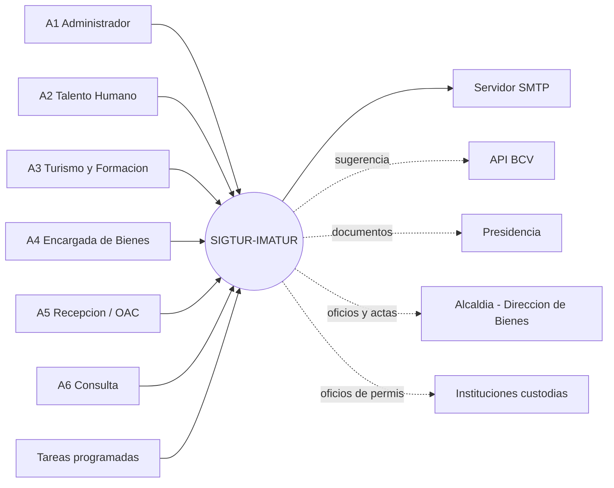

# Documento de Especificación y Requerimientos (DER)

**Sistema Integral de Gestión Turística y Administrativa — SIGTUR-IMATUR**
**Cliente:** Instituto Municipal de Turismo de Cumaná (IMATUR) · Municipio Sucre, estado Sucre, Venezuela
**Versión del documento:** 1.0 · **Fecha:** 2026-09-19
**Versión del sistema descrita:** migraciones 001–083 · rama `development_stage`

> **Alcance de este documento.** Especifica **qué hace** el sistema (requerimientos funcionales),
> **con qué calidad** (no funcionales), **para quién** (actores), **bajo qué reglas** (reglas de
> negocio) y **qué queda fuera**. Estructura basada en IEEE 830, adaptada a un sistema ya
> construido: cada requerimiento indica su **estado real de implementación**.
>
> **Documentos relacionados:** `MODELO_DATOS_ER.md` (datos) · `CASOS_DE_USO.md` (interacción) ·
> `DIAGRAMA_CLASES.md` / `DIAGRAMA_COMPONENTES.md` / `DIAGRAMAS_SECUENCIA.md` (diseño) ·
> `MANUAL_USUARIO.md` (operación) · `BACKLOG.md` (lo que falta) · `REGLAS_NEGOCIO_*.md` (reglas).

---

## Índice

1. [Introducción](#1-introducción)
2. [Descripción general](#2-descripción-general)
3. [Actores del sistema](#3-actores-del-sistema)
4. [Requerimientos funcionales](#4-requerimientos-funcionales)
5. [Requerimientos no funcionales](#5-requerimientos-no-funcionales)
6. [Reglas de negocio](#6-reglas-de-negocio-rn)
7. [Interfaces externas](#7-interfaces-externas)
8. [Restricciones de diseño y del entorno](#8-restricciones-de-diseño-y-del-entorno)
9. [Supuestos y dependencias](#9-supuestos-y-dependencias)
10. [Fuera de alcance](#10-fuera-de-alcance)
11. [Matriz de trazabilidad](#11-matriz-de-trazabilidad)
12. [Glosario](#12-glosario)

---

## 1. Introducción

### 1.1 Propósito
Definir de manera completa y verificable los requerimientos del sistema SIGTUR-IMATUR, de modo que
sirva simultáneamente como (a) contrato funcional con el cliente, (b) base para el diseño y las
pruebas, y (c) documento de referencia para el mantenimiento.

### 1.2 Ámbito del producto
SIGTUR-IMATUR es una **aplicación web de uso interno** que automatiza la gestión administrativa y
operativa de IMATUR en seis áreas: **Recursos Humanos** (incluida **Nómina**), **Formación**,
**Turismo (Rutas)**, **Bienes/Inventario**, **Recepción de visitantes** y **Análisis/Reportes**,
sobre una base transversal de **Seguridad y Auditoría**.

**Lo que resuelve:**
- Sustituye libros en papel y hojas de cálculo dispersas por un repositorio único con trazabilidad.
- Emite los documentos oficiales del instituto (constancias, oficios, actas, fichas, carnets) con
  **correlativo controlado** y membrete institucional.
- Calcula lo que hoy se calcula a mano y con error (nómina quincenal, bono vacacional, saldo de
  vacaciones, días hábiles, tarifas en divisas).
- Da visibilidad de gestión (indicadores, alertas de vencimiento, centro de alertas).

### 1.3 Definiciones principales
Ver §12 (Glosario). Términos críticos: **catálogo de ruta** vs **salida**, **estatus** vs
**condición** de un bien, **comisión de servicio**, **participante libre**, **borrado lógico**.

### 1.4 Referencias
- Manual Descriptivo de Cargos de IMATUR (abril 2024) — organigrama sembrado.
- Ley Orgánica del Trabajo, los Trabajadores y las Trabajadoras (LOTTT) y **contrato colectivo**
  vigente — base de vacaciones, bono vacacional y primas.
- Procedimiento de bienes de la Alcaldía de Sucre (formulario **BM-1**; modificado 2026-09-02).
- Levantamientos con el cliente: `MODELO_NEGOCIO_RRHH.md`,
  `PREGUNTAS_DESCUBRIMIENTO_Bienes_Rutas.md`, `formatos/`.

---

## 2. Descripción general

### 2.1 Perspectiva del producto
Sistema **autónomo** (no es módulo de otro), desplegado **on-premise** en la sede de IMATUR, **sin
dependencia de internet** para operar. Arquitectura **MVC en PHP puro** sobre **PostgreSQL 17**,
servida por Apache. No usa framework ni gestor de dependencias: todas las librerías de terceros
están **vendorizadas** en el repositorio.

### 2.2 Funciones principales (resumen)

| Módulo | Funciones |
|---|---|
| **Seguridad** | Autenticación, RBAC dinámico por rol, bitácora de auditoría, papelera, recuperación de contraseña |
| **RRHH** | Organigrama, ficha técnica, expediente digital, horarios, asistencia y puntualidad, permisos y reposos, vacaciones, disciplina, constancias, traslados, egreso/reingreso, carnetización |
| **Nómina** | Parámetros mensuales, nómina quincenal calculada, bono vacacional, exportación multi-hoja |
| **Formación** | Talleres/charlas/inducciones, participantes (con y sin cédula), asistencia, informe demográfico, evidencias, pasantes |
| **Turismo** | Catálogo de recorridos, salidas con solicitud y aprobación, itinerario por salida, personal asignado, permisos a custodios, cobro y pagos, ficha institucional |
| **Bienes** | Expediente administrativo por bien, codificación contra BM-1, movimientos, mantenimiento, conteos, dotación, etiquetas QR, relaciones y actas |
| **Recepción** | Registro de visitantes y control de visitas |
| **Análisis** | ~30 reportes filtrables con exportación Excel/PDF, indicadores de gestión, centro de alertas |

### 2.3 Características de los usuarios

| Perfil | Formación informática | Frecuencia de uso |
|---|---|---|
| Administrador del sistema | Media-alta | Diaria |
| Personal de Talento Humano | Media | Diaria |
| Personal de Turismo / Formación | Básica-media | Diaria |
| Encargada de Bienes | Básica | Semanal |
| Recepción / OAC | Básica | Continua durante la jornada |
| Directivos (consulta) | Básica | Ocasional |

**Consecuencia de diseño:** la interfaz debe ser autoexplicativa, en español, con validación en
línea y mensajes de error que digan **qué corregir**, no códigos.

### 2.4 Estado de implementación (a la fecha del documento)

| Módulo | Estado |
|---|---|
| Seguridad y Sistema | ✅ Completo |
| RRHH (sin nómina) | ✅ Completo |
| Nómina | 🟢 Motor de cálculo y bono vacacional completos · 🔒 **falta Liquidación de Prestaciones Sociales** |
| Formación | ✅ Completo |
| Turismo (Rutas) | ✅ Las nueve fases construidas · ⏳ falta el formato oficial de 2 imprimibles |
| Bienes | ✅ Fases 1–4 construidas · 🔒 faltan 2 formatos oficiales y la carga de los bienes reales |
| Recepción | ✅ Completo |
| Reportes / Indicadores | ✅ Completo |

---

## 3. Actores del sistema

### 3.1 Actores humanos (roles del sistema)

| ID | Actor | Rol BD | Responsabilidad |
|---|---|---|---|
| **A1** | **Administrador del Sistema** | 1 | Acceso total. Usuarios, roles y permisos, configuración institucional, bitácora, papelera, catálogos geográficos |
| **A2** | **Analista / Dirección de Talento Humano** | 2 | Personal, expedientes, asistencia, permisos, vacaciones, disciplina, constancias, nómina, configuración |
| **A3** | **Personal de Turismo y Formación** | 3 | Recorridos y salidas, talleres, pasantes, sedes de formación, visitantes, reportes del área |
| **A4** | **Encargada de Bienes** | 4 | Inventario, categorías, ubicaciones, movimientos, reportes del área |
| **A5** | **Recepcionista / OAC** | 5 | Registro de visitantes y visitas, marcaje de asistencia |
| **A6** | **Consulta (Solo Lectura)** | 6 | Reportes y visitantes, sin capacidad de modificación |

> **A1 es el único que puede** administrar usuarios/roles, ver la **Bitácora general**, editar
> **Municipios/Parroquias** y aprobar la transición *Postulado → Aceptado* de un pasante.

### 3.2 Actores de negocio que NO usan el sistema
Son quienes firman o autorizan fuera de él, y cuyo acto **se registra** dentro:

| Actor | Participación registrada |
|---|---|
| **Presidencia de IMATUR** | Aprueba cada salida de ruta; autoriza exoneraciones de cobro; firma constancias y oficios |
| **Director(a) de Relaciones Inter-Institucionales** | Tramita los oficios de permiso a instituciones custodias |
| **Alcaldía de Sucre (Dirección de Bienes)** | Emite el formulario **BM-1** con los códigos; recibe la relación de bienes y el acta de desincorporación |
| **Institución solicitante** (escuela, liceo, ente público) | Solicita una salida por oficio; el oficio se **archiva** |
| **Institución custodia** (museo, castillo, fundación) | Concede o niega el permiso de acceso a una parada |
| **Zona Educativa** | Selecciona instituciones y cantidad de participantes de las actividades formativas externas |

### 3.3 Actores sistema

| Actor | Función |
|---|---|
| **Tarea programada `SIGTUR-Estados`** | Cada ~10 min: auto-transiciona el estado de los talleres según su fecha |
| **Tarea programada `SIGTUR-Respaldo`** | Diaria: respaldo de la base con rotación |
| **Servidor SMTP** | Envía el correo de recuperación de contraseña |
| **API del BCV** | Sugiere la tasa del dólar (**nunca bloquea**; si falla, se carga a mano) |

### 3.4 Diagrama de actores

---

## 4. Requerimientos funcionales

**Notación de estado:** ✅ implementado · 🟡 parcial · 🔒 bloqueado por insumo del cliente.
**Prioridad:** **A** = imprescindible · **M** = importante · **B** = deseable.

### 4.1 Seguridad, acceso y sistema (RF-SEG)

| ID | Requerimiento | Actor | Prio | Estado |
|---|---|---|---|---|
| RF-SEG-01 | El sistema debe autenticar al usuario por **nombre de usuario o correo** + contraseña, validando contra un hash bcrypt | Todos | A | ✅ |
| RF-SEG-02 | Tras **5 intentos fallidos consecutivos** debe bloquear la cuenta **15 minutos**, informando los intentos restantes cuando queden ≤ 2 | Todos | A | ✅ |
| RF-SEG-03 | Debe cerrar la sesión automáticamente tras **30 minutos de inactividad** | Todos | A | ✅ |
| RF-SEG-04 | Debe revalidar en **cada petición** que la cuenta sigue activa y con qué rol; si fue suspendida, cerrar sesión en el acto | — | A | ✅ |
| RF-SEG-05 | Debe restringir el acceso a cada módulo según un **mapa de permisos por rol almacenado en base de datos**, editable desde la interfaz | A1 | A | ✅ |
| RF-SEG-06 | El menú lateral debe construirse **desde el mismo mapa de permisos** que aplica el control de acceso (sin condiciones cableadas por rol) | Todos | A | ✅ |
| RF-SEG-07 | Debe permitir al usuario **recuperar su contraseña** mediante un enlace de un solo uso enviado a su correo, válido 30 minutos | Todos | M | 🟡 construido; 🔒 faltan credenciales SMTP reales |
| RF-SEG-08 | La contraseña debe tener **mínimo 8 caracteres, con al menos una letra y un número** | Todos | A | ✅ |
| RF-SEG-09 | Debe registrar en una **bitácora inmutable** toda operación INSERT/UPDATE/DELETE con el estado previo y posterior en JSON, el usuario y la IP | — | A | ✅ |
| RF-SEG-10 | Debe registrar los eventos de acceso: LOGIN, LOGIN_FALLIDO y LOGIN_INACTIVO | — | A | ✅ |
| RF-SEG-11 | Todo borrado debe ser **lógico**, con posibilidad de restauración desde una **papelera** | A1 + rol con permiso | A | ✅ |
| RF-SEG-12 | Debe impedir que un **doble envío** de formulario cree registros duplicados, mediante un **token de un solo uso** por formulario | Todos | A | ✅ |
| RF-SEG-13 | Los archivos subidos por usuarios **no deben ser accesibles por URL directa**: se sirven por un controlador que valida el rol | — | A | ✅ |
| RF-SEG-14 | Debe permitir configurar los **datos institucionales** (presidenta, cargo, resolución, gaceta, RIF, dirección, teléfono, lema) que se imprimen en los documentos | A1, A2 | A | ✅ |
| RF-SEG-15 | Debe generar **correlativos de oficio atómicos**, con reinicio a `001` al cambiar de año y sin reciclaje de números anulados | — | A | ✅ |
| RF-SEG-16 | Debe ofrecer una **búsqueda global** en el encabezado que devuelva coincidencias agrupadas y filtradas por el acceso del usuario | Todos | M | ✅ |
| RF-SEG-17 | Debe respaldar la base de datos **diariamente**, con rotación configurable | A1 | A | ✅ |
| RF-SEG-18 | El usuario debe poder cambiar su **nombre de usuario** y su **contraseña** desde su perfil | Todos | M | ✅ |
| RF-SEG-19 | La cuenta de un trabajador debe **desactivarse automáticamente al egresarlo** y reactivarse al reingresarlo | — | A | ✅ |

### 4.2 Recursos Humanos (RF-RH)

#### Estructura y personal

| ID | Requerimiento | Prio | Estado |
|---|---|---|---|
| RF-RH-01 | Debe mantener el **organigrama jerárquico** de unidades (Presidencia → Direcciones → Coordinaciones → unidades), con relación padre-hijo y tipo de unidad | A | ✅ |
| RF-RH-02 | Debe mantener un catálogo de **cargos** clasificados por nivel jerárquico (Presidencia, Dirección, Coordinación, Adscrito), **sin sueldo por cargo** | A | ✅ |
| RF-RH-03 | Debe registrar a todo trabajador como una **persona** más su vinculación laboral, en una **única transacción** (nunca un empleado sin persona) | A | ✅ |
| RF-RH-04 | El alta de un trabajador debe hacerse mediante un **asistente por pasos**: datos personales → formación → institucionales → carga familiar → resumen | A | ✅ |
| RF-RH-05 | Debe validar la **edad** al registrar: 18–65 años para personal IMATUR y 18–70 para comisión de servicio | A | ✅ |
| RF-RH-06 | Debe registrar **tipo de contrato** (Fijo/Contratado) e **institución de origen** (Alcaldía/Gobernación/IMATUR) como campos independientes, y **derivar** de ellos la comisión de servicio | A | ✅ |
| RF-RH-07 | Debe asignar automáticamente un **folio de expediente** `EXP-####`, no editable | M | ✅ |
| RF-RH-08 | Debe señalar cuándo un trabajador es **elegible para pasar a fijo** por tiempo de servicio (Gobernación 3 años, Alcaldía/IMATUR 5), **sin promoverlo automáticamente** | M | ✅ |
| RF-RH-09 | Debe generar la **Ficha Técnica del Trabajador** en versión imprimible, con datos personales, formación, carga familiar y datos laborales | A | ✅ |
| RF-RH-10 | Debe gestionar **carga familiar, cursos realizados y experiencia laboral** como colecciones del trabajador | A | ✅ |
| RF-RH-11 | Debe permitir **cargar recaudos escaneados** (PDF/JPG/PNG ≤ 5 MB) y mostrar un **checklist con los obligatorios faltantes** | A | ✅ |
| RF-RH-12 | Debe registrar el **traslado de departamento** como una reasignación con **historial** (fecha, motivo, origen y destino) | M | ✅ |
| RF-RH-13 | Debe permitir **egresar** a un trabajador conservando su expediente, con fecha (no futura), motivo y observación, y **reingresarlo** dejando constancia en el histórico | A | ✅ |
| RF-RH-14 | Debe emitir **constancias** en seis tipos (trabajo, bancaria, horario, funciones, antigüedad, egreso) con correlativo, estatus del trabajador y tiempo de servicio, **sin exigir antigüedad mínima** | A | ✅ |
| RF-RH-15 | Debe generar el **carnet institucional** imprimible en formato CR80 vertical, con foto, e indicar si el trabajador es FIJO o CONTRATADO | M | ✅ |

#### Jornada, asistencia y ausencias

| ID | Requerimiento | Prio | Estado |
|---|---|---|---|
| RF-RH-16 | Debe mantener un catálogo de **horarios/modalidades** (Estándar 8:00–14:00, OAC matutino/vespertino, Servicios Generales A/B, ajustados) y asignar uno a cada trabajador | A | ✅ |
| RF-RH-17 | Debe registrar la asistencia con **patrón toggle**: la primera marca del día abre la entrada, la siguiente cierra la salida | A | ✅ |
| RF-RH-18 | Al marcar entrada debe calcular los **minutos de retraso** contra el horario asignado y marcar impuntualidad si supera la tolerancia configurada | A | ✅ |
| RF-RH-19 | Al marcar salida **antes de la hora** (más allá de su propia tolerancia, independiente de la de puntualidad) debe exigir **motivo obligatorio** | A | ✅ |
| RF-RH-20 | Debe permitir el **registro manual/retroactivo** de asistencia | M | ✅ |
| RF-RH-21 | Debe excluir del ausentismo a quien esté **en ruta o en formación externa** ese día | M | ✅ |
| RF-RH-22 | Las asistencias son **bitácora: no se eliminan** | A | ✅ |
| RF-RH-23 | Debe gestionar **permisos y reposos** con categoría (Reposo/Permiso), taxonomía de tipo, fechas, duración y flujo Pendiente → Aprobado/Rechazado/Anulado | A | ✅ |
| RF-RH-24 | Debe calcular el **saldo de vacaciones**: 15 días hábiles + 1 por año de servicio, **tope 30**, sobre la antigüedad total en la Administración Pública | A | ✅ |
| RF-RH-25 | El conteo de días de vacaciones debe **excluir fines de semana y feriados**, con feriados fijos recurrentes y **Carnaval/Semana Santa calculados por año** | A | ✅ |
| RF-RH-26 | Las vacaciones **no disfrutadas se acumulan** y debe admitirse un **ajuste inicial** por trabajador para el saldo previo al sistema | A | ✅ |
| RF-RH-27 | Debe advertir cuando a un año próximo le falten los **feriados movibles** (si no, el conteo falla en silencio) | A | ✅ |

#### Disciplina

| ID | Requerimiento | Prio | Estado |
|---|---|---|---|
| RF-RH-28 | Debe registrar **faltas** con tipo (inasistencia injustificada / incumplimiento) y **amonestaciones**, contarlas por trabajador y mostrarlas en un roster con semáforo | A | ✅ |
| RF-RH-29 | Debe permitir **escalar una falta a amonestación**, conservando el vínculo con la falta de origen | M | ✅ |
| RF-RH-30 | Con **3 amonestaciones activas** debe mostrar la alerta *"causa de despido"*. **El despido NO es automático**: el egreso es una acción manual | A | ✅ |
| RF-RH-31 | Anular una falta o una amonestación debe exigir **motivo** | M | ✅ |

### 4.3 Nómina (RF-NOM)

| ID | Requerimiento | Prio | Estado |
|---|---|---|---|
| RF-NOM-01 | Debe mantener los **porcentajes de prima por grado de instrucción** y la **escala de antigüedad** (tope 30 %) como **parámetros en base de datos**, no en código | A | ✅ |
| RF-NOM-02 | Debe mantener por **mes** el monto de la **cesta ticket** y la **tasa del dólar**, e impedir generar un período si el mes no está cargado | A | ✅ |
| RF-NOM-03 | Debe **sugerir** la tasa del dólar desde el BCV; un fallo de red **nunca** debe bloquear: la tasa se carga a mano | M | ✅ |
| RF-NOM-04 | Debe mantener el **historial salarial** de cada trabajador con fecha efectiva (append-only, nunca sobrescribir) | A | ✅ |
| RF-NOM-05 | Debe generar la **nómina quincenal** tomando una foto del personal activo y calculando: sueldo base, primas de profesionalización y antigüedad, bono de transporte, prima por hijos, deducciones (SSO, FAOV, LRPPF), aportes patronales, alícuotas y neto a cobrar | A | ✅ |
| RF-NOM-06 | Las **primas se derivan** del grado, la antigüedad y la carga familiar; **no se capturan a mano** | A | ✅ |
| RF-NOM-07 | Debe **congelar** en el período los parámetros usados (cesta ticket, tasa, semanas) para que el recálculo reproduzca el resultado exacto | A | ✅ |
| RF-NOM-08 | Debe emitir **advertencias por trabajador** cuando falte o sea dudoso un dato de entrada, sin abortar la corrida | A | ✅ |
| RF-NOM-09 | Debe permitir **recalcular** un período en borrador conservando su identificador | A | ✅ |
| RF-NOM-10 | Debe soportar **5 tipos de personal** (Alto Nivel, Empleados Fijos, Obreros Fijos, Contratados, Comisión de Servicio), y para el último registrar el sueldo de la dependencia de origen y la diferencia | A | ✅ |
| RF-NOM-11 | Debe **exportar a Excel** una hoja por tipo de personal más una hoja RESUMEN | A | ✅ |
| RF-NOM-12 | Un período **cerrado** no debe poder recalcularse ni editarse | A | ✅ |
| RF-NOM-13 | Debe calcular el **Bono Vacacional** con días según el tipo de personal (configurables por contrato colectivo), permitiendo **corregir el total a mano** y **aceptar en bloque** los calculados; al recalcular, los confirmados se conservan | A | ✅ |
| RF-NOM-14 | Debe calcular la **Liquidación de Prestaciones Sociales** | A | 🔒 **No implementado** — bloqueado por la pregunta N-3 (días adicionales de la hoja INTERESES) |

### 4.4 Formación (RF-FOR)

| ID | Requerimiento | Prio | Estado |
|---|---|---|---|
| RF-FOR-01 | Debe registrar actividades formativas en tres tipos: **Taller, Charla e Inducción**, internas o externas | A | ✅ |
| RF-FOR-02 | Para actividades **externas** debe registrar el **tipo de ente** destinatario (Escuela, Liceo, Comunidad, Prestador de Servicio) | A | ✅ |
| RF-FOR-03 | Debe permitir inscribir participantes **con cédula** (personas registradas) o **sin cédula** en "modo libre" (niños y niñas), con datos demográficos propios | A | ✅ |
| RF-FOR-04 | Al inscribir un menor en actividad externa debe registrar el **docente acompañante** (nombre y cédula) | M | ✅ |
| RF-FOR-05 | Debe **advertir de participantes repetidos** al inscribir y ofrecer un reporte de posibles duplicados | M | ✅ |
| RF-FOR-06 | Debe permitir el **marcaje de asistencia individual y masivo**, y emitir la **lista de asistencia imprimible** | A | ✅ |
| RF-FOR-07 | Debe generar automáticamente el **informe demográfico** de la actividad (mujeres, hombres, niñas, niños) con total derivado | A | ✅ |
| RF-FOR-08 | Debe permitir adjuntar **evidencias** (imágenes/documentos ≤ 5 MB) validando extensión y tipo real | M | ✅ |
| RF-FOR-09 | Debe gestionar la máquina de estados Programado → En Curso → Finalizado, con Cancelado desde los dos primeros. La transición **Programado → En Curso** debe ocurrir **sola** (tarea programada) cuando llegue la fecha/hora de inicio y la actividad tenga al menos un participante; las demás son manuales | A | ✅ |
| RF-FOR-10 | Un taller **Finalizado o Cancelado** no debe poder cambiar de estado | A | ✅ |
| RF-FOR-11 | Debe gestionar **pasantes** con máquina de estados Postulado → Aceptado → En Curso → Culminado (+ Rechazado), asignación de tutor institucional y checklist de documentos | A | ✅ |
| RF-FOR-12 | La transición **Postulado → Aceptado** debe estar restringida al Administrador | M | ✅ |
| RF-FOR-13 | Debe emitir la **carta de postulación**, la **carta de aceptación** (con correlativo) y el **carnet de pasante** | A | ✅ |
| RF-FOR-14 | Debe calcular y mostrar la **duración de la pasantía** en días | B | ✅ |
| RF-FOR-15 | Debe mantener el catálogo de **sedes de formación** con su parroquia e indicador de sede propia | M | ✅ |
| RF-FOR-16 | Debe registrar el **oficio de formación** recibido | B | 🔒 Bloqueado — falta el formato y el destinatario (D-FO06/D-NEW01) |

### 4.5 Turismo — Rutas (RF-TUR)

#### Catálogo

| ID | Requerimiento | Prio | Estado |
|---|---|---|---|
| RF-TUR-01 | Debe mantener un **catálogo de recorridos reutilizables**, independiente de cada salida | A | ✅ |
| RF-TUR-02 | Cada recorrido debe declarar sus **paradas** con orden, descripción y coordenadas, y mostrarlas en un **mapa que funciona sin internet** | A | ✅ |
| RF-TUR-03 | Cada parada debe declarar su **institución custodia** (si la tiene) y si el punto pone **guía externo** | A | ✅ |
| RF-TUR-04 | El recorrido debe declarar su **rango de edad admisible** (edad mínima/máxima, ambas opcionales) y sus **restricciones** en texto. **La edad nunca debe estar cableada en el código** | A | ✅ |
| RF-TUR-05 | El recorrido debe declarar su **modo de tarifa**: Gratuita, Fija (monto en **USD**) o A convenir, más las exoneraciones aplicables (menores de N años, instituciones públicas) | A | ✅ |

#### Salida (ejecución)

| ID | Requerimiento | Prio | Estado |
|---|---|---|---|
| RF-TUR-06 | Debe registrar **cada salida** del recorrido con fecha, hora, cupo y **origen** (Particular o Institucional) | A | ✅ |
| RF-TUR-07 | Una salida **institucional** debe identificar a la institución solicitante y permitir **archivar el oficio entrante** (escaneado) que la solicita | A | ✅ |
| RF-TUR-08 | Toda salida debe requerir **aprobación de la Presidencia**, registrando quién la asentó y cuándo, y **no debe poder aprobarse dos veces** | A | ✅ |
| RF-TUR-09 | Los estados de una salida deben ser **Programado, Ejecutado y No ejecutado**; los dos últimos son **terminales** | A | ✅ |
| RF-TUR-10 | Marcar una salida como **No ejecutada** debe exigir **motivo obligatorio** | A | ✅ |
| RF-TUR-11 | No debe poder marcarse como **Ejecutada** una salida con fecha futura | A | ✅ |
| RF-TUR-12 | **Reprogramar** debe crear una **salida nueva enlazada** a la original (que se conserva intacta), heredando grupo, origen, cupo y oficio; solo desde «No ejecutado», una sola vez y con fecha no pasada | A | ✅ |
| RF-TUR-13 | Debe permitir asignar **varios trabajadores de IMATUR** a una salida, con **uno solo marcado como encargado**, y sugerir cuántos hacen falta sin bloquear | A | ✅ |
| RF-TUR-14 | Debe permitir definir un **itinerario propio de la salida** (orden distinto al del catálogo) y marcar paradas como **omitidas** con su nota; «Restablecer» vuelve al orden del catálogo | A | ✅ |
| RF-TUR-15 | El itinerario personalizado debe exigir **todas** las paradas sin órdenes repetidos, y guardarse en bloque | A | ✅ |
| RF-TUR-16 | Debe registrar las **incidencias** de la salida | M | ✅ |

#### Inscripción

| ID | Requerimiento | Prio | Estado |
|---|---|---|---|
| RF-TUR-17 | Debe inscribir participantes **con cédula** o en **modo libre** (menores), registrando en este caso a su **representante** | A | ✅ |
| RF-TUR-18 | Debe **impedir o advertir** la inscripción cuando la edad del participante esté fuera del rango del recorrido, aplicando la misma regla en **todos** los flujos de inscripción | A | ✅ |
| RF-TUR-19 | Debe **advertir** (no bloquear) cuando se supere el **cupo diario** configurado (por defecto 60 personas/día, 0 = sin tope) | M | ✅ |
| RF-TUR-20 | Debe permitir marcar asistencia **individual y masiva** de los participantes | A | ✅ |
| RF-TUR-21 | Una salida **no ejecutada** no debe admitir inscripciones ni generar ficha | A | ✅ |
| RF-TUR-22 | Para recorridos marcados con **prerequisito de formación**, debe verificar que el participante con cédula haya asistido antes a una actividad formativa; los participantes libres están **exentos** | M | ✅ |

#### Permisos a custodios

| ID | Requerimiento | Prio | Estado |
|---|---|---|---|
| RF-TUR-23 | Debe emitir **oficios de permiso** a las instituciones custodias, con correlativo propio (`PERM-`), cubriendo un **rango semanal** | A | ✅ |
| RF-TUR-24 | La relación permiso ↔ salida debe ser **N:M**: un oficio cubre varias salidas y una salida puede requerir varios oficios | A | ✅ |
| RF-TUR-25 | Debe mostrar **a qué custodios falta pedirles permiso** en una semana, derivándolo de las paradas de las salidas programadas | A | ✅ |
| RF-TUR-26 | Debe registrar la respuesta (**En espera / Aceptado / Rechazado**), exigiendo motivo en el rechazo, y permitir adjuntar el **pase recibido** | A | ✅ |
| RF-TUR-27 | **Anular** un permiso no debe borrarlo ni **reciclar su número** | A | ✅ |
| RF-TUR-28 | El oficio de permiso debe imprimirse en el **formato oficial** | M | 🔒 Vista **provisional** — falta el formato de IMATUR |

#### Cobro

| ID | Requerimiento | Prio | Estado |
|---|---|---|---|
| RF-TUR-29 | Debe fijar en cada salida la **tarifa en USD** y la **tasa de cambio**, **congelándolas**: cambiar el catálogo o la tasa no debe alterar lo ya cobrado | A | ✅ |
| RF-TUR-30 | Debe registrar la **fecha tope de pago** (pago anticipado) y señalar las salidas vencidas con saldo | A | ✅ |
| RF-TUR-31 | Debe llevar la **cuenta completa** de lo cobrado: varios abonos, de pagadores distintos, con estado de cuenta por salida | A | ✅ |
| RF-TUR-32 | Debe soportar tres formas de pago: **Transferencia** (con comprobante adjunto), **Efectivo** (con **acta numerada** `ACTP-`) y **Punto de venta** | A | ✅ |
| RF-TUR-33 | **Anular un pago no debe borrarlo**: se marca anulado con motivo obligatorio y deja de sumar | A | ✅ |
| RF-TUR-34 | Debe permitir **exonerar** una salida registrando motivo obligatorio, quién lo asentó y cuándo. La exoneración es **por ruta**, nunca automática por ser institución pública | A | ✅ |

#### Cierre

| ID | Requerimiento | Prio | Estado |
|---|---|---|---|
| RF-TUR-35 | Al marcar la salida como **Ejecutada**, el sistema debe **generar automáticamente** la **Ficha Institucional** en borrador, precargada con lo que ya sabe | A | ✅ |
| RF-TUR-36 | La Ficha debe capturarse **por institución** (renglones con conteo por sexo y rango de edad), más **docentes**, **representantes** e **instituciones de apoyo** | A | ✅ |
| RF-TUR-37 | Los totales de la Ficha deben ser **derivados** de sus renglones y recalcularse en cada guardado | A | ✅ |
| RF-TUR-38 | Debe existir **una sola Ficha por salida** y poder **cerrarse** (y reabrirse) | A | ✅ |
| RF-TUR-39 | La Ficha debe imprimirse en el **formato oficial** de IMATUR | A | ✅ |
| RF-TUR-40 | Debe emitir el **oficio de visita** (saliente) con correlativo `NNN/AAAA` y vista imprimible | A | ✅ |

### 4.6 Bienes / Inventario (RF-BIE)

| ID | Requerimiento | Prio | Estado |
|---|---|---|---|
| RF-BIE-01 | Debe registrar cada bien con categoría, **ubicación obligatoria**, marca, modelo, serial y datos de adquisición (origen Compra/Donación, costo, proveedor, garantía) | A | ✅ |
| RF-BIE-02 | Un bien nace **sin código**, en estatus *En espera de codificación* | A | ✅ |
| RF-BIE-03 | Debe registrar la recepción de los **formularios BM-1** de la Alcaldía, con su escaneado opcional, y **codificar** desde ellos cada bien por partes (grupo, subgrupo, sección, N° de orden) | A | ✅ |
| RF-BIE-04 | El **código `codigo_bn` debe componerse** de sus cuatro partes y el **N° de orden no debe repetirse** | A | ✅ |
| RF-BIE-05 | Debe separar el **estatus administrativo** (En espera de codificación, Activo, En mantenimiento, Extraviado, Robado, Desincorporado) de la **condición física** (Nuevo, Bueno, Regular, Dañado) | A | ✅ |
| RF-BIE-06 | El **responsable de un bien debe derivarse** del departamento de su ubicación; **no debe almacenarse** | A | ✅ |
| RF-BIE-07 | Debe registrar **movimientos**: asignación de responsable, traslado, salida y retorno de mantenimiento, y baja, con origen, destino y quién autoriza | A | ✅ |
| RF-BIE-08 | Debe impedir los movimientos sin sentido: mover un bien desincorporado, trasladarlo al mismo sitio, sacarlo dos veces a mantenimiento o retornarlo sin mantenimiento abierto. Un bien sin codificar solo admite asignación de responsable | A | ✅ |
| RF-BIE-09 | Debe gestionar **mantenimiento correctivo** (falla, trabajo realizado, costo, resultado) y **preventivo** (frecuencia en meses, próxima fecha, aviso de vencimiento) | A | ✅ |
| RF-BIE-10 | Debe permitir **conteos de inventario** por cambio de gestión o auditoría: bien por bien, comparando esperado contra hallado, con **acta imprimible** al cerrar | A | ✅ |
| RF-BIE-11 | Debe generar **etiquetas imprimibles** con el código oficial y un **QR** que abre la hoja de vida del bien, **funcionando sin internet** y solo para bienes codificados | M | ✅ |
| RF-BIE-12 | Debe analizar la **suficiencia de bienes**: dotación esperada por departamento contra existencia real | M | ✅ |
| RF-BIE-13 | Cada bien debe tener **hoja de vida**: documentos, foto e historial completo de movimientos | A | ✅ |
| RF-BIE-14 | Debe emitir el **oficio de relación de bienes nuevos** a la Alcaldía, con correlativo y anulación con motivo | A | ✅ |
| RF-BIE-15 | Debe registrar la **donación** de un bien (donante, cédula, estado civil, domicilio, procedencia, valor en USD) y emitir su documento | M | ✅ |
| RF-BIE-16 | Debe emitir el **Acta de Desincorporación por lote**, con dos estados (emitida → firmada). Al registrarla firmada, **todos sus bienes pasan a Retirado**; anularla **revierte el retiro** | A | 🟡 Datos y flujo ✅ · imprimible **provisional** 🔒 falta el formato oficial |
| RF-BIE-17 | Debe distinguir claramente la **desincorporación** (movimiento de negocio) de la **eliminación** (papelera) en listados y reportes | A | ✅ |
| RF-BIE-18 | Debe adaptarse al **procedimiento nuevo** en el que IMATUR asigna sus propios códigos continuando la secuencia | A | 🔒 Bloqueado por B-73 (punto de partida) y B-75 (catálogo de clasificación) |

### 4.7 Recepción (RF-REC)

| ID | Requerimiento | Prio | Estado |
|---|---|---|---|
| RF-REC-01 | Debe registrar **visitantes externos** con cédula, nombre, apellido, institución/procedencia, teléfono, género y correo | A | ✅ |
| RF-REC-02 | Debe registrar entrada y salida con **patrón toggle**, admitiendo varias visitas del mismo visitante en un día | A | ✅ |
| RF-REC-03 | Debe permitir asociar la visita al **empleado visitado** y a un **motivo** de una lista cerrada | M | ✅ |
| RF-REC-04 | Las visitas son **bitácora: no se eliminan**, solo se consultan | A | ✅ |
| RF-REC-05 | Debe mostrar en el panel **Visitas hoy** y **Activas ahora** (entradas sin salida registrada) | M | ✅ |

### 4.8 Análisis, reportes e indicadores (RF-REP)

| ID | Requerimiento | Prio | Estado |
|---|---|---|---|
| RF-REP-01 | Debe ofrecer un **panel principal** con indicadores del área del usuario | A | ✅ |
| RF-REP-02 | Debe ofrecer reportes filtrables por período y criterios propios en las áreas de RRHH, Formación/Turismo, Inventario, Recepción y Seguridad | A | ✅ |
| RF-REP-03 | Todo listado y reporte debe poder **exportarse a Excel y PDF** respetando los filtros aplicados y con membrete institucional | A | ✅ |
| RF-REP-04 | Cada reporte debe estar **protegido por rol a nivel de método**, adicionalmente al control de acceso por módulo | A | ✅ |
| RF-REP-05 | Debe ofrecer una página de **Indicadores de Gestión** con KPIs por área y selección de año | A | ✅ |
| RF-REP-06 | Debe ofrecer un **Centro de Alertas** y una **campana de notificaciones** con los pendientes del área del usuario | A | ✅ |
| RF-REP-07 | Una alerta ya revisada debe **dejar de mostrarse** y reaparecer solo si cambia el conjunto de casos que la origina | M | ✅ |
| RF-REP-08 | Debe alertar de: contratos por vencer, pasantías por culminar, expedientes incompletos, talleres vencidos, mantenimientos próximos y bienes en alerta | A | ✅ |
| RF-REP-09 | Debe ofrecer un **informe trimestral** de formación | M | 🟡 Se arma sumando los individuales |

---

## 5. Requerimientos no funcionales

### 5.1 Seguridad (RNF-SEG)

| ID | Requerimiento | Verificación |
|---|---|---|
| RNF-SEG-01 | Las contraseñas se almacenan con **hash bcrypt**; nunca en claro ni reversible | Inspección de `usuarios.password` |
| RNF-SEG-02 | Toda consulta a base de datos usa **sentencias preparadas** (PDO) | Revisión de código: no hay concatenación de entrada en SQL |
| RNF-SEG-03 | La cookie de sesión es `httponly`, `samesite=Lax` y `secure` bajo HTTPS | Inspección de cabeceras |
| RNF-SEG-04 | El identificador de sesión se **regenera** al autenticar (mitiga fijación de sesión) | Prueba manual |
| RNF-SEG-05 | La entrada de formularios se **sanitiza** (`strip_tags` + `trim`) preservando UTF-8, y toda salida se escapa en la vista | Prueba con carga XSS |
| RNF-SEG-06 | En producción **no se muestran errores** al usuario (`APP_DEBUG=false`); todo se registra en el log del servidor | Configuración |
| RNF-SEG-07 | Solo `public/` es accesible por web; `app/`, `config/`, `storage/`, `cron/` y `database/` no | Configuración del servidor |
| RNF-SEG-08 | Las credenciales viven en `config/config.php`, **fuera del control de versiones** | `.gitignore` |
| RNF-SEG-09 | La bitácora **nunca registra contraseñas** | `Model::fetchFullRow()` elimina la columna |
| RNF-SEG-10 | Los archivos subidos se validan por **extensión, tamaño (≤ 5 MB) y tipo MIME real** | Prueba con archivo renombrado |

### 5.2 Rendimiento (RNF-REN)

| ID | Requerimiento |
|---|---|
| RNF-REN-01 | Una pantalla de listado debe responder en **< 2 s** con el volumen esperado (≤ 200 empleados, ≤ 2.000 bienes, ≤ 5.000 visitas/año) |
| RNF-REN-02 | Los listados extensos deben **paginarse** en el servidor |
| RNF-REN-03 | La conexión a base de datos se **comparte dentro de la misma petición** (abrir una conexión cuesta ~45 ms; la consulta, < 1 ms) |
| RNF-REN-04 | El mapa RBAC y el resumen del Centro de Alertas se **cachean** por petición/por lapso para no repetir consultas |
| RNF-REN-05 | Las consultas frecuentes deben estar respaldadas por **índices** (migración 052) |

### 5.3 Disponibilidad y respaldo (RNF-DIS)

| ID | Requerimiento |
|---|---|
| RNF-DIS-01 | El sistema debe operar **sin conexión a internet**. Ninguna funcionalidad esencial puede depender de una CDN o de un servicio externo |
| RNF-DIS-02 | Debe existir un **respaldo diario automático** de la base, con rotación configurable |
| RNF-DIS-03 | La restauración debe poder hacerse con un solo comando `psql` sobre el archivo de respaldo |
| RNF-DIS-04 | La falta de conexión con el BCV o con el servidor SMTP **degrada la funcionalidad, no la interrumpe** |

### 5.4 Usabilidad (RNF-USA)

| ID | Requerimiento |
|---|---|
| RNF-USA-01 | Interfaz **íntegramente en español**, con terminología del instituto |
| RNF-USA-02 | Diseño **responsive** (Bootstrap 5.3) y **tema claro/oscuro** |
| RNF-USA-03 | Validación **en el cliente y en el servidor** para cédula, teléfono, correo y RIF, con el **mismo criterio** en ambos lados |
| RNF-USA-04 | Los mensajes de error deben indicar **qué corregir**, no códigos técnicos |
| RNF-USA-05 | Las acciones destructivas deben pedir **confirmación** |
| RNF-USA-06 | Los formularios deben tener etiquetas asociadas (`label[for]`) para accesibilidad |
| RNF-USA-07 | El texto libre capturado por el usuario se **capitaliza automáticamente** |
| RNF-USA-08 | Los documentos imprimibles deben abrirse en una vista **sin el layout del sistema**, lista para imprimir |

### 5.5 Mantenibilidad (RNF-MAN)

| ID | Requerimiento |
|---|---|
| RNF-MAN-01 | Arquitectura **MVC** con un controlador y un modelo por área funcional |
| RNF-MAN-02 | Los **enumerados y umbrales de negocio** viven en constantes del modelo o en `configuracion_sistema`, **nunca cableados en vistas o consultas** |
| RNF-MAN-03 | Todo cambio de esquema se entrega como **migración idempotente** numerada, con encabezado que explique el porqué |
| RNF-MAN-04 | Debe existir un **esquema consolidado autosuficiente** para instalar desde cero sin aplicar migraciones |
| RNF-MAN-05 | La lógica de cálculo pura (p. ej. el motor de nómina) debe estar **cubierta por pruebas automatizadas** que no toquen la base |
| RNF-MAN-06 | **Sin gestor de dependencias**: las librerías de terceros se vendorizan en el repositorio |

### 5.6 Trazabilidad y cumplimiento (RNF-TRA)

| ID | Requerimiento |
|---|---|
| RNF-TRA-01 | Toda escritura queda registrada con **quién, qué, cuándo y desde dónde** |
| RNF-TRA-02 | **Nada se borra físicamente**: la recuperación siempre es posible |
| RNF-TRA-03 | Los documentos oficiales llevan **correlativo único, atómico y no reciclado** |
| RNF-TRA-04 | Los registros de naturaleza probatoria (asistencias, visitas, pagos, permisos emitidos) **no se eliminan**: se anulan con motivo |
| RNF-TRA-05 | Los cálculos económicos **congelan sus parámetros de entrada** para ser reproducibles |

### 5.7 Portabilidad (RNF-POR)

| ID | Requerimiento |
|---|---|
| RNF-POR-01 | Debe funcionar sobre **PHP 8.0+** con `pdo_pgsql`, `zip` y `fileinfo`, y **PostgreSQL 16/17** |
| RNF-POR-02 | Debe funcionar en Windows (Laragon/Apache) y en Linux (Apache) sin cambios de código |
| RNF-POR-03 | La URL base y las credenciales deben ser configurables por entorno en un único archivo |

---

## 6. Reglas de negocio (RN)

Las reglas completas por módulo están en los documentos `REGLAS_NEGOCIO_*.md` y
`MODELO_NEGOCIO_RRHH.md`. Aquí se consolidan las **transversales y las de mayor impacto**.

### 6.1 Transversales

| ID | Regla |
|---|---|
| RN-G01 | **Nada se borra.** Todo borrado es lógico y recuperable desde la papelera |
| RN-G02 | **Toda escritura se audita** con estado previo y posterior |
| RN-G03 | La **cédula** se normaliza a solo dígitos (máx. 8) antes de buscar o guardar, excepto en los campos de "participante libre" |
| RN-G04 | El **género** admite únicamente `M` o `F` |
| RN-G05 | Los correlativos **no se reciclan**: anular un documento no libera su número |
| RN-G06 | Un **doble envío** de formulario no genera un segundo registro |
| RN-G07 | El acceso se resuelve por el **mapa de permisos en base de datos**, y el menú refleja exactamente ese mapa |

### 6.2 RRHH

| ID | Regla |
|---|---|
| RN-RH01 | Un empleado **siempre** está vinculado a una persona; el alta es atómica |
| RN-RH02 | **Comisión de servicio se deriva** del origen institucional, no se marca a mano |
| RN-RH03 | Todo trabajador nuevo entra como **Contratado**. El único camino directo a **Fijo** es venir ya fijo de Alcaldía/Gobernación |
| RN-RH04 | El paso a fijo por tiempo de servicio **no es automático**: el sistema solo señala la elegibilidad |
| RN-RH05 | **Asistencia y visitas son bitácora**: no se eliminan |
| RN-RH06 | **3 amonestaciones activas = causa de despido**, pero el **egreso es manual** |
| RN-RH07 | Vacaciones: **15 días hábiles + 1 por año, tope 30**, sobre antigüedad en la Administración Pública, excluyendo fines de semana y feriados |
| RN-RH08 | Las vacaciones **no disfrutadas se acumulan** y nunca se pierden |
| RN-RH09 | El **egreso conserva** expediente, tiempo de servicio y constancias; desactiva el acceso al sistema |
| RN-RH10 | La **fecha de vencimiento de contrato** es distinta de la fecha de egreso |

### 6.3 Nómina

| ID | Regla |
|---|---|
| RN-NOM01 | Las **primas se derivan**; no se capturan |
| RN-NOM02 | Los **porcentajes** son parámetros de contratación colectiva y viven en tablas, no en código |
| RN-NOM03 | Cesta ticket y tasa del dólar **cambian cada mes** y se **congelan** en el período |
| RN-NOM04 | El cálculo **nunca sale a internet** |
| RN-NOM05 | Un período **cerrado es inmutable** |

### 6.4 Turismo

| ID | Regla |
|---|---|
| RN-TUR01 | **Catálogo ≠ salida.** Todo lo operativo cuelga de la salida |
| RN-TUR02 | Toda salida la **aprueba la Presidencia** |
| RN-TUR03 | **No ejecutada exige motivo**; los estados terminales no vuelven atrás |
| RN-TUR04 | **Reprogramar crea una salida nueva**; la original se conserva como constancia |
| RN-TUR05 | La **edad admisible es del recorrido**, nunca del sistema |
| RN-TUR06 | El **cupo es diario** y **advierte, no bloquea** |
| RN-TUR07 | La **tarifa se pacta en USD** y se cobra en bolívares a la tasa **congelada** en la salida |
| RN-TUR08 | La **gratuidad es por ruta**, no automática por ser institución pública |
| RN-TUR09 | El **pago es anticipado**, con fecha tope |
| RN-TUR10 | **Anular un pago no lo borra**: deja de sumar |
| RN-TUR11 | El **acta de pago se numera solo para efectivo** |
| RN-TUR12 | **Un permiso de acceso cubre la semana** y no cuelga de una sola salida |
| RN-TUR13 | La **Ficha Institucional nace sola** al ejecutar la salida y sus totales son derivados |
| RN-TUR14 | El **oficio de solicitud es entrante** (se archiva); el **oficio de visita es saliente** (se emite con correlativo) |
| RN-TUR15 | El **guía externo es del punto**, no de la salida |

### 6.5 Bienes

| ID | Regla |
|---|---|
| RN-BIE01 | **Estatus (administrativo) ≠ condición (física)** |
| RN-BIE02 | **Desincorporado ≠ eliminado**: lo primero es un movimiento, lo segundo es la papelera |
| RN-BIE03 | El **responsable se deriva** del departamento de la ubicación |
| RN-BIE04 | Un bien **nace sin código** y se codifica contra el BM-1 |
| RN-BIE05 | El **N° de orden es único** |
| RN-BIE06 | Registrar el **acta firmada retira todo el lote**; anularla **revierte el retiro** |
| RN-BIE07 | Sin **ubicaciones** sembradas **no se puede registrar un bien** |

### 6.6 Formación

| ID | Regla |
|---|---|
| RN-FOR01 | Actividades **internas** (para el propio personal) vs **externas** (a terceros, vía Zona Educativa u otras instituciones) |
| RN-FOR02 | Los **niños se inscriben sin cédula**, con docente acompañante en actividades externas |
| RN-FOR03 | Un participante **puede inscribirse en varias actividades**; el sistema no lo bloquea, solo advierte |
| RN-FOR04 | Un taller **Finalizado o Cancelado** no cambia de estado |
| RN-FOR05 | La transición de pasante **Postulado → Aceptado** es exclusiva del Administrador |

---

## 7. Interfaces externas

### 7.1 Interfaz de usuario
Navegador web (Chrome/Edge/Firefox actualizados). Interfaz Bootstrap 5.3, responsive, con tema
claro/oscuro. **Todos los recursos son locales** (Bootstrap, Bootstrap Icons, ApexCharts, Leaflet,
QRCode.js están vendorizados en `public/assets/libs/`).

### 7.2 Interfaz de hardware
Ninguna especial. La impresión de carnets requiere impresora con soporte **CR80 vertical
(54 × 85,6 mm)**; las etiquetas de bienes se imprimen en hoja común.

### 7.3 Interfaces de software

| Interfaz | Protocolo | Criticidad | Comportamiento ante fallo |
|---|---|---|---|
| **PostgreSQL 17** | PDO / TCP 5432 | **Crítica** | El sistema no opera |
| **Servidor SMTP** | SMTP (PHPMailer vendorizado) | Baja | Solo afecta la recuperación de contraseña; el Administrador puede restablecerla |
| **API del BCV** | HTTPS | Muy baja | La tasa se carga a mano; **nunca bloquea** el cálculo |
| **`pg_dump`** | CLI | Media | Sin respaldo automático (se puede hacer manual) |
| **Programador de tareas** | CLI (PowerShell/cron) | Media | Los talleres no auto-transicionan y no hay respaldo diario |

### 7.4 Interfaces de comunicación
HTTP/HTTPS en red local. **No se expone a internet**; no hay API pública ni integración entrante.

---

## 8. Restricciones de diseño y del entorno

| ID | Restricción | Origen |
|---|---|---|
| RES-01 | **PHP puro, sin framework ni Composer** | Decisión del proyecto: el equipo que mantendrá el sistema no usa gestores de dependencias |
| RES-02 | **Despliegue on-premise sin internet** | Condición operativa de IMATUR |
| RES-03 | **PostgreSQL** como único motor | Decisión de arquitectura |
| RES-04 | **Toda librería de terceros vendorizada**; prohibido el uso de CDN | Consecuencia de RES-02 |
| RES-05 | El documento oficial que emita el sistema debe **reproducir el formato físico vigente** del instituto | Requisito del cliente |
| RES-06 | Los cambios de esquema se entregan como **migraciones idempotentes numeradas** | Convención del proyecto |
| RES-07 | La raíz web es `public/`; el resto del proyecto no debe ser servible | Seguridad |

---

## 9. Supuestos y dependencias

### 9.1 Supuestos
- Los usuarios operan desde la red interna de IMATUR, en equipos administrados por la institución.
- El volumen de datos se mantiene en el orden de: ~200 trabajadores, ~2.000 bienes,
  ~50 salidas de ruta al año, ~5.000 visitas al año.
- Los documentos físicos (oficios recibidos, actas firmadas) se digitalizan y se adjuntan.
- Existe personal responsable de cargar cada año los **feriados movibles** y los **parámetros
  mensuales de nómina**.

### 9.2 Dependencias de insumos del cliente (bloqueantes)

| ID | Insumo pendiente | Bloquea |
|---|---|---|
| **N-3** | Definición de los "días adicionales" de la hoja INTERESES, con evidencia | RF-NOM-14 (Liquidación de Prestaciones Sociales) |
| **N-1 / N-2** | Días base (75 vs 85/45) y semanas (×4/×5) | No bloquea: son parámetros. Vuelven definitivos los montos |
| **B-73 / B-75** | Punto de partida de la secuencia de códigos y catálogo de clasificación | RF-BIE-18 (codificación propia de IMATUR) |
| **R-2 / R-3** | Formato del **Acta de Desincorporación** y del **acta de asignación** | RF-BIE-16 (imprimible definitivo) |
| **B-81** | Confirmación de vigencia del oficio de relación recibido | Ajuste menor de RF-BIE-14 |
| **Bono calculado** | Un mes de bono vacacional ya calculado por el cliente | Calibración del total de RF-NOM-13 |
| **Formato de permiso** | Formato oficial del oficio de permiso a custodios | RF-TUR-28 |
| **SMTP** | Credenciales del servidor de correo | RF-SEG-07 |
| **D-FO06** | Contenido y destinatario del oficio de formación | RF-FOR-16 |

### 9.3 Dependencias de carga de datos
El sistema está **funcionalmente correcto pero vacío** hasta que se carguen: personal real,
datos salariales, catálogo de cargos completo, los ~142 bienes, la configuración institucional
definitiva y las credenciales de producción.

---

## 10. Fuera de alcance

Explícitamente **no** forma parte del sistema (decisiones registradas con el cliente):

| Qué | Por qué |
|---|---|
| Portal público o reserva en línea de rutas | El sistema es de uso interno |
| Aplicación móvil / "modo campo" para el guía | R-46: el informe se hace en la oficina |
| Galería fotográfica de salidas | R-49: descartado |
| Gestión de transporte y vehículos | R-58: descartado |
| Encuestas de satisfacción al turista | R-59: descartado |
| Contabilidad general / integración con sistemas financieros | Fuera del alcance acordado |
| Horas extras en el cálculo de nómina | No existen en IMATUR |
| Pago electrónico o pasarela de pagos | El cobro se registra, no se procesa |
| Clasificación de rutas por nivel de dificultad | IMATUR no clasifica así (eliminado, mig. 021) |
| Asignación de bienes a rutas o talleres | No se hace (eliminado, mig. 019 y 050) |
| Registro de visitantes extranjeros con tipo de documento | IMATUR no recibe visitantes extranjeros con frecuencia |
| Certificación obligatoria para guiar | R-34: no es requisito |

---

## 11. Matriz de trazabilidad

### 11.1 Requerimiento → Módulo → Casos de uso → Tablas

| Grupo RF | Controladores | Casos de uso | Tablas principales |
|---|---|---|---|
| RF-SEG | `Auth`, `Usuarios`, `Roles`, `Auditoria`, `Config`, `Perfil`, `Descarga`, `Buscar`, `Exportar` | CU-01…CU-09 | `usuarios`, `roles`, `permisos_rol`, `audit_logs`, `configuracion_sistema`, `password_resets` |
| RF-RH | `Empleados`, `Cargos`, `Departamentos`, `Horarios`, `Asistencias`, `Permisos`, `Vacaciones`, `Amonestaciones` | CU-10…CU-27 | `personas`, `empleados`, `departamentos`, `cargos`, `horarios`, `asistencias`, `permisos_laborales`, `vacaciones`, `faltas`, `amonestaciones`, `constancias`, `expediente_documentos` |
| RF-NOM | `Nomina` | CU-28…CU-33 | `nomina_*`, `empleado_salarios`, `bono_vacacional_*` |
| RF-FOR | `Talleres`, `Ubicacionesformacion`, `Pasantes` | CU-34…CU-42 | `talleres`, `participantes_taller`, `taller_informes`, `taller_evidencias`, `pasantes`, `pasante_documentos` |
| RF-TUR | `Rutas` | CU-43…CU-56 | `rutas`, `puntos_ruta`, `ruta_ejecuciones`, `ruta_ejecucion_*`, `ruta_permisos`, `ruta_pagos`, `ruta_informes`, `ruta_ficha_grupos`, `participantes_ruta`, `oficios_emitidos` |
| RF-BIE | `Inventario`, `Categorias`, `Ubicaciones`, `Actividadesinventario` | CU-57…CU-68 | `inventario`, `actividad_inventario`, `inventario_*` |
| RF-REC | `Visitantes`, `Visitas` | CU-69…CU-71 | `visitantes`, `visitas` |
| RF-REP | `Reportes`, `Dashboard` | CU-72…CU-75 | consultas sobre todas |

### 11.2 Regla de negocio → Requerimiento → Dónde vive

| Regla | RF | Implementación |
|---|---|---|
| RN-G01 (nada se borra) | RF-SEG-11 | `is_active` + `AuditoriaController::papelera()` |
| RN-G02 (todo se audita) | RF-SEG-09 | `Model::audit()` / `AuditLog::log()` |
| RN-G06 (anti doble envío) | RF-SEG-12 | `Router` + `sigtur_token_*` |
| RN-RH06 (3 amonestaciones) | RF-RH-30 | `Amonestacion::LIMITE_DESPIDO` |
| RN-RH07 (vacaciones) | RF-RH-24/25 | `Vacacion::diasPorAnios()`, `diasHabiles()` |
| RN-NOM03 (congelar parámetros) | RF-NOM-07 | `Nomina::generarPeriodo()` |
| RN-TUR05 (edad del recorrido) | RF-TUR-04/18 | `Ruta::motivoEdadNoValida()` |
| RN-TUR07 (tarifa congelada) | RF-TUR-29 | `PagoRuta::fijarCondiciones()` |
| RN-TUR13 (ficha automática) | RF-TUR-35 | `RutaEjecucion::cambiarEstado()` → `RutaFicha::generarDesdeEjecucion()` |
| RN-BIE03 (responsable derivado) | RF-BIE-06 | `Inventario` (mig. 066) |
| RN-BIE06 (acta firmada) | RF-BIE-16 | `ActaDesincorporacion::registrarFirmada()` / `anular()` |

### 11.3 Requerimientos con implementación pendiente

| RF | Estado | Motivo |
|---|---|---|
| RF-NOM-14 | 🔒 No implementado | Falta la definición N-3 |
| RF-BIE-18 | 🔒 No implementado | Faltan B-73 y B-75 |
| RF-BIE-16 | 🟡 Imprimible provisional | Falta el formato oficial (R-2) |
| RF-TUR-28 | 🟡 Imprimible provisional | Falta el formato oficial |
| RF-FOR-16 | 🔒 No implementado | Falta contenido y destinatario |
| RF-SEG-07 | 🟡 Construido, sin probar en producción | Faltan credenciales SMTP |
| RF-REP-09 | 🟡 Parcial | Informe trimestral agregado |

---

## 12. Glosario

| Término | Definición |
|---|---|
| **BM-1** | Formulario mediante el cual la Alcaldía de Sucre comunica a IMATUR los códigos oficiales de sus bienes |
| **Catálogo de ruta** | El recorrido reutilizable (nombre, paradas, tarifa, restricciones). No tiene fecha |
| **Salida / ejecución** | Una realización concreta de un recorrido, con fecha, grupo, personal, cobro e informe |
| **Comisión de servicio** | Trabajador cuyo origen institucional es Alcaldía o Gobernación y presta servicio en IMATUR |
| **Condición** (de un bien) | Estado **físico**: Nuevo, Bueno, Regular, Dañado |
| **Estatus** (de un bien) | Situación **administrativa**: En espera de codificación, Activo, En mantenimiento, Extraviado, Robado, Desincorporado |
| **Desincorporar** | Sacar un bien del inventario activo por acto administrativo. **No** es eliminarlo |
| **Ficha Institucional** | Documento de cierre de una salida: conteo demográfico por institución, docentes, representantes y apoyo |
| **Institución custodia** | Ente que resguarda una parada (museo, castillo, fundación) y a quien hay que pedir permiso de acceso |
| **Oficio entrante** | Documento que envía un tercero a IMATUR y que el sistema **archiva** (no genera) |
| **Oficio saliente** | Documento que IMATUR emite, con correlativo propio |
| **Participante libre** | Persona inscrita sin cédula (típicamente un menor), con datos demográficos propios y representante |
| **Patrón toggle** | Mecanismo de marcaje en el que la primera acción abre el registro y la siguiente lo cierra |
| **RBAC** | Control de acceso basado en roles, aquí almacenado en base de datos y editable desde la interfaz |
| **Borrado lógico** | Marcar `is_active = FALSE` en lugar de eliminar la fila |
| **Papelera** | Vista donde se consultan y restauran los registros con borrado lógico |
| **Correlativo** | Número secuencial anual de un documento oficial; atómico y no reciclable |
| **Tipo de personal** | Clasificación a efectos de nómina: Alto Nivel, Empleados Fijos, Obreros Fijos, Contratados, Comisión de Servicio |

---

## Control de versiones del documento

| Versión | Fecha | Cambios |
|---|---|---|
| 1.0 | 2026-09-19 | Versión inicial. Cubre el sistema hasta la migración 083 (Rutas fase T-C incluida) |
