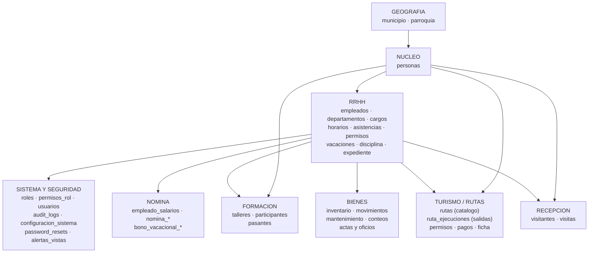
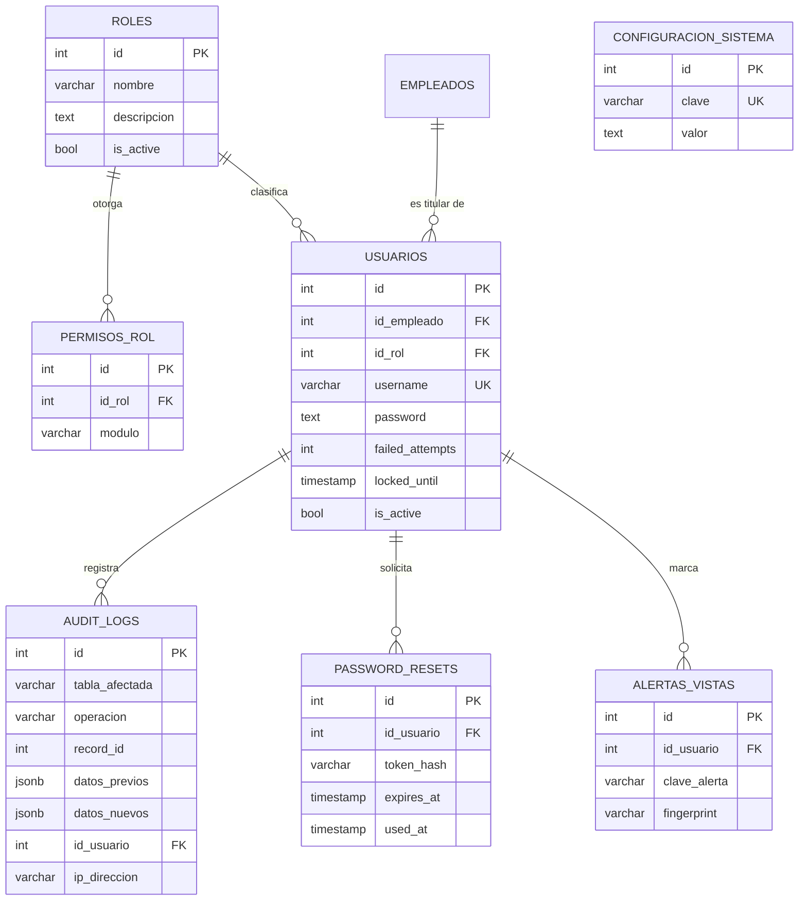
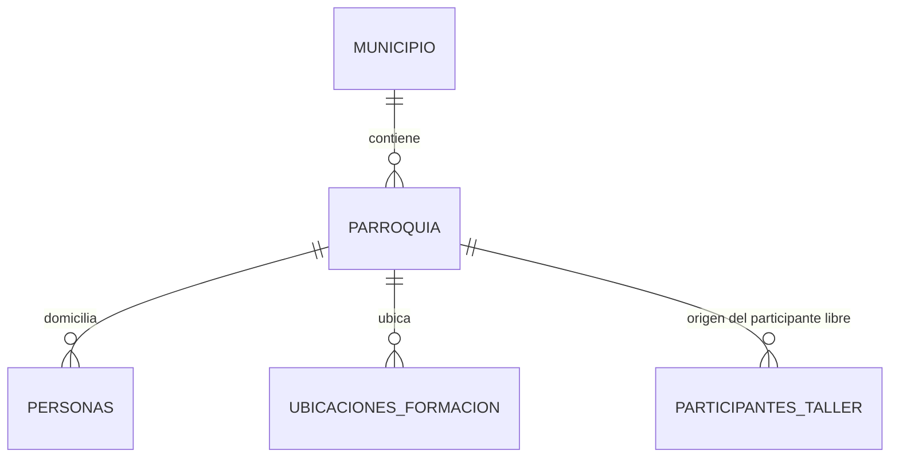
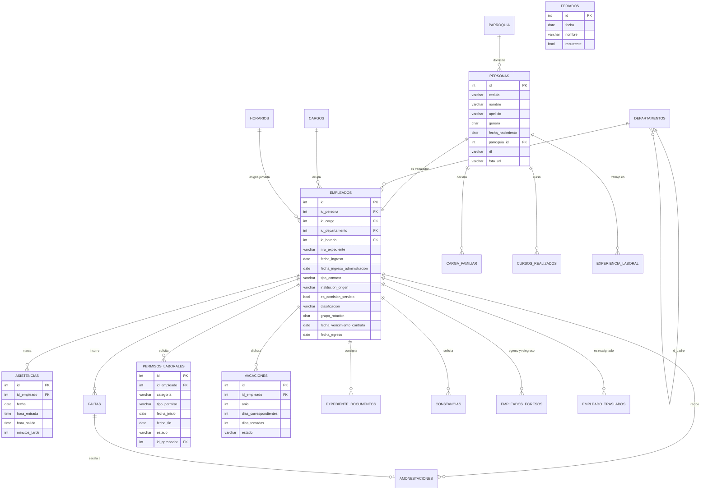
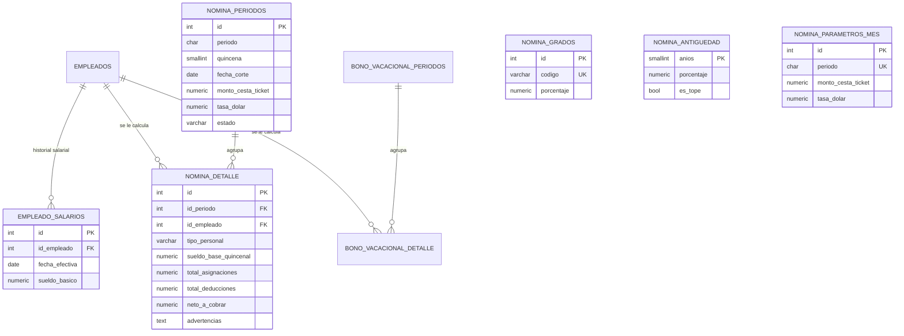
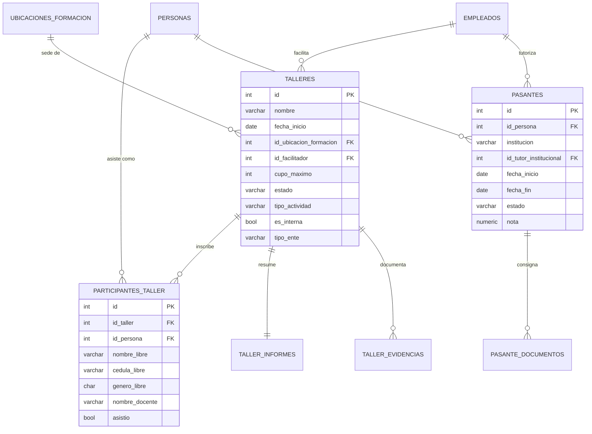
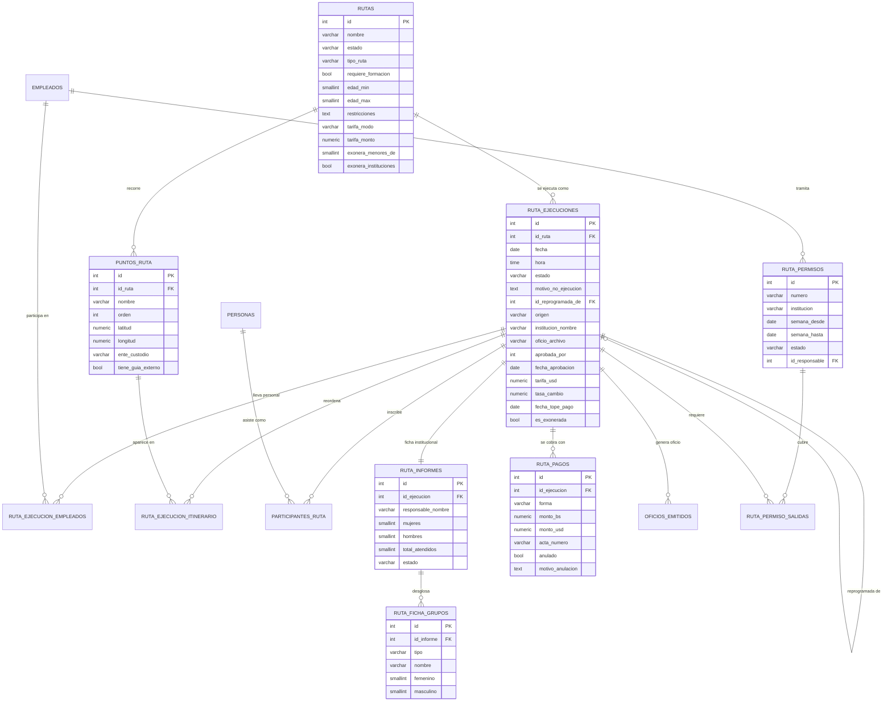
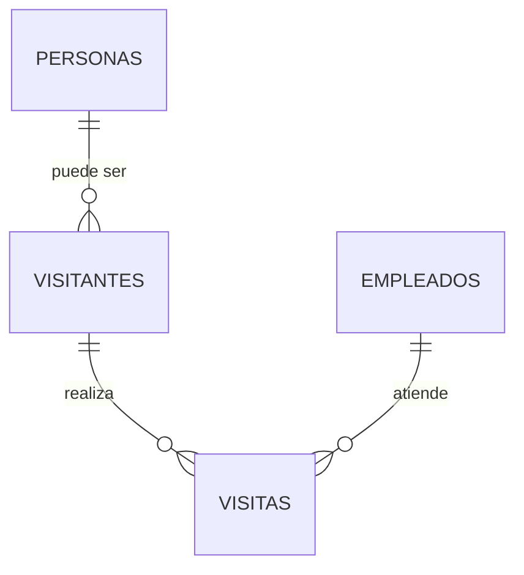
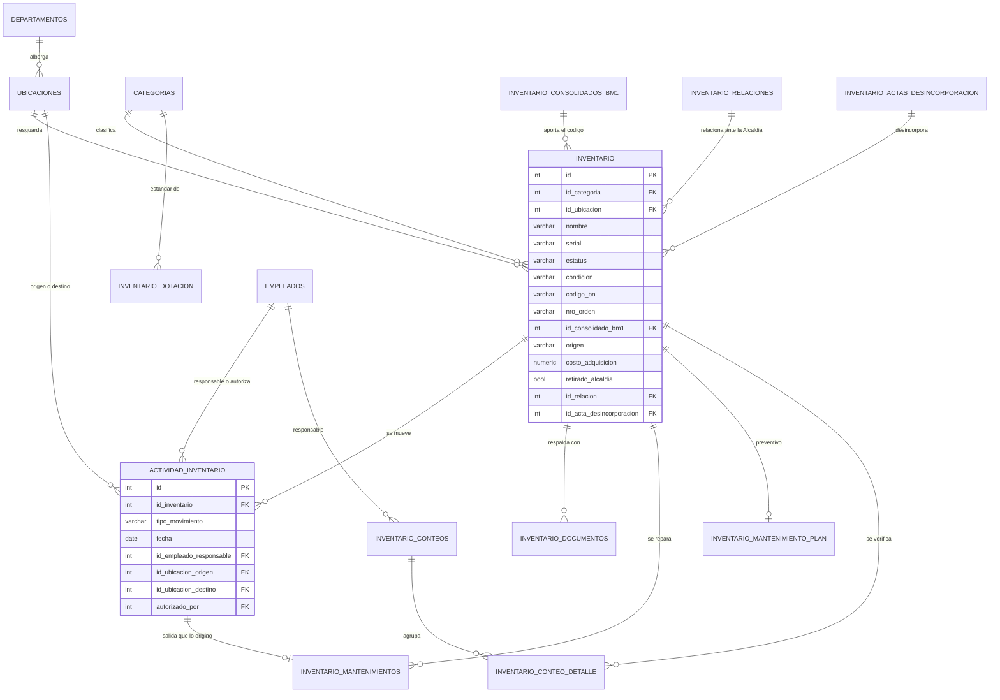

# Modelo de Datos — Diagrama Entidad-Relación (ER)

**SIGTUR-IMATUR** · PostgreSQL 17 · **69 tablas** · esquema `public`
**Estado:** migraciones **001–083** aplicadas · **Última actualización:** 2026-09-19

> **Para qué sirve este documento.** Es el insumo para dibujar el **ER** del sistema (en
> draw.io, ERDPlus, MySQL Workbench, dbdiagram.io o el que se use). Contiene: las entidades
> agrupadas por módulo, sus atributos con tipo y restricción, todas las claves foráneas con su
> cardinalidad, y los diagramas Mermaid ya listos por subsistema.
>
> **Fuente de verdad del esquema:** `database/schema_consolidado.sql` (base + migraciones
> 001–074, 60 tablas) + `database/migrations/075…083` (9 tablas más). Si algo aquí discrepa
> del SQL, **manda el SQL**.

---

## Índice

1. [Convenciones del modelo](#1-convenciones-del-modelo)
2. [Mapa general de subsistemas](#2-mapa-general-de-subsistemas)
3. [Sistema y seguridad](#3-sistema-y-seguridad-7-tablas)
4. [Geografía](#4-geografía-2-tablas)
5. [Personas y RRHH](#5-personas-y-rrhh-18-tablas)
6. [Nómina](#6-nómina-8-tablas)
7. [Formación](#7-formación-7-tablas)
8. [Turismo / Rutas](#8-turismo--rutas-12-tablas)
9. [Recepción](#9-recepción-2-tablas)
10. [Bienes / Inventario](#10-bienes--inventario-13-tablas)
11. [Catálogo completo de relaciones (FK)](#11-catálogo-completo-de-relaciones-fk)
12. [Reglas de integridad que NO están en el ER](#12-reglas-de-integridad-que-no-están-en-el-er)
13. [Trampas del modelo — leer antes de dibujar](#13-trampas-del-modelo--leer-antes-de-dibujar)

---

## 1. Convenciones del modelo

### 1.1 Clave primaria
Toda tabla tiene `id SERIAL PRIMARY KEY`, **salvo `nomina_antiguedad`**, cuya PK es
`anios SMALLINT` (la escala de antigüedad se indexa por años de servicio).

### 1.2 Columnas de auditoría (presentes en casi todas las tablas)

| Columna | Tipo | Significado |
|---|---|---|
| `is_active` | BOOLEAN DEFAULT TRUE | **Borrado lógico**: `FALSE` = en la papelera |
| `created_at` / `updated_at` / `deleted_at` | TIMESTAMP | Sellos de tiempo |
| `created_by` / `updated_by` / `deleted_by` | INTEGER → `usuarios(id)` | Autor de cada operación |

> **En el ER estas 7 columnas se omiten** de los rectángulos de entidad (si no, el diagrama
> es ilegible). Se declaran una sola vez como *estereotipo* `<<auditable>>` y se documentan aquí.
>
> ⚠️ **Excepción de nomenclatura:** la tabla `parroquia` usa `create_at`/`create_by`,
> `update_at`/`update_by`, `delete_at`/`delete_by` (**sin la "d"**), y sus columnas
> `create_by`/`update_by` son **NOT NULL**. Es deuda histórica, no un patrón a imitar.

### 1.3 Borrado
**No hay DELETE físico.** Todo borrado es `is_active = FALSE` + `deleted_at`/`deleted_by`.
La recuperación se hace desde *Sistema → Papelera de Reciclaje*.
Consecuencia para el ER: **no existen relaciones de "borrado en cascada" a nivel de negocio**;
los `ON DELETE CASCADE` declarados solo aplican si alguna vez se borra físicamente.

### 1.4 Notación usada en las tablas de atributos

| Marca | Significado |
|---|---|
| **PK** | Clave primaria |
| **FK** | Clave foránea |
| **UQ** | Único |
| **NN** | NOT NULL |
| **CK** | Tiene restricción CHECK (los valores válidos se listan) |
| **D** | Atributo **derivado** (lo calcula el sistema; no se captura a mano) |

---

## 2. Mapa general de subsistemas



**Lectura del mapa:** `personas` es la **entidad raíz de todo individuo** del sistema
(trabajador, pasante, participante de taller o de ruta, visitante). `empleados` es la
**especialización laboral** de una persona, y a su vez es lo que el resto de los módulos
referencia cuando necesitan "un trabajador de IMATUR" (facilitador, tutor, guía, responsable
de un bien, aprobador de un permiso).

---

## 3. Sistema y seguridad (7 tablas)

### 3.1 Entidades

**`roles`** — perfiles de acceso.

| Atributo | Tipo | Notas |
|---|---|---|
| id | SERIAL | PK |
| nombre | VARCHAR(50) | NN |
| descripcion | TEXT | |
| is_active | BOOLEAN | NN |

Filas sembradas: `1 Administrador`, `2 RRHH`, `3 Turismo`, `4 Inventario`, `5 Recepción`, `6 Solo Lectura`.

**`permisos_rol`** — RBAC dinámico (qué controlador puede usar cada rol).

| Atributo | Tipo | Notas |
|---|---|---|
| id | SERIAL | PK |
| id_rol | INTEGER | **FK** → `roles(id)` ON DELETE CASCADE, NN |
| modulo | VARCHAR(60) | NN — nombre del controlador (`EmpleadosController`) o el comodín `'*'` |

> El rol 1 tiene una única fila con `modulo = '*'` = acceso total. Es un marcador, **no** un
> módulo: en el ER conviene anotarlo, porque no es una FK a nada.

**`usuarios`** — credenciales de acceso.

| Atributo | Tipo | Notas |
|---|---|---|
| id | SERIAL | PK |
| id_empleado | INTEGER | **FK** → `empleados(id)`, **NN** — toda cuenta pertenece a un trabajador |
| id_rol | INTEGER | **FK** → `roles(id)` ON DELETE RESTRICT, NN |
| username | VARCHAR(50) | NN, UQ |
| password | TEXT | NN — hash bcrypt |
| failed_attempts | INTEGER | NN DEFAULT 0 — intentos fallidos consecutivos |
| locked_until | TIMESTAMP | Bloqueo temporal (5 fallos ⇒ 15 min) |
| last_login / ultimo_login | TIMESTAMP | |
| is_active | BOOLEAN | El egreso del trabajador la pone en FALSE automáticamente |

**`audit_logs`** — bitácora inmutable.

| Atributo | Tipo | Notas |
|---|---|---|
| id | SERIAL | PK |
| tabla_afectada | VARCHAR(100) | NN |
| operacion | VARCHAR(20) | NN, **CK** ∈ {INSERT, UPDATE, DELETE, LOGIN, LOGIN_FALLIDO} |
| record_id | INTEGER | Id del registro tocado |
| datos_previos / datos_nuevos | JSONB | Diff completo |
| id_usuario | INTEGER | **FK** → `usuarios(id)` ON DELETE SET NULL |
| fecha | TIMESTAMP | |
| ip_direccion | VARCHAR(45) | IPv4/IPv6 |

> ⚠️ Esta tabla **no tiene borrado lógico ni FK en cascada**: es un log. En el ER márquela
> como `<<log>>`, fuera del ciclo de vida del resto.

**`configuracion_sistema`** — parámetros clave/valor (no es una entidad de negocio).
`id · clave VARCHAR(100) UQ NN · valor TEXT · descripcion VARCHAR(255)`.
Contiene: datos del instituto (nombre de la Presidenta, cargo, resolución, gaceta, RIF, dirección,
teléfono, lema), **correlativos de oficios** — `correlativo_oficio_{ruta, constancia, pasante, acta,
bienes, permiso, actapago, formacion}` con su `ano_correlativo_*` pareja —, tolerancias (`minutos_tolerancia_puntualidad`,
`minutos_tolerancia_salida_temprana`), metas anuales, `rutas_cupo_diario`, días de bono vacacional
por tipo de personal y días de preaviso.

**`password_resets`** — tokens de recuperación por correo.
`id · id_usuario FK→usuarios(id) CASCADE NN · token_hash VARCHAR(64) NN · expires_at TIMESTAMP NN · used_at · requested_ip`.

**`alertas_vistas`** — marca de "ya la revisé" por usuario.
`id · id_usuario FK→usuarios(id) CASCADE NN · clave_alerta VARCHAR(60) NN · fingerprint VARCHAR(64) NN · visto_at`.
El `fingerprint` es el hash del conjunto de IDs que originan la alerta: si cambia, la alerta reaparece.

### 3.2 Diagrama



---

## 4. Geografía (2 tablas)

**`municipio`** — `id · nombre VARCHAR(55) NN · codigo_postal VARCHAR(4) · is_active NN`.
**`parroquia`** — `id · nombre VARCHAR(100) NN · id_municipio FK→municipio(id) NN · is_active NN`
(+ las columnas de auditoría con la nomenclatura irregular descrita en §1.2).



---

## 5. Personas y RRHH (18 tablas)

### 5.1 `personas` — entidad raíz

| Atributo | Tipo | Notas |
|---|---|---|
| id | SERIAL | PK |
| cedula | VARCHAR(15) | **Solo dígitos, máx. 8** (mig. 037). Clave natural de negocio |
| nombre / apellido | VARCHAR(100) | ambos NN |
| telefono | VARCHAR(15) | formato `0XXXXXXXXXX` (11 dígitos) |
| correo | VARCHAR(100) | |
| genero | CHAR(1) | **CK** ∈ {M, F} |
| fecha_nacimiento | DATE | |
| direccion | TEXT | |
| parroquia_id | INTEGER | **FK** → `parroquia(id)` |
| rif | VARCHAR(20) | Formato canónico `X-XXXXXXXX-X` |
| estado_civil | VARCHAR(20) | **CK** ∈ {Soltero, Casado, Concubinato, Divorciado, Viudo} |
| discapacidad / discapacidad_detalle | BOOLEAN / VARCHAR(150) | |
| nivel_academico · profesion · titulo · fecha_graduacion · institucion_academica | | Bloque de formación |
| centro_votacion · consejo_comunal · comuna | VARCHAR(150) | Datos comunitarios |
| foto_url | VARCHAR(255) | Una foto **por persona** (mig. 053), compartida por carnet de empleado y de pasante |

**Tablas hijas de persona** (bloques de la *Ficha Técnica*):

- **`carga_familiar`** — `id · id_persona FK NN · nombre_apellido NN · cedula · fecha_nacimiento · parentesco` **CK** ∈ {Padre, Madre, Cónyuge, Concubino, Hijo} `· genero` CK ∈ {M,F} `· vive BOOLEAN`.
- **`cursos_realizados`** — `id · id_persona FK NN · institucion · curso NN · fecha_inicio · fecha_culminacion`.
- **`experiencia_laboral`** — `id · id_persona FK NN · organismo NN · cargo · fecha_inicio · fecha_culminacion`.

### 5.2 Estructura organizativa

**`departamentos`** — organigrama **jerárquico** (auto-referencia).
`id · nombre NN · descripcion · id_padre FK→departamentos(id) ON DELETE SET NULL · tipo_unidad` **CK** ∈ {Presidencia, Junta Directiva, Dirección, Coordinación, Oficina, Unidad}.

**`cargos`** — `id · nombre NN · descripcion · nivel_jerarquico` **CK** ∈ {Presidencia, Dirección, Coordinación, Adscrito}.

> No tiene `sueldo_base`: IMATUR no distingue sueldo por cargo (decisión D-RH11).

**`horarios`** — `id · nombre NN · hora_entrada TIME NN · hora_salida TIME NN · dias_laborales VARCHAR(50) · descripcion`.
Modalidades sembradas: Estándar (8:00–14:00), OAC Matutino (7:00–12:00), OAC Vespertino (10:00–14:00), Servicios Generales A/B.

### 5.3 `empleados` — especialización laboral de una persona

| Atributo | Tipo | Notas |
|---|---|---|
| id | SERIAL | PK |
| id_persona | INTEGER | **FK** → `personas(id)` ON DELETE RESTRICT, NN — **relación 1:1** |
| id_cargo | INTEGER | **FK** → `cargos(id)` ON DELETE RESTRICT, NN |
| id_departamento | INTEGER | **FK** → `departamentos(id)` ON DELETE RESTRICT, NN |
| id_horario | INTEGER | **FK** → `horarios(id)` ON DELETE SET NULL |
| nro_expediente | VARCHAR(20) | **D** — folio `EXP-####` derivado del `id`, no editable |
| fecha_ingreso | DATE | Ingreso a IMATUR |
| fecha_ingreso_administracion | DATE | Ingreso a la Administración Pública — **base de antigüedad** para vacaciones y primas |
| tipo_contrato | VARCHAR(30) | **CK** ∈ {Fijo, Contratado}, DEFAULT Contratado |
| institucion_origen | VARCHAR(20) | **CK** ∈ {Alcaldía, Gobernación, IMATUR} |
| es_comision_servicio | BOOLEAN | **D** = (`institucion_origen ≠ 'IMATUR'`) |
| clasificacion | VARCHAR(20) | **CK** ∈ {Empleado, Obrero} |
| grupo_rotacion | CHAR(1) | **CK** ∈ {A, B} — rotación de Servicios Generales |
| uniforme · talla_camisa · talla_pantalon · talla_zapato | | Dotación |
| fecha_vencimiento_contrato | DATE | **Distinta de `fecha_egreso`** — alimenta la alerta de contratos por vencer |
| fecha_egreso · motivo_egreso · observacion_egreso | | Egreso vigente (el histórico va en `empleados_egresos`) |
| vacaciones_ajuste_dias | INTEGER | Saldo de vacaciones traído de antes del sistema |

### 5.4 Ciclo de vida laboral

- **`empleados_egresos`** — histórico de salidas y reingresos. `id · id_empleado FK NN · fecha_egreso NN · motivo_egreso NN · observacion · fecha_reingreso · reingreso_observacion · reingreso_at · reingreso_by`.
- **`empleado_traslados`** — reasignación de departamento con historial. `id · id_empleado FK NN · id_departamento_origen · id_departamento_destino NN · id_cargo_origen · id_cargo_destino · fecha NN · motivo · observacion`.
- **`expediente_documentos`** — recaudos escaneados. `id · id_empleado FK NN · tipo_documento NN · archivo_url NN · nombre_original · observaciones`. Los archivos viven en `storage/uploads/expedientes/`, **fuera de la raíz web**.
- **`constancias`** — documentos emitidos. `id · id_empleado FK NN · numero VARCHAR(30) NN · tipo` (trabajo, bancaria, horario, funciones, antigüedad, egreso) `· fecha_emision · observaciones`.

### 5.5 Asistencia y disciplina

- **`asistencias`** — `id · id_empleado FK NN · fecha DATE · hora_entrada TIME NN · hora_salida TIME · minutos_tarde INTEGER (D) · observacion`. **Patrón toggle**: una sola fila abierta por empleado/día. **Bitácora: no se elimina.**
- **`faltas`** — `id · id_empleado FK NN · fecha NN · motivo · tipo` ∈ {Inasistencia injustificada, Incumplimiento} `· motivo_anulacion`.
- **`amonestaciones`** — `id · id_empleado FK NN · fecha NN · motivo NN · id_falta_origen FK→faltas(id) · motivo_anulacion`. **3 activas = causa de despido** (solo alerta; el egreso es manual).
- **`permisos_laborales`** — `id · id_empleado FK NN · categoria` **CK** ∈ {Reposo, Permiso, Vacaciones} `· tipo_permiso` **CK** ∈ {Reposo médico, Médico familiar, Diligencia, Duelo, Maternidad/Paternidad, Personal, Estudios, Otro} `· fecha_inicio NN · fecha_fin NN · dias_solicitados · duracion · motivo · estado` **CK** ∈ {Pendiente, Aprobado, Rechazado, Anulado} `· id_aprobador FK→empleados(id) · fecha_aprobacion`.
- **`vacaciones`** — `id · id_empleado FK NN · anio INTEGER NN · dias_correspondientes · dias_tomados · fecha_inicio · fecha_fin · estado` **CK** ∈ {Pendiente, Aprobado, En Curso, Completado, Rechazado}.
- **`feriados`** — `id · fecha DATE NN · nombre NN · recurrente BOOLEAN NN`. Los fijos se comparan por mes-día; **Carnaval y Semana Santa son movibles** y se generan por año.

### 5.6 Diagrama RRHH



---

## 6. Nómina (8 tablas)

### 6.1 Parámetros (no dependen del trabajador)

- **`nomina_grados`** — % de prima por grado de instrucción. `id · codigo VARCHAR(10) UQ NN · nombre NN · porcentaje NUMERIC(6,3) NN · orden · is_active`.
- **`nomina_antiguedad`** — escala de prima por años. **PK = `anios SMALLINT`** · `porcentaje NUMERIC(6,3) NN · es_tope BOOLEAN` (tope 30 %).
- **`nomina_parametros_mes`** — vigencia mensual. `id · periodo CHAR(7) UQ NN` (`AAAA-MM`, **CK** regex) `· monto_cesta_ticket NUMERIC(14,2) · tasa_dolar NUMERIC(14,4) · observaciones`.

### 6.2 Datos salariales del trabajador

**`empleado_salarios`** — historial **append-only**; el vigente es la fila con `fecha_efectiva` más reciente.
`id · id_empleado FK NN · fecha_efectiva DATE NN · sueldo_basico · prima_profesional · prima_responsabilidad · prima_antiguedad · prima_por_hijo · bono_transporte · prima_fond · prima_discapacidad · caja_ahorro · motivo` (todos `NUMERIC(12,2) NOT NULL DEFAULT 0`).

### 6.3 Corridas

- **`nomina_periodos`** — quincena. `id · periodo CHAR(7) NN · quincena SMALLINT` **CK** ∈ {1,2} `· fecha_corte NN · monto_cesta_ticket · tasa_dolar · semanas SMALLINT CK 1..6 · estado` **CK** ∈ {Borrador, Cerrado} `· cerrado_at · cerrado_by`. **UQ (periodo, quincena)**.
  > Los parámetros se **congelan** al generar: recalcular reconstruye el período exacto.
- **`nomina_detalle`** — una fila por trabajador y período. `id · id_periodo FK CASCADE NN · id_empleado FK NN · tipo_personal` **CK** ∈ {Alto Nivel, Empleados Fijos, Obreros Fijos, Contratados, Comisión de Servicio} + ~30 columnas de cálculo (entradas congeladas, asignaciones, deducciones SSO/FAOV/LRPPF, aportes patronales, alícuotas, `neto_a_cobrar`, `cuenta_nomina`, `banco_nomina`, `advertencias`). **UQ (id_periodo, id_empleado)**.
- **`bono_vacacional_periodos`** — `id · periodo VARCHAR(20) NN · fecha_corte NN · estado` **CK** ∈ {Borrador, Cerrado} `· cerrado_at · cerrado_by`.
- **`bono_vacacional_detalle`** — `id · id_periodo FK CASCADE NN · id_empleado FK NN · tipo_personal CK · dias_vacaciones · grado_escala` + componentes salariales + `total_bono_vacacional` (el único capturable a mano).



> **Relación implícita (no es FK):** `nomina_detalle.codigo_grado` ↔ `nomina_grados.codigo`, y
> `nomina_detalle.anios_administracion` se resuelve contra `nomina_antiguedad.anios`. En el ER
> dibújelas como **relaciones de consulta punteadas**, no como integridad referencial.

---

## 7. Formación (7 tablas)

- **`ubicaciones_formacion`** — sedes e instituciones. `id · nombre NN · tipo · direccion · parroquia FK→parroquia(id) NN · es_sede_propia BOOLEAN`.
- **`talleres`** — `id · nombre NN · descripcion · fecha_inicio NN · fecha_fin · hora_inicio · hora_fin · id_ubicacion_formacion FK · id_facilitador FK→empleados(id) NN · cupo_maximo · estado` **CK** ∈ {Programado, En Curso, Finalizado, Cancelado} `· tipo_actividad` **CK** ∈ {Taller, Charla, Inducción} `· es_interna BOOLEAN NN · tipo_ente` **CK** ∈ {Escuela, Liceo, Comunidad, Prestador de Servicio, IMATUR} `· motivo_cancelacion`.
- **`participantes_taller`** — inscripción **dual**: `id_persona FK` (adulto con cédula) **o** modo libre (`nombre_libre`, `apellido_libre`, `cedula_libre`, `fecha_nac_libre`, `genero_libre` CK ∈ {M,F}, `parroquia_id_libre` FK, `direccion_libre`) + `nombre_docente`/`cedula_docente` (acompañante del menor) + `asistio BOOLEAN`.
  **CK `pt_participante_requerido`:** `id_persona IS NOT NULL OR nombre_libre IS NOT NULL`.
- **`taller_informes`** — informe demográfico, **1:1 con el taller**. `id_taller FK NN · unidad_estadal · lugar_exacto · instituciones_presentes · mujeres · hombres · ninas · ninos · total_atendidas (D) · resumen_actividad`.
- **`taller_evidencias`** — `id · id_taller FK CASCADE NN · archivo NN · nombre_original NN · tipo_archivo · uploaded_at NN · uploaded_by FK→usuarios(id)`.
- **`pasantes`** — `id · id_persona FK NN · institucion NN · carrera · id_tutor_institucional FK→empleados(id) · fecha_inicio · fecha_fin · estado` **CK** ∈ {Postulado, Aceptado, En Curso, Culminado, Rechazado} `· evaluacion · nota NUMERIC(5,2) · oficio_aceptacion · tutor_externo`.
- **`pasante_documentos`** — `id · id_pasante FK CASCADE NN · tipo_documento` **CK** ∈ {Carta de Postulación, Carta de Aceptación, Evaluación, Otro} `· entregado BOOLEAN · archivo_url · fecha_registro`.



---

## 8. Turismo / Rutas (12 tablas)

> 🔑 **La distinción central del módulo:** `rutas` es el **catálogo** (el recorrido reutilizable);
> `ruta_ejecuciones` es **cada salida**. Participantes, informe, itinerario, pagos, personal y
> oficios cuelgan de la **salida** (`id_ejecucion`), no del recorrido.

### 8.1 Catálogo

**`rutas`** — recorrido ofertado.

| Atributo | Tipo | Notas |
|---|---|---|
| id · nombre NN · descripcion · duracion_estimada | | |
| estado | VARCHAR(20) | **CK** ∈ {Activa, Inactiva, En Mantenimiento} — describe si **se ofrece** |
| tipo_ruta | VARCHAR(50) | CK ∈ {Cumaná Histórica, Exploradores de Cumaná, Comunitaria, General} |
| id_departamento FK · id_facilitador FK→empleados | | |
| cupo_maximo | INTEGER | Referencial (el tope real es **diario**, en configuración) |
| requiere_formacion | BOOLEAN | Prerequisito de haber asistido a formación |
| edad_min / edad_max | SMALLINT | NULL = sin tope. **La edad es del recorrido, no del sistema** |
| restricciones | TEXT | Condiciones no etarias (movilidad, visión…) |
| tarifa_modo | VARCHAR(20) | **CK** ∈ {Gratuita, Fija, A convenir}, NN |
| tarifa_monto | NUMERIC(10,2) | **En USD**. CK: obligatorio y > 0 si `tarifa_modo = 'Fija'` |
| tiene_tarifa | BOOLEAN | **D** — se conserva derivada para consultas viejas |
| exonera_menores_de | SMALLINT | p. ej. 8 en Cumaná Histórica |
| exonera_instituciones | BOOLEAN | La gratuidad institucional es **por ruta**, no global |

**`puntos_ruta`** — paradas del catálogo. `id · id_ruta FK CASCADE NN · nombre NN · descripcion · orden INTEGER NN (UQ por ruta) · latitud/longitud NUMERIC(10,7) · ente_custodio VARCHAR(160) · tiene_guia_externo BOOLEAN NN`.

> `ente_custodio` es lo que alimenta "a quién hay que pedirle permiso esta semana".

### 8.2 Salida (ejecución)

**`ruta_ejecuciones`**

| Atributo | Tipo | Notas |
|---|---|---|
| id | SERIAL | PK |
| id_ruta | INTEGER | **FK** → `rutas(id)` ON DELETE RESTRICT, NN |
| fecha DATE NN · hora TIME · cupo_maximo | | |
| estado | VARCHAR(20) | **CK** ∈ {Programado, Ejecutado, No ejecutado}, NN. Los dos últimos son **terminales** |
| motivo_no_ejecucion | TEXT | **Obligatorio** si el estado es «No ejecutado» |
| id_reprogramada_de | INTEGER | **FK** → `ruta_ejecuciones(id)` — auto-referencia: la nueva salida apunta a la que no se ejecutó |
| origen | VARCHAR(20) | **CK** ∈ {Particular, Institucional}, NN |
| institucion_nombre | VARCHAR(200) | Obligatorio de negocio si `origen = 'Institucional'` |
| oficio_archivo / oficio_original | VARCHAR(255) | **Oficio ENTRANTE** que envía la institución (se archiva, no se genera) |
| aprobada_por INTEGER · fecha_aprobacion DATE | | Visto bueno de la Presidencia |
| tarifa_usd NUMERIC(10,2) · tasa_cambio NUMERIC(14,4) · tasa_fecha DATE | | **Congelados** al fijar el cobro |
| fecha_tope_pago | DATE | El pago es anticipado |
| es_exonerada BOOLEAN NN · motivo_exoneracion TEXT · exonerada_por · fecha_exoneracion | | **CK:** si `es_exonerada`, el motivo es obligatorio |
| incidencias · observaciones | TEXT | |

**`ruta_ejecucion_empleados`** — personal de IMATUR que va en la salida.
`id · id_ejecucion FK CASCADE NN · id_empleado FK RESTRICT NN · es_encargado BOOLEAN NN` (uno solo encabeza).

**`ruta_ejecucion_itinerario`** — orden de paradas **propio de esa salida** (R-10).
`id · id_ejecucion FK CASCADE NN · id_punto FK→puntos_ruta CASCADE NN · orden SMALLINT NN (CK ≥ 1) · omitido BOOLEAN NN · nota`.

> **Sin filas ⇒ manda el orden del catálogo.** Con filas, mandan ellas, y deben cubrir **todas** las paradas sin repetir orden.

### 8.3 Permisos a instituciones custodias (N:M)

**`ruta_permisos`** — oficio de permiso, **uno por institución y por semana**.
`id · numero VARCHAR(20) NN` (prefijo `PERM-`, **no se recicla**) `· fecha NN · institucion VARCHAR(160) NN · destinatario_nombre · destinatario_cargo · semana_desde DATE NN · semana_hasta DATE NN` (**CK** `hasta ≥ desde`) `· estado` **CK** ∈ {En espera, Aceptado, Rechazado, Anulado} `· fecha_respuesta · observaciones · motivo_anulacion · id_responsable FK→empleados(id) · respuesta_archivo · respuesta_original`.

**`ruta_permiso_salidas`** — tabla puente. `id · id_permiso FK CASCADE NN · id_ejecucion FK NN`.

> Es N:M **a propósito**: un oficio cubre varias salidas de la semana, y una salida con dos custodios necesita dos oficios.

### 8.4 Cobro

**`ruta_pagos`** — abonos de una salida. `id · id_ejecucion FK NN · fecha NN · forma` **CK** ∈ {Transferencia, Efectivo, Punto de venta} `· monto_bs NUMERIC(14,2) NN` (**CK** > 0) `· monto_usd · tasa_aplicada · personas SMALLINT · pagador_nombre · pagador_cedula · referencia · comprobante_archivo · comprobante_original · acta_numero VARCHAR(20) · observaciones · anulado BOOLEAN NN · motivo_anulacion` (**CK**: si `anulado`, el motivo es obligatorio).

> **Anular no borra**: el pago queda con su motivo y **deja de sumar**. El acta (`ACTP-`) se numera **solo** para efectivo.

### 8.5 Participantes, informe y oficios

- **`participantes_ruta`** — `id · id_ejecucion FK CASCADE` (**la columna viva**) `· id_ruta FK` (nullable, **columna legacy**) `· id_persona FK` **o** modo libre (`nombre_libre`, `apellido_libre`, `cedula_libre`, `genero_libre` CK ∈ {M,F}, `fecha_nac_libre`) `· nombre_representante · cedula_representante · asistio BOOLEAN`. **CK `pr_participante_req`**: `id_persona IS NOT NULL OR nombre_libre IS NOT NULL`.
- **`ruta_informes`** — **Ficha Institucional** de la salida, **1:1 con la ejecución** (índice único por `id_ejecucion`). `id · id_ejecucion FK CASCADE · id_ruta FK` (legacy) `· lugar_exacto · responsable_nombre · mujeres · hombres · ninas · ninos · docentes_f · docentes_m · representantes_f · representantes_m · total_atendidos · estado` **CK** ∈ {Borrador, Cerrada} `· fecha_cierre · observaciones · resumen_visita`.
  > ⚠️ Los conteos agregados (`mujeres`/`hombres`/`ninas`/`ninos`/`total_atendidos`) son **DERIVADOS**: los recalcula el sistema desde los renglones. **No se escriben a mano.**
  > La ficha **nace sola** al marcar la salida como «Ejecutado».
- **`ruta_ficha_grupos`** — renglones de la ficha. `id · id_informe FK CASCADE NN · tipo` **CK** ∈ {Institucion, Apoyo} `· nombre VARCHAR(160) NN · femenino SMALLINT NN · masculino SMALLINT NN · edad_min · edad_max · orden`.
- **`oficios_emitidos`** — oficios **salientes** con correlativo `NNN/AAAA`. `id · numero VARCHAR(20) NN · fecha NN · destinatario_nombre · destinatario_cargo · asunto · id_ejecucion FK SET NULL · id_ruta FK` (legacy).

### 8.6 Diagrama Turismo



---

## 9. Recepción (2 tablas)

- **`visitantes`** — `id · id_persona FK→personas(id)` (opcional) `· cedula · nombre · apellido · procedencia VARCHAR(100)` (**institución que representa**, no ciudad) `· telefono · genero CK ∈ {M,F} · correo · motivo_frecuente`.
- **`visitas`** — `id · id_visitante FK RESTRICT NN · id_empleado FK SET NULL` (el empleado visitado) `· motivo VARCHAR(255)` ∈ {Reunión de trabajo, Trámite administrativo, Entrega de documentos, Visita institucional, Pasantías, Otro} `· hora_entrada TIMESTAMP · hora_salida TIMESTAMP · observaciones`.
  **Patrón toggle**: visita abierta (sin `hora_salida`) ⇒ la próxima marca cierra. **Bitácora: no se elimina.**



---

## 10. Bienes / Inventario (13 tablas)

### 10.1 Catálogos

- **`categorias`** — `id · nombre NN · descripcion`.
- **`ubicaciones`** — `id · nombre NN · descripcion · "departamento _d" INTEGER FK→departamentos(id) NN` ⚠️ **(nombre de columna con espacio, entre comillas)** `· sede VARCHAR(80) · es_deposito BOOLEAN NN`.
  > Sin filas aquí **es imposible registrar un bien** (sembradas en la mig. 069).

### 10.2 `inventario` — el bien

| Atributo | Tipo | Notas |
|---|---|---|
| id | SERIAL | PK |
| id_categoria | INTEGER | **FK** → `categorias(id)` RESTRICT, NN |
| id_ubicacion | INTEGER | **FK** → `ubicaciones(id)` RESTRICT, NN |
| nombre NN · descripcion · marca · modelo · serial | | |
| **estatus** | VARCHAR(30) | **CK** ∈ {En espera de codificación, Activo, En mantenimiento, Extraviado, Robado, **Desincorporado**} — eje **administrativo** |
| **condicion** | VARCHAR(20) | **CK** ∈ {Nuevo, Bueno, Regular, Dañado} — eje **físico** |
| codigo_grupo · codigo_subgrupo · codigo_seccion · nro_orden | VARCHAR | Partes del código oficial |
| codigo_bn | VARCHAR(50) | **D** — compuesto de las 4 partes (`2-01-108-084`) |
| id_consolidado_bm1 | INTEGER | **FK** → `inventario_consolidados_bm1(id)` SET NULL — en qué BM-1 vino el código |
| verificado_alcaldia · fecha_verificacion | | |
| retirado_alcaldia · fecha_retiro | | Confirmación del retiro físico |
| origen | VARCHAR(20) | **CK** ∈ {Compra, Donación} |
| donante · donante_cedula · donante_estado_civil · donante_domicilio · donacion_procedencia · donacion_valor_usd · donacion_fecha | | Bloque de donación (mig. 075) |
| costo_adquisicion · fecha_adquisicion · proveedor · tiene_garantia · garantia_vence | | |
| foto_url | VARCHAR(255) | |
| id_relacion | INTEGER | **FK** → `inventario_relaciones(id)` SET NULL |
| id_acta_desincorporacion | INTEGER | **FK** → `inventario_actas_desincorporacion(id)` SET NULL |

> 🔴 **El responsable NO se almacena**: se **deriva** del departamento de la ubicación (mig. 066).
> En el ER no dibuje una FK `inventario → empleados`.

### 10.3 Ciclo de vida del bien

- **`actividad_inventario`** — movimientos. `id · id_inventario FK CASCADE NN · tipo_movimiento` **CK** ∈ {Traslado, Asignación de responsable, Salida a mantenimiento, Retorno de mantenimiento, Baja} `· descripcion · fecha · id_empleado_responsable FK→empleados SET NULL · id_ubicacion_origen FK→ubicaciones · id_ubicacion_destino FK→ubicaciones · autorizado_por FK→empleados · fecha_retorno`.
- **`inventario_mantenimientos`** — `id · id_inventario FK RESTRICT NN · id_actividad_salida FK→actividad_inventario SET NULL · fecha_salida NN · fecha_retorno · id_empleado_encargado FK · proveedor_externo · descripcion_falla · trabajo_realizado · costo · resultado` **CK** ∈ {Reparado, Sin reparación, Irrecuperable}.
- **`inventario_mantenimiento_plan`** — preventivo. `id · id_inventario FK CASCADE NN · frecuencia_meses` **CK** 1..60 `· ultima_fecha · proxima_fecha NN · descripcion`.
- **`inventario_conteos`** — verificación física. `id · motivo` **CK** ∈ {Cambio de coordinación, Cambio de presidencia, Auditoría, Otro} `· fecha_inicio NN · fecha_cierre · estado` **CK** ∈ {Abierto, Cerrado} `· id_responsable FK→empleados · observaciones`.
- **`inventario_conteo_detalle`** — `id · id_conteo FK CASCADE NN · id_inventario FK NN · esperado_ubicacion · esperado_estatus · esperado_condicion · hallado BOOLEAN · hallado_ubicacion · hallado_condicion · observaciones · verificado_at · verificado_by`.
- **`inventario_dotacion`** — estándar de suficiencia. `id · id_categoria FK CASCADE NN · unidades_por_empleado NUMERIC(6,2) NN` (**CK** 0 < x ≤ 99).
- **`inventario_documentos`** — `id · id_inventario FK CASCADE NN · tipo_documento NN · archivo_url NN · nombre_original · observaciones`.

### 10.4 Documentos administrativos (lotes de bienes)

- **`inventario_consolidados_bm1`** — formularios BM-1 recibidos de la Alcaldía. `id · fecha_recepcion NN · fecha_documento · referencia · archivo_url · nombre_original · observaciones`.
- **`inventario_relaciones`** — oficio de **relación de bienes nuevos** enviado a la Alcaldía. `id · numero VARCHAR(20) NN · fecha NN · destinatario_nombre NN · destinatario_cargo · destinatario_ente · observacion · anulado_motivo`.
- **`inventario_actas_desincorporacion`** — acta de desincorporación **por lote**. `id · numero NN · fecha NN · motivo · observacion · fecha_firma · recibido_por · archivo_url · nombre_original · anulado_motivo`.
  > Dos estados: **emitida** → **firmada**. Al registrarla firmada, **todos sus bienes pasan a «Retirado» de una vez**; anularla **revierte el retiro**.



---

## 11. Catálogo completo de relaciones (FK)

> Tabla lista para transcribir al ER. Las relaciones hacia `usuarios(id)` desde las columnas de
> auditoría (`created_by`, `updated_by`, `deleted_by`, `cerrado_by`, `verificado_by`,
> `uploaded_by`, `reingreso_by`) **se omiten**: son 100+ aristas que solo ensucian el diagrama.
> Se documentan como el estereotipo `<<auditable>>` de §1.2.

| # | Origen (N) | Columna | Destino (1) | ON DELETE | Cardinalidad |
|---|---|---|---|---|---|
| 1 | `parroquia` | id_municipio | `municipio` | — | N:1 |
| 2 | `personas` | parroquia_id | `parroquia` | — | N:1 opcional |
| 3 | `empleados` | id_persona | `personas` | RESTRICT | **1:1** |
| 4 | `empleados` | id_cargo | `cargos` | RESTRICT | N:1 |
| 5 | `empleados` | id_departamento | `departamentos` | RESTRICT | N:1 |
| 6 | `empleados` | id_horario | `horarios` | SET NULL | N:1 opcional |
| 7 | `departamentos` | id_padre | `departamentos` | SET NULL | **auto-referencia** |
| 8 | `carga_familiar` | id_persona | `personas` | CASCADE | N:1 |
| 9 | `cursos_realizados` | id_persona | `personas` | CASCADE | N:1 |
| 10 | `experiencia_laboral` | id_persona | `personas` | CASCADE | N:1 |
| 11 | `usuarios` | id_empleado | `empleados` | — | N:1 (en la práctica 1:1) |
| 12 | `usuarios` | id_rol | `roles` | RESTRICT | N:1 |
| 13 | `permisos_rol` | id_rol | `roles` | CASCADE | N:1 |
| 14 | `audit_logs` | id_usuario | `usuarios` | SET NULL | N:1 |
| 15 | `password_resets` | id_usuario | `usuarios` | CASCADE | N:1 |
| 16 | `alertas_vistas` | id_usuario | `usuarios` | CASCADE | N:1 |
| 17 | `asistencias` | id_empleado | `empleados` | CASCADE | N:1 |
| 18 | `faltas` | id_empleado | `empleados` | CASCADE | N:1 |
| 19 | `amonestaciones` | id_empleado | `empleados` | CASCADE | N:1 |
| 20 | `amonestaciones` | id_falta_origen | `faltas` | — | 1:1 opcional (escalado) |
| 21 | `permisos_laborales` | id_empleado | `empleados` | CASCADE | N:1 |
| 22 | `permisos_laborales` | id_aprobador | `empleados` | SET NULL | N:1 |
| 23 | `vacaciones` | id_empleado | `empleados` | CASCADE | N:1 |
| 24 | `expediente_documentos` | id_empleado | `empleados` | CASCADE | N:1 |
| 25 | `constancias` | id_empleado | `empleados` | CASCADE | N:1 |
| 26 | `empleados_egresos` | id_empleado | `empleados` | CASCADE | N:1 |
| 27 | `empleado_traslados` | id_empleado | `empleados` | CASCADE | N:1 |
| 28 | `empleado_salarios` | id_empleado | `empleados` | CASCADE | N:1 |
| 29 | `nomina_detalle` | id_periodo | `nomina_periodos` | CASCADE | N:1 |
| 30 | `nomina_detalle` | id_empleado | `empleados` | — | N:1 (**UQ** con id_periodo) |
| 31 | `bono_vacacional_detalle` | id_periodo | `bono_vacacional_periodos` | CASCADE | N:1 |
| 32 | `bono_vacacional_detalle` | id_empleado | `empleados` | — | N:1 |
| 33 | `ubicaciones_formacion` | parroquia | `parroquia` | — | N:1 |
| 34 | `talleres` | id_ubicacion_formacion | `ubicaciones_formacion` | SET NULL | N:1 |
| 35 | `talleres` | id_facilitador | `empleados` | RESTRICT | N:1 |
| 36 | `participantes_taller` | id_taller | `talleres` | CASCADE | N:1 |
| 37 | `participantes_taller` | id_persona | `personas` | — | N:1 **opcional** |
| 38 | `participantes_taller` | parroquia_id_libre | `parroquia` | — | N:1 opcional |
| 39 | `taller_informes` | id_taller | `talleres` | CASCADE | **1:1** |
| 40 | `taller_evidencias` | id_taller | `talleres` | CASCADE | N:1 |
| 41 | `pasantes` | id_persona | `personas` | RESTRICT | N:1 |
| 42 | `pasantes` | id_tutor_institucional | `empleados` | SET NULL | N:1 |
| 43 | `pasante_documentos` | id_pasante | `pasantes` | CASCADE | N:1 |
| 44 | `rutas` | id_departamento | `departamentos` | SET NULL | N:1 |
| 45 | `rutas` | id_facilitador | `empleados` | SET NULL | N:1 |
| 46 | `puntos_ruta` | id_ruta | `rutas` | CASCADE | N:1 |
| 47 | `ruta_ejecuciones` | id_ruta | `rutas` | RESTRICT | N:1 |
| 48 | `ruta_ejecuciones` | id_reprogramada_de | `ruta_ejecuciones` | SET NULL | **auto-referencia 1:1** |
| 49 | `ruta_ejecucion_empleados` | id_ejecucion | `ruta_ejecuciones` | CASCADE | N:1 |
| 50 | `ruta_ejecucion_empleados` | id_empleado | `empleados` | RESTRICT | N:1 → **N:M** salida↔empleado |
| 51 | `ruta_ejecucion_itinerario` | id_ejecucion | `ruta_ejecuciones` | CASCADE | N:1 |
| 52 | `ruta_ejecucion_itinerario` | id_punto | `puntos_ruta` | CASCADE | N:1 → **N:M** salida↔parada |
| 53 | `participantes_ruta` | id_ejecucion | `ruta_ejecuciones` | CASCADE | N:1 |
| 54 | `participantes_ruta` | id_ruta | `rutas` | CASCADE | N:1 **legacy, nullable** |
| 55 | `participantes_ruta` | id_persona | `personas` | — | N:1 **opcional** |
| 56 | `ruta_informes` | id_ejecucion | `ruta_ejecuciones` | CASCADE | **1:1 (índice único)** |
| 57 | `ruta_informes` | id_ruta | `rutas` | CASCADE | **legacy, nullable** |
| 58 | `ruta_ficha_grupos` | id_informe | `ruta_informes` | CASCADE | N:1 |
| 59 | `ruta_permisos` | id_responsable | `empleados` | — | N:1 |
| 60 | `ruta_permiso_salidas` | id_permiso | `ruta_permisos` | CASCADE | N:1 |
| 61 | `ruta_permiso_salidas` | id_ejecucion | `ruta_ejecuciones` | — | N:1 → **N:M** permiso↔salida |
| 62 | `ruta_pagos` | id_ejecucion | `ruta_ejecuciones` | — | N:1 |
| 63 | `oficios_emitidos` | id_ejecucion | `ruta_ejecuciones` | SET NULL | N:1 |
| 64 | `oficios_emitidos` | id_ruta | `rutas` | SET NULL | **legacy** |
| 65 | `visitantes` | id_persona | `personas` | — | N:1 opcional |
| 66 | `visitas` | id_visitante | `visitantes` | RESTRICT | N:1 |
| 67 | `visitas` | id_empleado | `empleados` | SET NULL | N:1 opcional |
| 68 | `ubicaciones` | `"departamento _d"` | `departamentos` | — | N:1 |
| 69 | `inventario` | id_categoria | `categorias` | RESTRICT | N:1 |
| 70 | `inventario` | id_ubicacion | `ubicaciones` | RESTRICT | N:1 |
| 71 | `inventario` | id_consolidado_bm1 | `inventario_consolidados_bm1` | SET NULL | N:1 |
| 72 | `inventario` | id_relacion | `inventario_relaciones` | SET NULL | N:1 |
| 73 | `inventario` | id_acta_desincorporacion | `inventario_actas_desincorporacion` | SET NULL | N:1 |
| 74 | `actividad_inventario` | id_inventario | `inventario` | CASCADE | N:1 |
| 75 | `actividad_inventario` | id_empleado_responsable | `empleados` | SET NULL | N:1 |
| 76 | `actividad_inventario` | autorizado_por | `empleados` | SET NULL | N:1 |
| 77 | `actividad_inventario` | id_ubicacion_origen / _destino | `ubicaciones` | SET NULL | N:1 (×2) |
| 78 | `inventario_documentos` | id_inventario | `inventario` | CASCADE | N:1 |
| 79 | `inventario_mantenimientos` | id_inventario | `inventario` | RESTRICT | N:1 |
| 80 | `inventario_mantenimientos` | id_actividad_salida | `actividad_inventario` | SET NULL | 1:1 opcional |
| 81 | `inventario_mantenimientos` | id_empleado_encargado | `empleados` | SET NULL | N:1 |
| 82 | `inventario_mantenimiento_plan` | id_inventario | `inventario` | CASCADE | 1:1 |
| 83 | `inventario_conteos` | id_responsable | `empleados` | SET NULL | N:1 |
| 84 | `inventario_conteo_detalle` | id_conteo | `inventario_conteos` | CASCADE | N:1 |
| 85 | `inventario_conteo_detalle` | id_inventario | `inventario` | CASCADE | N:1 |
| 86 | `inventario_dotacion` | id_categoria | `categorias` | CASCADE | 1:1 |

### 11.1 Relaciones N:M del modelo (tablas puente)

| Relación | Tabla puente | Atributos propios de la relación |
|---|---|---|
| Rol ↔ Módulo | `permisos_rol` | — |
| Salida ↔ Empleado | `ruta_ejecucion_empleados` | `es_encargado` |
| Salida ↔ Parada | `ruta_ejecucion_itinerario` | `orden`, `omitido`, `nota` |
| Permiso ↔ Salida | `ruta_permiso_salidas` | — |
| Conteo ↔ Bien | `inventario_conteo_detalle` | esperado/hallado (ubicación, estatus, condición) |
| Taller ↔ Persona | `participantes_taller` | `asistio`, datos del modo libre, docente |
| Salida ↔ Persona | `participantes_ruta` | `asistio`, datos del modo libre, representante |

---

## 12. Reglas de integridad que NO están en el ER

Son restricciones **de aplicación** (PHP), no de la base. Documentarlas al lado del ER evita que
alguien las "descubra" leyendo solo el esquema.

| Regla | Dónde vive |
|---|---|
| La cédula se normaliza a **solo dígitos, máx. 8** antes de buscar o guardar (excepto campos `*_libre`) | Controladores + `sigtur-validations.js` |
| **Un empleado nunca sin persona**: INSERT en `personas` + INSERT en `empleados` en la **misma transacción** | `Empleado::save()` |
| `es_comision_servicio` se **deriva** de `institucion_origen`, no se captura | `EmpleadosController` |
| Edad al registrar: 18–65 (IMATUR) / 18–70 (comisión de servicio) | Cliente + `EmpleadosController` |
| **Una asistencia abierta por empleado y día** (patrón toggle) | `Asistencia::findOpen()` |
| **Una visita abierta por visitante** (patrón toggle) | `Visita::registrar()` |
| **3 amonestaciones activas = causa de despido** (alerta, no acción) | `Amonestacion::LIMITE_DESPIDO` |
| Vacaciones: **15 días hábiles + 1 por año, tope 30**, excluyendo fines de semana y feriados | `Vacacion::diasPorAnios()` / `diasHabiles()` |
| Edad admisible de un participante de ruta: **del recorrido**, nunca cableada | `Ruta::motivoEdadNoValida()` |
| **Cupo de 60 personas por día** (configurable, 0 = sin tope): **advierte, no bloquea** | `RutaEjecucion::cupoDiario()` |
| Un estado terminal de salida (`Ejecutado` / `No ejecutado`) **no vuelve atrás** | `RutaEjecucion::cambiarEstado()` |
| La **Ficha Institucional nace sola** al marcar la salida como Ejecutada | `RutaEjecucion::cambiarEstado()` → `RutaFicha::generarDesdeEjecucion()` |
| Los conteos de la ficha son **derivados** de los renglones | `RutaFicha::recalcular()` |
| Correlativos de oficio: incremento **atómico** (`UPDATE … RETURNING` en transacción) y **reinicio a 001 al cambiar de año** | `ConfigSistema::generarNumeroOficio()` |
| Un período de nómina **cerrado** no se recalcula ni se edita | `Nomina::cerrar()` |
| La tasa del dólar y la cesta ticket se **congelan** al generar el período | `Nomina::generarPeriodo()` |
| Tarifa y tasa se **congelan en la salida**: cambiar el catálogo no mueve lo cobrado | `PagoRuta::fijarCondiciones()` |
| Anular un pago **no lo borra**: deja de sumar y conserva el motivo | `PagoRuta::anular()` |
| El **responsable de un bien se deriva** del departamento de su ubicación | `Inventario` (mig. 066) |
| Un bien desincorporado no se mueve; uno sin codificar solo admite asignación de responsable | `ActividadInventario::registrarMovimiento()` |
| **Token anti doble-envío** en todo `form[method=post]`: un POST repetido se ignora | `Router` + `session_helper` |

---

## 13. Trampas del modelo — leer antes de dibujar

1. **`ubicaciones."departamento _d"`** — el nombre de la columna **tiene un espacio**. Hay que
   citarla siempre. No la "arregle" al transcribir el ER si el diagrama debe reflejar la base real.
2. **`parroquia`** usa `create_at`/`create_by` (sin "d") y son **NOT NULL**. Es la única tabla así.
3. **Columnas legacy nullable en Turismo:** `participantes_ruta.id_ruta`, `ruta_informes.id_ruta` y
   `oficios_emitidos.id_ruta` quedaron **a propósito** para las filas migradas antes de la mig. 078.
   **La columna viva es `id_ejecucion`.** En el ER márquelas como `<<legacy>>` o no las dibuje.
4. **`estatus` ≠ `condicion`** en `inventario`. Son dos ejes ortogonales; confundirlos fue el
   origen de un defecto real (H-04). Y **`is_active = FALSE` es la papelera**, *no* la
   desincorporación (defecto H-16): un bien desincorporado tiene
   `estatus = 'Desincorporado'` **y sigue activo**.
5. **`nomina_antiguedad` no tiene `id`.** Su PK es `anios`.
6. **`inventario` no tiene FK a `empleados`.** El responsable es derivado.
7. **`audit_logs` no participa del borrado lógico** ni tiene columnas `is_active`/`deleted_*`.
8. **Secuencias SERIAL:** insertar con `id` explícito **no** las avanza. Si aparece
   *"llave duplicada viola restricción X_pkey"*, hay que reajustar la secuencia
   (`database/migrations/009_fix_sequences.sql`).
9. **`genero` está restringido a `'M'`/`'F'`** en cuatro tablas (`personas`, `visitantes`,
   `participantes_taller`, `participantes_ruta`). No reintroducir `'O'`.
10. **Participación dual:** tanto `participantes_taller` como `participantes_ruta` admiten
    **o** una `persona` registrada **o** un "participante libre" sin cédula. En el ER esto es una
    relación **opcional** más una restricción CHECK — no una generalización.

---

## Anexo — Orden de carga para poblar la base

Útil para el script de datos de prueba o para el diagrama de dependencias:

```
1. roles → permisos_rol → configuracion_sistema
2. municipio → parroquia
3. departamentos (jerarquía: padres antes que hijos) → cargos → horarios → feriados
4. personas → empleados → usuarios
5. categorias → ubicaciones → inventario
6. ubicaciones_formacion → talleres → participantes_taller
7. rutas → puntos_ruta → ruta_ejecuciones → participantes_ruta / ruta_informes / ruta_pagos
8. nomina_grados / nomina_antiguedad / nomina_parametros_mes → empleado_salarios
   → nomina_periodos → nomina_detalle
```

> ⚠️ `municipio.created_by` y `parroquia.create_by` son **NOT NULL** y apuntan a `usuarios(id)`.
> El usuario administrador de arranque debe existir **antes** de cargar la geografía.
