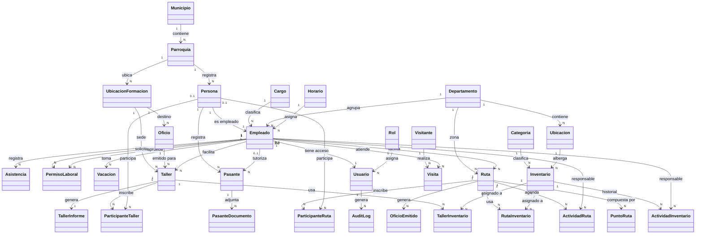
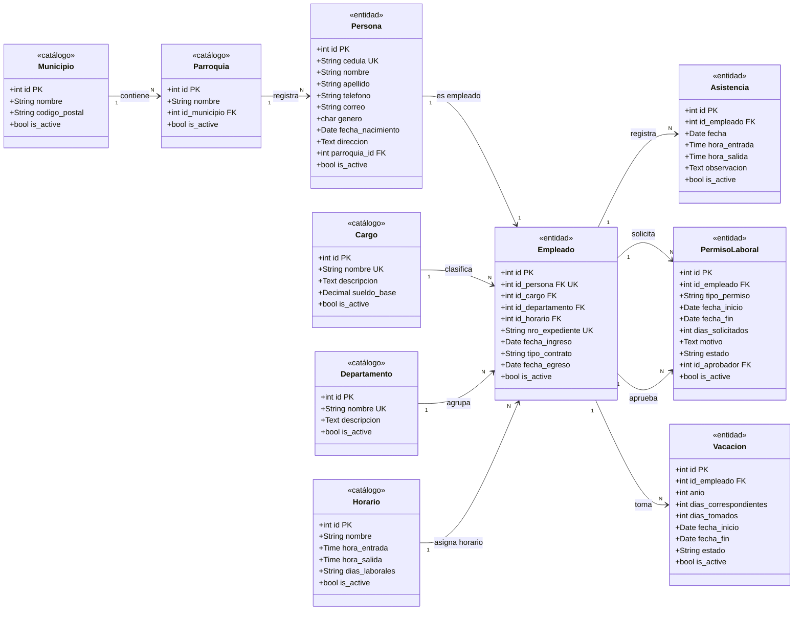
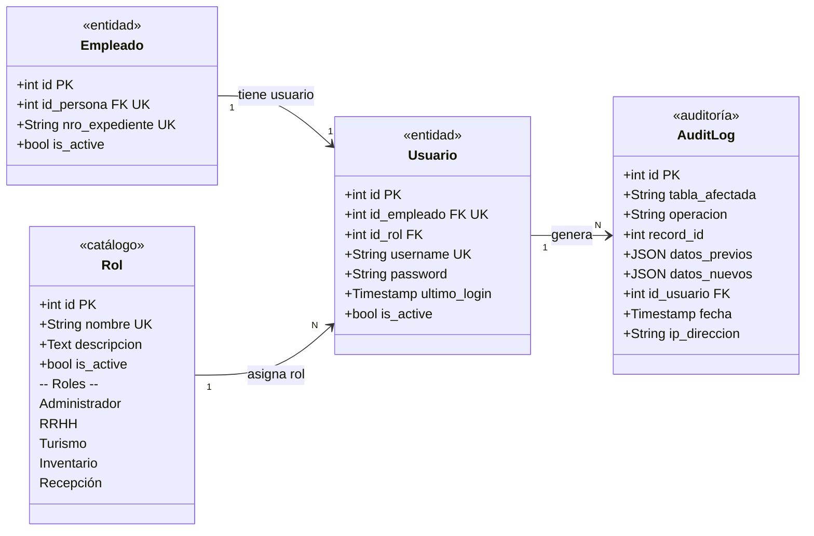
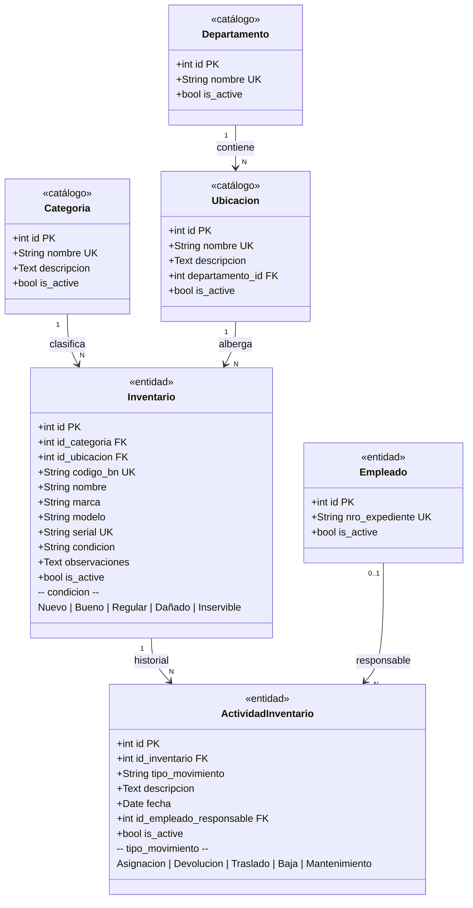
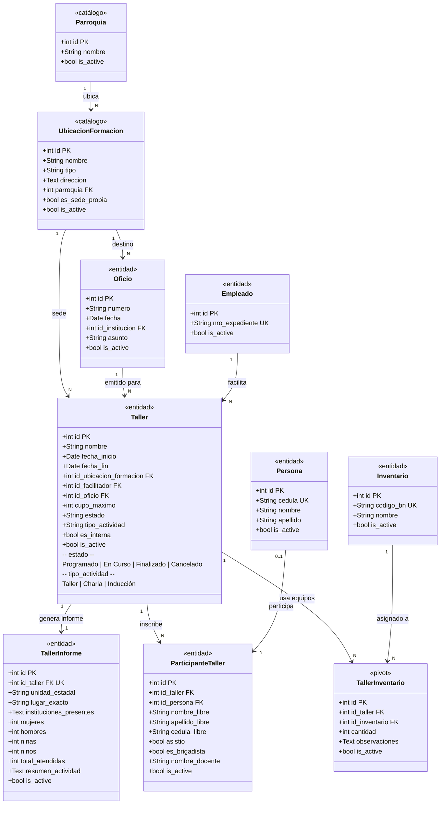
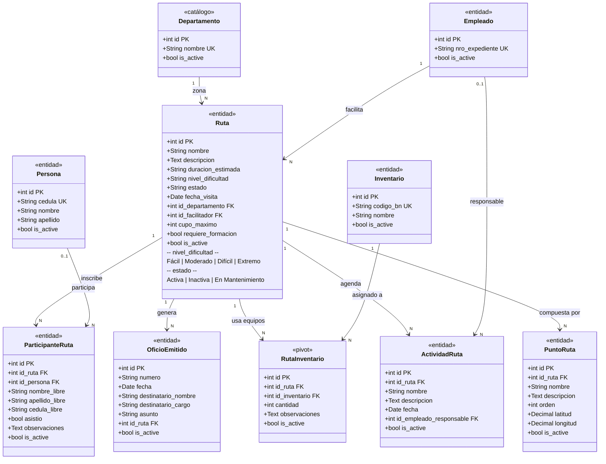
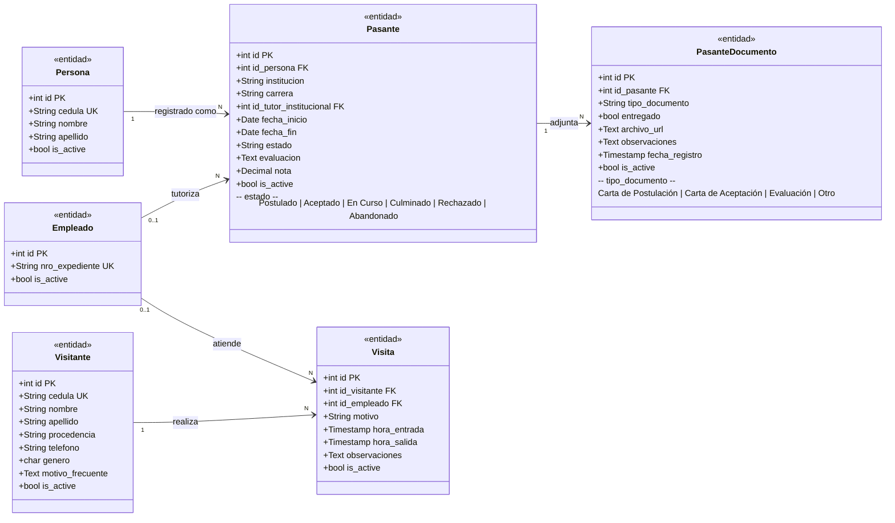

# Diagrama de Clases UML — SIGTUR-IMATUR

**Sistema:** Sistema de Gestión Turística — IMATUR  
**Fecha:** 2026-05-23  
**Entidades:** 34 clases | **Módulos:** 8  
**Stack:** Laravel (PHP) + PostgreSQL  

---

## Leyenda

| Símbolo | Significado |
|---------|-------------|
| `<<entidad>>` | Clase principal del dominio |
| `<<pivot>>` | Tabla de unión N:N |
| `<<catálogo>>` | Tabla de referencia/catálogo |
| `<<sistema>>` | Configuración del sistema |
| `1 ──── N` | Uno a muchos (asociación) |
| `1 ◆──── N` | Composición (la parte depende del todo) |
| `1 ◇──── N` | Agregación (la parte existe de forma independiente) |
| `PK` | Clave primaria |
| `FK` | Clave foránea |
| `UK` | Restricción UNIQUE |

---

## 1. Diagrama Completo — PlantUML

> Para renderizar online: https://www.plantuml.com/plantuml/uml/  
> Compatible con: IntelliJ IDEA, VS Code (extensión PlantUML), draw.io, StarUML, Enterprise Architect.

```plantuml
@startuml SIGTUR-IMATUR
!theme plain
skinparam classAttributeIconSize 0
skinparam classBorderColor #555555
skinparam classBackgroundColor #FAFAFA
skinparam arrowColor #333333
skinparam arrowThickness 1.5
skinparam linetype ortho
skinparam packagestyle rectangle
skinparam packageBorderColor #AAAAAA
skinparam shadowing false

title "SIGTUR-IMATUR — Diagrama de Clases UML\n<size:11><color:#666>Sistema de Gestión Turística — IMATUR | 2026</color></size>"

' ══════════════════════════════════════════════════
' MÓDULO: GEOGRAFÍA
' ══════════════════════════════════════════════════
package "Geografía" #E8F4FD {
    class Municipio <<catálogo>> {
        + id : int <<PK>>
        --
        + nombre : varchar(55)
        + codigo_postal : varchar(4)
        + is_active : bool
    }
    class Parroquia <<catálogo>> {
        + id : int <<PK>>
        --
        + nombre : varchar(100)
        + id_municipio : int <<FK>>
        + is_active : bool
    }
}

' ══════════════════════════════════════════════════
' MÓDULO: RECURSOS HUMANOS
' ══════════════════════════════════════════════════
package "Recursos Humanos" #FEF9E7 {
    class Persona <<entidad>> {
        + id : int <<PK>>
        --
        + cedula : varchar(15) <<UK>>
        + nombre : varchar(100)
        + apellido : varchar(100)
        + telefono : varchar(15)
        + correo : varchar(100)
        + genero : char(1) {M|F|O}
        + fecha_nacimiento : date
        + direccion : text
        + parroquia_id : int <<FK>>
        + is_active : bool
    }
    class Cargo <<catálogo>> {
        + id : int <<PK>>
        --
        + nombre : varchar(100) <<UK>>
        + descripcion : text
        + sueldo_base : decimal(12,2)
        + is_active : bool
    }
    class Departamento <<catálogo>> {
        + id : int <<PK>>
        --
        + nombre : varchar(100) <<UK>>
        + descripcion : text
        + is_active : bool
    }
    class Horario <<catálogo>> {
        + id : int <<PK>>
        --
        + nombre : varchar(100)
        + hora_entrada : time
        + hora_salida : time
        + dias_laborales : varchar(50)
        + descripcion : text
        + is_active : bool
    }
    class Empleado <<entidad>> {
        + id : int <<PK>>
        --
        + id_persona : int <<FK, UK>>
        + id_cargo : int <<FK>>
        + id_departamento : int <<FK>>
        + id_horario : int <<FK, nullable>>
        + nro_expediente : varchar(20) <<UK>>
        + fecha_ingreso : date
        + tipo_contrato : varchar(30) {Fijo|Contratado|Suplente|Comisión}
        + fecha_egreso : date {nullable}
        + is_active : bool
    }
    class Asistencia <<entidad>> {
        + id : int <<PK>>
        --
        + id_empleado : int <<FK>>
        + fecha : date
        + hora_entrada : time
        + hora_salida : time {nullable}
        + observacion : text
        + is_active : bool
    }
    class PermisoLaboral <<entidad>> {
        + id : int <<PK>>
        --
        + id_empleado : int <<FK>>
        + tipo_permiso : varchar(50) {Médico|Personal|Duelo|Lactancia|Estudio|Otro}
        + fecha_inicio : date
        + fecha_fin : date
        + dias_solicitados : int
        + motivo : text
        + estado : varchar(20) {Pendiente|Aprobado|Rechazado|Anulado}
        + id_aprobador : int <<FK, nullable>>
        + fecha_aprobacion : timestamp
        + observaciones : text
        + is_active : bool
    }
    class Vacacion <<entidad>> {
        + id : int <<PK>>
        --
        + id_empleado : int <<FK>>
        + anio : int
        + dias_correspondientes : int
        + dias_tomados : int
        + fecha_inicio : date {nullable}
        + fecha_fin : date {nullable}
        + estado : varchar(20) {Pendiente|Aprobado|En Curso|Completado|Rechazado}
        + observaciones : text
        + is_active : bool
    }
}

' ══════════════════════════════════════════════════
' MÓDULO: AUTENTICACIÓN & SEGURIDAD
' ══════════════════════════════════════════════════
package "Autenticación & Seguridad" #EAFAF1 {
    class Rol <<catálogo>> {
        + id : int <<PK>>
        --
        + nombre : varchar(50) <<UK>>
        + descripcion : text
        + is_active : bool
        .. Roles del sistema ..
        {Administrador | RRHH | Turismo | Inventario | Recepción}
    }
    class Usuario <<entidad>> {
        + id : int <<PK>>
        --
        + id_empleado : int <<FK, UK>>
        + id_rol : int <<FK>>
        + username : varchar(50) <<UK>>
        + password : text {bcrypt}
        + ultimo_login : timestamp {nullable}
        + is_active : bool
    }
    class AuditLog <<auditoría>> {
        + id : int <<PK>>
        --
        + tabla_afectada : varchar(100)
        + operacion : varchar(20) {INSERT|UPDATE|DELETE}
        + record_id : int {nullable}
        + datos_previos : jsonb {nullable}
        + datos_nuevos : jsonb {nullable}
        + id_usuario : int <<FK, nullable>>
        + fecha : timestamp
        + ip_direccion : varchar(45)
    }
}

' ══════════════════════════════════════════════════
' MÓDULO: INVENTARIO
' ══════════════════════════════════════════════════
package "Inventario" #F8F9FA {
    class Categoria <<catálogo>> {
        + id : int <<PK>>
        --
        + nombre : varchar(100) <<UK>>
        + descripcion : text
        + is_active : bool
    }
    class Ubicacion <<catálogo>> {
        + id : int <<PK>>
        --
        + nombre : varchar(100) <<UK>>
        + descripcion : text
        + departamento_id : int <<FK>>
        + is_active : bool
    }
    class Inventario <<entidad>> {
        + id : int <<PK>>
        --
        + id_categoria : int <<FK>>
        + id_ubicacion : int <<FK>>
        + codigo_bn : varchar(50) <<UK>>
        + nombre : varchar(255)
        + descripcion : text
        + marca : varchar(100)
        + modelo : varchar(100)
        + serial : varchar(100) <<UK>>
        + condicion : varchar(20) {Nuevo|Bueno|Regular|Dañado|Inservible}
        + observaciones : text
        + is_active : bool
    }
    class ActividadInventario <<entidad>> {
        + id : int <<PK>>
        --
        + id_inventario : int <<FK>>
        + tipo_movimiento : varchar(30) {Asignacion|Devolucion|Traslado|Baja|Mantenimiento}
        + descripcion : text
        + fecha : date
        + id_empleado_responsable : int <<FK, nullable>>
        + is_active : bool
    }
}

' ══════════════════════════════════════════════════
' MÓDULO: FORMACIÓN
' ══════════════════════════════════════════════════
package "Formación" #FFFDE7 {
    class UbicacionFormacion <<catálogo>> {
        + id : int <<PK>>
        --
        + nombre : varchar(150)
        + tipo : varchar(50)
        + direccion : text
        + parroquia : int <<FK>>
        + es_sede_propia : bool
        + is_active : bool
    }
    class Oficio <<entidad>> {
        + id : int <<PK>>
        --
        + numero : varchar(50)
        + fecha : date
        + id_institucion : int <<FK, nullable>>
        + asunto : varchar(255)
        + is_active : bool
    }
    class Taller <<entidad>> {
        + id : int <<PK>>
        --
        + nombre : varchar(200)
        + descripcion : text
        + fecha_inicio : date
        + fecha_fin : date {nullable}
        + hora_inicio : time {nullable}
        + hora_fin : time {nullable}
        + id_ubicacion_formacion : int <<FK, nullable>>
        + id_facilitador : int <<FK>>
        + id_oficio : int <<FK, nullable>>
        + cupo_maximo : int
        + estado : varchar(20) {Programado|En Curso|Finalizado|Cancelado}
        + tipo_actividad : varchar(30) {Taller|Charla|Inducción}
        + es_interna : bool
        + tipo_ente : varchar(50) {nullable}
        + is_active : bool
    }
    class TallerInforme <<entidad>> {
        + id : int <<PK>>
        --
        + id_taller : int <<FK, UK>>
        + unidad_estadal : varchar(255)
        + lugar_exacto : varchar(255)
        + instituciones_presentes : text
        + mujeres : int
        + hombres : int
        + ninas : int
        + ninos : int
        + total_atendidas : int {derivado}
        + resumen_actividad : text
        + is_active : bool
    }
    class ParticipanteTaller <<entidad>> {
        + id : int <<PK>>
        --
        + id_taller : int <<FK>>
        + id_persona : int <<FK, nullable>>
        + nombre_libre : varchar(100) {nullable}
        + apellido_libre : varchar(100) {nullable}
        + cedula_libre : varchar(20) {nullable}
        + asistio : bool
        + observaciones : text
        + es_brigadista : bool
        + nombre_docente : varchar(100) {nullable}
        + cedula_docente : varchar(20) {nullable}
        + is_active : bool
        .. Constraint ..
        id_persona IS NOT NULL OR nombre_libre IS NOT NULL
    }
    class TallerInventario <<pivot>> {
        + id : int <<PK>>
        --
        + id_taller : int <<FK>>
        + id_inventario : int <<FK>>
        + cantidad : int
        + observaciones : text
        + is_active : bool
        .. Unique ..
        (id_taller, id_inventario)
    }
}

' ══════════════════════════════════════════════════
' MÓDULO: TURISMO — RUTAS
' ══════════════════════════════════════════════════
package "Turismo — Rutas" #FDF2F8 {
    class Ruta <<entidad>> {
        + id : int <<PK>>
        --
        + nombre : varchar(200)
        + descripcion : text
        + duracion_estimada : varchar(50)
        + nivel_dificultad : varchar(20) {Fácil|Moderado|Difícil|Extremo}
        + estado : varchar(20) {Activa|Inactiva|En Mantenimiento}
        + fecha_visita : date {nullable}
        + hora_visita : time {nullable}
        + id_departamento : int <<FK, nullable>>
        + id_facilitador : int <<FK, nullable>>
        + cupo_maximo : int
        + requiere_formacion : bool
        + is_active : bool
    }
    class PuntoRuta <<entidad>> {
        + id : int <<PK>>
        --
        + id_ruta : int <<FK>>
        + nombre : varchar(200)
        + descripcion : text
        + orden : int
        + latitud : decimal(10,7) {nullable}
        + longitud : decimal(10,7) {nullable}
        + is_active : bool
    }
    class ActividadRuta <<entidad>> {
        + id : int <<PK>>
        --
        + id_ruta : int <<FK>>
        + nombre : varchar(200)
        + descripcion : text
        + fecha : date {nullable}
        + id_empleado_responsable : int <<FK, nullable>>
        + is_active : bool
    }
    class ParticipanteRuta <<entidad>> {
        + id : int <<PK>>
        --
        + id_ruta : int <<FK>>
        + id_persona : int <<FK, nullable>>
        + nombre_libre : varchar(100) {nullable}
        + apellido_libre : varchar(100) {nullable}
        + cedula_libre : varchar(20) {nullable}
        + asistio : bool
        + observaciones : text
        + is_active : bool
        .. Constraint ..
        id_persona IS NOT NULL OR nombre_libre IS NOT NULL
    }
    class RutaInventario <<pivot>> {
        + id : int <<PK>>
        --
        + id_ruta : int <<FK>>
        + id_inventario : int <<FK>>
        + cantidad : int
        + observaciones : text
        + is_active : bool
        .. Unique ..
        (id_ruta, id_inventario)
    }
    class OficioEmitido <<entidad>> {
        + id : int <<PK>>
        --
        + numero : varchar(20)
        + fecha : date
        + destinatario_nombre : varchar(200)
        + destinatario_cargo : varchar(200)
        + asunto : varchar(500)
        + id_ruta : int <<FK, nullable>>
        + is_active : bool
    }
}

' ══════════════════════════════════════════════════
' MÓDULO: PASANTES
' ══════════════════════════════════════════════════
package "Pasantes" #EAF4FB {
    class Pasante <<entidad>> {
        + id : int <<PK>>
        --
        + id_persona : int <<FK>>
        + institucion : varchar(200)
        + carrera : varchar(200)
        + id_tutor_institucional : int <<FK, nullable>>
        + fecha_inicio : date {nullable}
        + fecha_fin : date {nullable}
        + estado : varchar(50) {Postulado|Aceptado|En Curso|Culminado|Rechazado|Abandonado}
        + evaluacion : text
        + nota : decimal(5,2) {nullable}
        + is_active : bool
    }
    class PasanteDocumento <<entidad>> {
        + id : int <<PK>>
        --
        + id_pasante : int <<FK>>
        + tipo_documento : varchar(100) {Carta de Postulación|Carta de Aceptación|Evaluación|Otro}
        + entregado : bool
        + archivo_url : text {nullable}
        + observaciones : text
        + fecha_registro : timestamp
        + is_active : bool
    }
}

' ══════════════════════════════════════════════════
' MÓDULO: VISITANTES
' ══════════════════════════════════════════════════
package "Visitantes" #FDEDEC {
    class Visitante <<entidad>> {
        + id : int <<PK>>
        --
        + cedula : varchar(20) <<UK>>
        + nombre : varchar(100)
        + apellido : varchar(100)
        + procedencia : varchar(100) {nullable}
        + telefono : varchar(20) {nullable}
        + genero : char(1) {M|F|O, nullable}
        + correo : varchar(100) {nullable}
        + motivo_frecuente : text {nullable}
        + is_active : bool
    }
    class Visita <<entidad>> {
        + id : int <<PK>>
        --
        + id_visitante : int <<FK>>
        + id_empleado : int <<FK, nullable>>
        + motivo : varchar(255) {nullable}
        + hora_entrada : timestamp
        + hora_salida : timestamp {nullable — toggle}
        + observaciones : text
        + is_active : bool
    }
}

' ══════════════════════════════════════════════════
' MÓDULO: CONFIGURACIÓN
' ══════════════════════════════════════════════════
package "Configuración" #F0F0F0 {
    class ConfigSistema <<sistema>> {
        + id : int <<PK>>
        --
        + clave : varchar(100) <<UK>>
        + valor : text
        + descripcion : varchar(255)
        + updated_at : timestamp
        + updated_by : int <<FK>>
        .. Claves preconfiguradas ..
        director_nombre | director_apellido | director_cargo
        resolucion_numero | gaceta_numero
        correlativo_oficio_* | ano_correlativo_*
    }
}

' ══════════════════════════════════════════════════
' RELACIONES — GEOGRAFÍA
' ══════════════════════════════════════════════════
Municipio "1" *-- "N" Parroquia : contiene >
Parroquia "1" <--o "N" Persona : registrada en
Parroquia "1" <--o "N" UbicacionFormacion : ubicada en

' ══════════════════════════════════════════════════
' RELACIONES — RECURSOS HUMANOS
' ══════════════════════════════════════════════════
Persona "1" *-- "1" Empleado : es empleado >
Cargo "1" o-- "N" Empleado : tiene cargo >
Departamento "1" o-- "N" Empleado : pertenece a >
Horario "1" o-- "N" Empleado : asignado a >
Empleado "1" *-- "N" Asistencia : registra >
Empleado "1" --> "N" PermisoLaboral : solicita (solicitante) >
Empleado "1" --> "N" PermisoLaboral : aprueba (aprobador) >
Empleado "1" --> "N" Vacacion : toma >

' ══════════════════════════════════════════════════
' RELACIONES — AUTENTICACIÓN
' ══════════════════════════════════════════════════
Empleado "1" *-- "1" Usuario : tiene acceso >
Rol "1" o-- "N" Usuario : asigna rol >
Usuario "1" --> "N" AuditLog : genera >

' ══════════════════════════════════════════════════
' RELACIONES — INVENTARIO
' ══════════════════════════════════════════════════
Categoria "1" o-- "N" Inventario : clasifica >
Departamento "1" o-- "N" Ubicacion : contiene >
Ubicacion "1" o-- "N" Inventario : alberga >
Inventario "1" *-- "N" ActividadInventario : historial >
Empleado "0..1" --> "N" ActividadInventario : responsable >

' ══════════════════════════════════════════════════
' RELACIONES — FORMACIÓN
' ══════════════════════════════════════════════════
UbicacionFormacion "1" o-- "N" Oficio : institución destino >
UbicacionFormacion "1" o-- "N" Taller : sede >
Oficio "1" o-- "N" Taller : emitido para >
Empleado "1" --> "N" Taller : facilita >
Taller "1" *-- "1" TallerInforme : genera informe >
Taller "1" *-- "N" ParticipanteTaller : inscribe >
Persona "0..1" --> "N" ParticipanteTaller : participa en >
Taller "1" *-- "N" TallerInventario : usa equipos >
Inventario "1" --> "N" TallerInventario : asignado a >

' ══════════════════════════════════════════════════
' RELACIONES — TURISMO
' ══════════════════════════════════════════════════
Departamento "1" o-- "N" Ruta : zona >
Empleado "1" --> "N" Ruta : facilita >
Ruta "1" *-- "N" PuntoRuta : compuesta por >
Ruta "1" *-- "N" ActividadRuta : agenda >
Empleado "0..1" --> "N" ActividadRuta : responsable >
Ruta "1" *-- "N" ParticipanteRuta : inscribe >
Persona "0..1" --> "N" ParticipanteRuta : participa en >
Ruta "1" *-- "N" RutaInventario : usa equipos >
Inventario "1" --> "N" RutaInventario : asignado a >
Ruta "1" *-- "N" OficioEmitido : genera >

' ══════════════════════════════════════════════════
' RELACIONES — PASANTES
' ══════════════════════════════════════════════════
Persona "1" o-- "N" Pasante : registrado como >
Empleado "0..1" --> "N" Pasante : tutoriza >
Pasante "1" *-- "N" PasanteDocumento : adjunta >

' ══════════════════════════════════════════════════
' RELACIONES — VISITANTES
' ══════════════════════════════════════════════════
Visitante "1" *-- "N" Visita : realiza >
Empleado "0..1" --> "N" Visita : atiende >

@enduml
```

---

## 2. Vista General de Relaciones — Mermaid

> Compatible con GitHub, GitLab, Notion, Obsidian.



---

## 3. Diagramas Detallados por Módulo

### 3.1 Módulo — Recursos Humanos



---

### 3.2 Módulo — Autenticación & Auditoría



---

### 3.3 Módulo — Inventario



---

### 3.4 Módulo — Formación



---

### 3.5 Módulo — Turismo (Rutas)



---

### 3.6 Módulo — Pasantes & Visitantes



---

## 4. Resumen de Entidades por Módulo

| Módulo | Entidades | Relaciones N:N |
|--------|-----------|----------------|
| Geografía | Municipio, Parroquia | — |
| Recursos Humanos | Persona, Empleado, Cargo, Departamento, Horario, Asistencia, PermisoLaboral, Vacacion | — |
| Autenticación | Usuario, Rol, AuditLog | — |
| Inventario | Inventario, Categoria, Ubicacion, ActividadInventario | — |
| Formación | Taller, TallerInforme, ParticipanteTaller, UbicacionFormacion, Oficio, **TallerInventario** | Taller ↔ Inventario |
| Turismo | Ruta, PuntoRuta, ActividadRuta, ParticipanteRuta, OficioEmitido, **RutaInventario** | Ruta ↔ Inventario |
| Pasantes | Pasante, PasanteDocumento | — |
| Visitantes | Visitante, Visita | — |
| Configuración | ConfigSistema | — |

## 5. Cardinalidades Destacadas

```
Municipio    1──────◆N  Parroquia
Parroquia    1──────◇N  Persona
Persona      1──────◆1  Empleado          ← relación 1:1 estricta (UK)
Cargo        1──────◇N  Empleado
Departamento 1──────◇N  Empleado
Departamento 1──────◇N  Ubicacion
Empleado     1──────◆1  Usuario           ← relación 1:1 estricta (UK)
Empleado     1──────◆N  Asistencia
Rol          1──────◇N  Usuario
Taller       1──────◆1  TallerInforme     ← relación 1:1 estricta (UK)
Taller       ◆N─────N◆  Inventario        ← N:N vía TallerInventario
Ruta         ◆N─────N◆  Inventario        ← N:N vía RutaInventario
```

**Leyenda cardinalidades:**
- `◆` Composición (ciclo de vida dependiente)
- `◇` Agregación (ciclo de vida independiente)
- `──` Asociación simple
